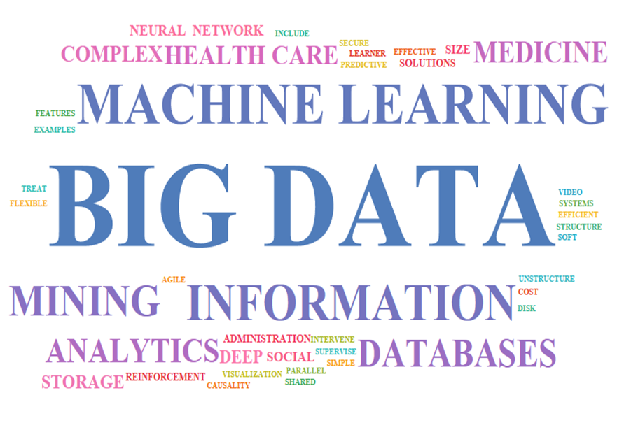
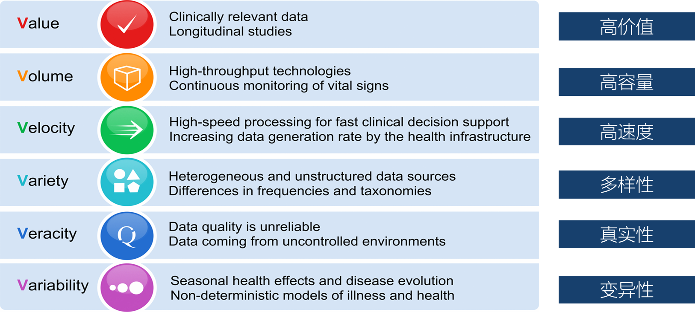
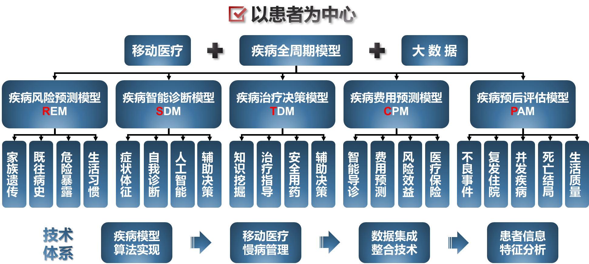
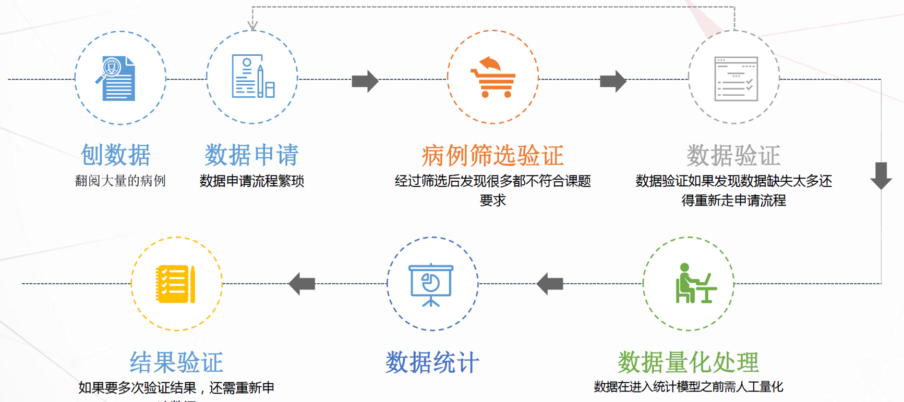
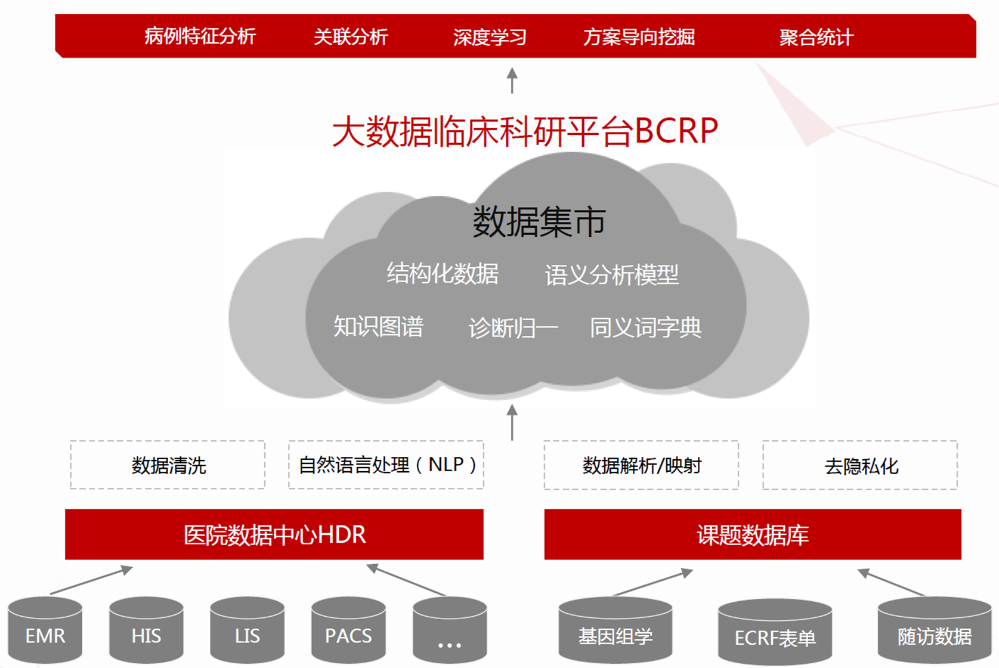
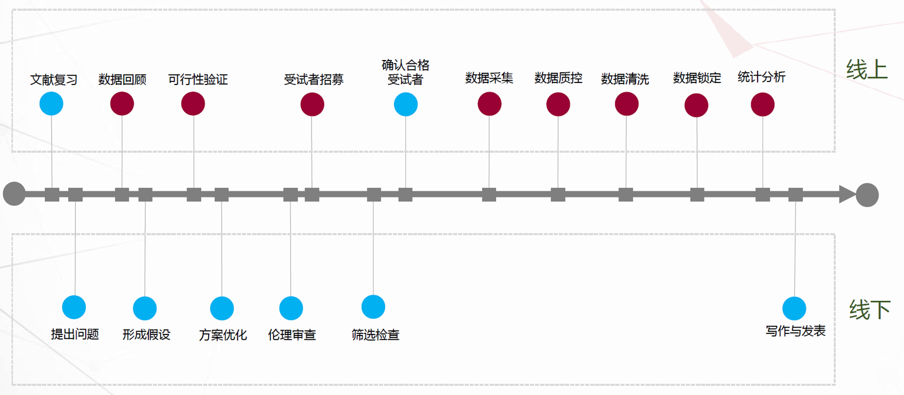

# 案例教学 {.unnumbered}

# 健康医疗大数据驱动下的临床科研

```{r setup, include=FALSE}
options(digits = 4, 
        dplyr.print_min = 6, 
        dplyr.print_max = 6,
        htmltools.dir.version = FALSE, 
        formatR.indent = 2, 
        width = 55
        )

knitr::opts_chunk$set(
                      echo = TRUE, 
                      warning = FALSE, 
                      message = FALSE,
                      fig.width = 6, 
                      fig.height = 4,
                      fig.showtext = TRUE
                      )
```

## 健康医疗大数据驱动下的临床科研

### 医疗大数据及其应用

-   **什么是大数据**

**大数据（Big data）**是结构化和非结构化数据集的广义术语，既庞大又复杂，以至于传统的数据处理应用程序和系统无法充分处理它们。健康医疗大数据为疾病人工智能诊断与预测预后分析提供强大支撑。

{width="60%"}

-   **医疗大数据的特点**

{width="100%"}

-   **医疗大数据的应用**

```{r ,out.width = '100%', echo = FALSE}
knitr::include_graphics("images/医疗大数据的应用.png", dpi = 300)
```

### **疾病模型类型**

-   **疾病的全周期模型类型**

{width="100%"}

### **研究设计类型**

-   **研究设计方法**

```{r ,out.width = '100%', echo = FALSE}
knitr::include_graphics("images/研究设计方法.png", dpi = 300)
```

-   **临床研究五要素（PiCOT）**

```{r ,out.width = '100%', echo = FALSE}
knitr::include_graphics("images/临床研究5个要素.png", dpi = 300)
```

### 临床数据获取

-   **数据的获取与处理**

{width="100%"}

-   **数据的集成和整合**

{width="100%"}

-   **全过程分析**

{width="100%"}

-   **CRF表的制定**

**设计要点**

1.  **科学性**：每个问题都要**真实**、**可靠**地测量研究人群的属性、特征、知识、态度或行为

2.  **逻辑性**：逻辑结构自然、顺畅，问题之间的逻辑关系较强

3.  **易用性**：易于被研究对象和调查员理解和接受

-   COPD-CRF基线部分（例）

```{r ,out.width = '100%', echo = FALSE}
knitr::include_graphics("images/CRF基线.png", dpi = 300)
```

-   COPD-CRF随访部分（例）

```{r ,out.width = '100%', echo = FALSE}
knitr::include_graphics("images/CRF2.png", dpi = 300)
```

### 变量类型与筛选

-   **变量角色**

```{r ,out.width = '100%', echo = FALSE}
knitr::include_graphics("images/变量角色.png", dpi = 300)
```

-   **预测变量/自变量选择**

```{r ,out.width = '100%', echo = FALSE}
knitr::include_graphics("images/预测变量.png", dpi = 300)
```

-   **指标组合的建模方法**

    -   **C模型**：基于临床特征（**C**linic character/history）：如来自HIS、LIS系统的数据、非结构化数据的量化与建模，如心电图、彩超、影像数据等

    -   **BC模型**：基于临床特征+ 生物标志物（ **B**iomarker）的预后模型

    -   **ABC模型**：基于临床特征 + 生物标志物 +人口学（或一般情况）的预后模型

-   **生命质量或患者报告结局（PRO）**

```{r ,out.width = '100%', echo = FALSE}
knitr::include_graphics("images/PRO.png", dpi = 300)
```

-   **结局变量选择**

```{r ,out.width = '100%', echo = FALSE}
knitr::include_graphics("images/COPD结局.png", dpi = 300)
knitr::include_graphics("images/COPD2.png", dpi = 300)
knitr::include_graphics("images/COPD3.png", dpi = 300)
```

## 临床预测模型

当今医学从经验医学发展到循证医学，再到精准医学，临床数据的应用也随着大数据时代的来临越来越受到重视。

```{r fig0101,out.width = '100%', echo = FALSE}
knitr::include_graphics("images/0101.png", dpi = 300)
```

**循证医学缺点：**

①降低了疾病深层机制和特殊人群特点的影响权重，将导致普遍性与特殊性之间的巨大偏差；

②高质量的循证研究费时费力(各种RCT)。

**精准医学**克服循证医学一些系统性的劣势。

临床预测模型就是在精准医学研究思维模式的基础上应运而生，成为当下最炙手可热的临床领域之一。

```{r , out.width = '100%', echo = FALSE}
knitr::include_graphics("images/0102.png", dpi = 300)
```

> 在PubMed以"Clinical Prediction Model" 搜索，自1964年发表的第一篇文章以来，到2015年论文发表数量以极快的趋势增长，其火热程度可见一斑。

### 临床预测模型应用场景

#### 什么是临床预测模型？

-   **预测模型**

    -   数学方程（数理）

    -   回归模型（统计）

    -   算法（计算机）

    -   规则（普通）

-   ***临床*****预测模型**

    -   应用与临床

    -   针对个体患者

    -   结局预测

        -   医学事件：死亡、再住院、复发等

        -   结局值：住院天数、住院费用

-   **临床预测模型(Clinical Prediction Models)**

    是指利用多因素模型估算患有某病的概率或者将来某结局发生的概率。

#### 应用场景

临床预测模型的应用场景主要是临床，针对个体患者，进行结局预测，例如预测医学事件：某种疾病的发生率、复发率、伤残率、并发症的发生以及死亡率等，也可以用于预测结局值：住院天数、住院费用等。

-   **临床领域的应用**

    -   预测急性心肌梗死患者30天的死亡率

    -   新型抗癌药物在某种癌症患者中的有效率

    -   新冠肺炎患者转为危重症的发生概率

    -   判断咳嗽患者发生哮喘的概率

-   **应用价值**

    -   **量化**对患者预测的结果

    -   更**直观**地展示疾病的危险性和治疗方案一定程度上缓和了医患之间**信息不对称**

-   **公共卫生领域（三级预防体系中发挥作用）**

    -   根据特定人群的健康状态，**量化**未来患病的概率

    -   构建高灵敏度和特异度的**诊断模型**

    -   利用**预后模型**对疾病的复发、死亡、伤残以及出现并发症的概率进行预测

-   实现价值

    -   **为健康教育和行为干预提供直观参考**

    -   将无创痛、经济性、便利性的指标用于疾病筛查，实现**"早发现、早诊断、早治疗"**的二级预防

    -   **指导个体化治疗和康复方案的制定**，防止病情恶化，预防并发症和伤残，提高患者生存质量

#### 为什么做临床预测模型？

**临床医生可能常常面临这样的困惑：**

①患者询问医生，体检发现血脂高，未来十年得冠心病的可能性是多少？需不需要吃药？

②慢乙肝免疫耐受期患者抗不抗病毒？现在治疗和延迟治疗哪个更好？哪个花钱多？

③如果能提前预测患者的病情，比如提前预测肝癌患者是否有微血管浸润，可能有助于外科医生在标准切除和扩大切除这两个完全不同的切除方式之间作出选择，患者结局或许不同。

临床预测模型就可以解答这些困惑。

**临床预测模型具有两方面的意义：**

一方面是**临床价值**，借助临床预测模型，医生可以更精准地做出临床决策，帮助患者实现更有利的价值选择，卫生管理部门可以更合理地配置医疗资源；

另一方面是**对医生发展的影响**，临床预测模型目前已成为SCI期刊发表论文的热门，更是SCI高分期刊的宠儿，通过收集数据，构建临床预测模型，能够快速地发表学术论文，提升职称，完成医生的高级进阶。

### 临床预测模型怎么构建

#### 完整构建流程

```{r , out.width = '100%', echo = FALSE}
knitr::include_graphics("images/0103.png", dpi = 300)
```

#### 确定研究问题和预测模型类型

最常见的两种类型

-   诊断模型：

    主要是基于研究对象的临床特征，预测当前患有某种疾病的概率，多见于**横断面研究**;

-   预后模型：

    是研究对象在患某种疾病时，预测其未来疾病的复发、死亡、伤残等转归情况的概率，多见于纵向研究，如**队列研究**等。

```{r , out.width = '100%', echo = FALSE}
knitr::include_graphics("images/0104.png", dpi = 300)
```

**预测模型的类型取决于感兴趣的结局**

-   结局类型：

    -   分类变量？ -\> 二分类？多分类？

    -   连续变量？

    -   有无考虑"生存时间"？

不同结局类型确定选用的模型 ------\> **数据决定模型**

#### 数据的预处理

-   数据的收集：现有的试验、队列研究、登记注册或管理的数据集

    数据集中样本量越大、患者信息越多，构建的预测模型就越准确

    > 注意：数据预处理前做好数据"**整洁**" 避免"**脏**"数据！

```{r , out.width = '100%', echo = FALSE}
knitr::include_graphics("images/0105.png", dpi = 300)
```

> **"整洁"数据：**
>
> -   一**行**是一个样本所有信息
>
> -   一**列**是一个variable
>
> -   中间无乱码、不规范表达

```{r , out.width = '100%', echo = FALSE}
knitr::include_graphics("images/0106.png", dpi = 300)
```

> **"脏"数据：**
>
> -   变量名不规范
>
> -   数值中英文混杂
>
> -   标点符号

-   数据预处理：

    -   离群值、异常值

    -   缺失值：删除？填补？

    -   协变量的类型

        -   连续变量

        -   分类、有序多分类、无序多分类

    -   协变量的编码与转换

        -   one-hot encoding

        -   Leave-one-out

        -   对数转化等（[参考知乎讨论](https://www.zhihu.com/question/22012482)）

```{r , out.width = '100%', echo = FALSE}
knitr::include_graphics("images/0107数据预处理.png", dpi = 300)
```

#### 变量筛选

```{r , out.width = '100%', echo = FALSE}
knitr::include_graphics("images/0108变量筛选.png", dpi = 300)
```

#### 模型的选择

**传统模型梳理**

```{r , out.width = '100%', echo = FALSE}
knitr::include_graphics("images/0110传统与机器学习模型梳理.png", dpi = 300)
```

**机器学习类型**

```{r , out.width = '100%', echo = FALSE}
knitr::include_graphics("images/0111纯机器学习模型梳理.png", dpi = 300)
```

#### 模型的构建

```{r , out.width = '100%', echo = FALSE}
knitr::include_graphics("images/0112模型构建.png", dpi = 300)
```

#### 模型的评价

-   **常用概率解释**

    -   假阳率：模型预测为正例实际负例的样本

        False Positive Rate = 实负测正 / 实负 = FP / (FP + TN)

    -   假阴率：模型预测为负例实际为正例的样本

        False Negative Rate = 实正测负 / 实正 = FN / (TP + FN)

    -   真阳率：模型预测为正例实际为正例的样本

        True Positive Rate = 实正测正 / 实正 = TP / (TP + FN)

    -   真阴率：模型预测为负例实际为负例的样本

        True Negative Rate = 实负测负 / 实负 = TN / (FP + TN)

-   分类结果混淆矩

| 真值/预测值 |  预测的正类  |  预测的负类  |
|:-----------:|:------------:|:------------:|
| 真实的正类  | TP（真正率） | FN（假负率） |
| 真实的负类  | FP（假正率） | TN（真负率） |

-   常用指标

    -   准确率（Accuracy）

        正例和负例中分别被正确预测的样本数量占总样本数量的比例

    -   AUC

        表示ROC曲线下的面积，即ROC曲线与x轴、（1，0）-（1，1）围绕的面积，评估的是随机给定一个正例和一个负例，模型对正例的预测概率大于模型对于负例预测概率的概率。

    -   召回率（Recall）

        以实际样本为基础，实际样本为正例，被模型预测正确的正例占总体实际样本正例的比例。

    -   精确度（Pecision）

        以预测结果为基础，被模型预测为正例的样本中是正确的比例。预测为正例的结果分两种，要么实际是正例TP，要么实际是负例FP。

    -   F1 score

        精确度和召回率是一对矛盾的度量，一般来说，精确度高时，召回率值往往偏低；而精确度值低时，召回率值往往偏高。当分类置信度高时，精确度偏高；分类置信度低时，召回率偏高。为了能够综合考虑这两个指标，F1 score被提出。

    -   ......

-   [**Diagnostic testing**](https://en.wikipedia.org/wiki/F-score)

```{r , out.width = '100%', echo = FALSE}
knitr::include_graphics("images/0122评价指标.png", dpi = 300)
```

#### 模型的展示

-   应用程序网页

-   Nomogram

-   评分系统

-   彩色打分卡

> **应用程序网页**

```{r , out.width = '100%', echo = FALSE}
knitr::include_graphics("images/0113.png", dpi = 300)
```

```{r , out.width = '100%', echo = FALSE}
knitr::include_graphics("images/0114.png", dpi = 300)
```

> **Nomogram**

```{r , out.width = '100%', echo = FALSE}
knitr::include_graphics("images/0115.png", dpi = 300)
```

> **评分系统**

```{r , out.width = '100%', echo = FALSE}
knitr::include_graphics("images/0116.png", dpi = 300)
```

> **彩色打分卡**

```{r , out.width = '100%', echo = FALSE}
knitr::include_graphics("images/0117.png", dpi = 300)
```

+------------------+--------------------+--------------------+
|                  | 优 势              | 劣 势              |
+:================:+:==================:+:==================:+
| **应用程序网页** | 结果快速精确       | 开发和使用成本较高 |
|                  |                    |                    |
|                  | 可嵌入常规诊疗系统 |                    |
+------------------+--------------------+--------------------+
| **Nomogram**     | 无需电子设备       | 肉眼比对不精确     |
|                  |                    |                    |
|                  | 只需简单加法       |                    |
+------------------+--------------------+--------------------+
| 评分系统         | 很少使用           | 连续变量需切割     |
|                  |                    |                    |
|                  |                    | 结果不精确         |
+------------------+--------------------+--------------------+
| 彩色打分卡       | 很少使用           | 连续变量需切割     |
|                  |                    |                    |
|                  |                    | 结果不精确         |
|                  |                    |                    |
|                  |                    | 预测因子不能太多   |
+------------------+--------------------+--------------------+

### 模型报告

只有对预测模型各方面的信息进行全面和明确的报告，才能充分评估预测模型的偏倚风险和潜在有用性。

个体预后或诊断多变量预测模型透明报告**Transparent Reporting of a multivariable prediction model for Individual Prognosis Or Diagnosis ([TRIPOD](https://www.equator-network.org/reporting-guidelines/tripod-statement/))**为开发、验证或更新预测模型的研究报告提出了一套建议。

#### 临床预测模型报告规范（TRIPOD）

```{r , out.width = '100%', echo = FALSE}
knitr::include_graphics("images/0118TRIPOD.png", dpi = 300)
```

**TRIPOD条目解读**

```{r , out.width = '100%', echo = FALSE}
knitr::include_graphics("images/012101.png", dpi = 300)
knitr::include_graphics("images/012102.png", dpi = 300)
knitr::include_graphics("images/012103.png", dpi = 300)
knitr::include_graphics("images/012104.png", dpi = 300)
```

#### 临床预测模型指南

```{r , out.width = '100%', echo = FALSE}
knitr::include_graphics("images/0119指南.png", dpi = 300)
```

#### 研究设计和方法学评价：PROBAST

```{r , out.width = '100%', echo = FALSE}
knitr::include_graphics("images/0120.png", dpi = 300)
```

-   [**机器学习构建流程总结**](https://www.mubucm.com/doc/3mH9_G3rgIg)

### [机器学习 VS 传统统计](https://www.datasciencecentral.com/machine-learning-vs-traditional-statistics-different-philosophi-1/)

```{r , out.width = '100%', echo = FALSE}
knitr::include_graphics("images/0123.png", dpi = 300)
```

```{r , out.width = '100%', echo = FALSE}
knitr::include_graphics("images/0124.png", dpi = 300)
```

```{r , out.width = '100%', echo = FALSE}
knitr::include_graphics("images/0125.png", dpi = 300)
```

```{r , out.width = '100%', echo = FALSE}
knitr::include_graphics("images/0126.png", dpi = 300)
```

```{r , out.width = '100%', echo = FALSE}
knitr::include_graphics("images/0127.png", dpi = 300)
```
