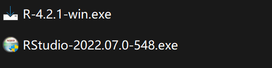
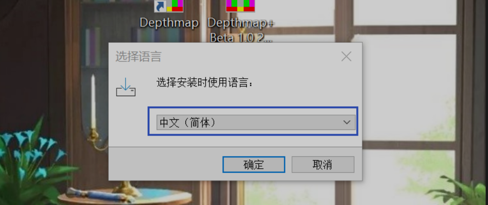
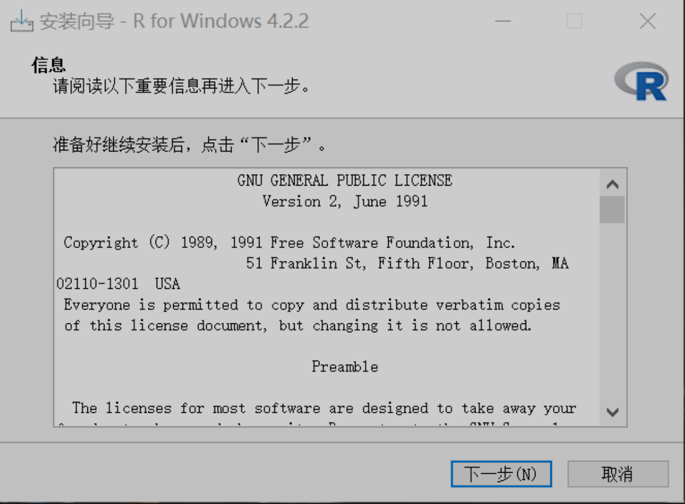
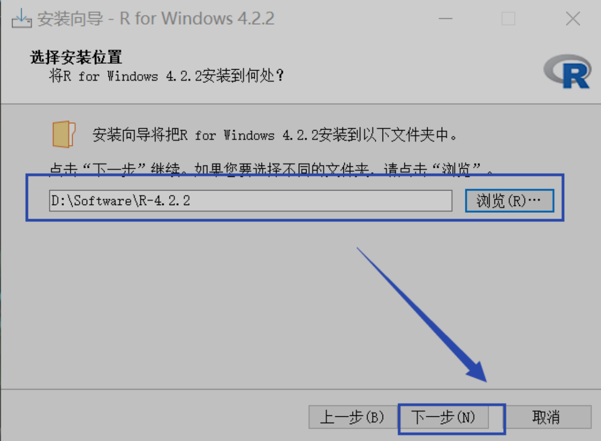
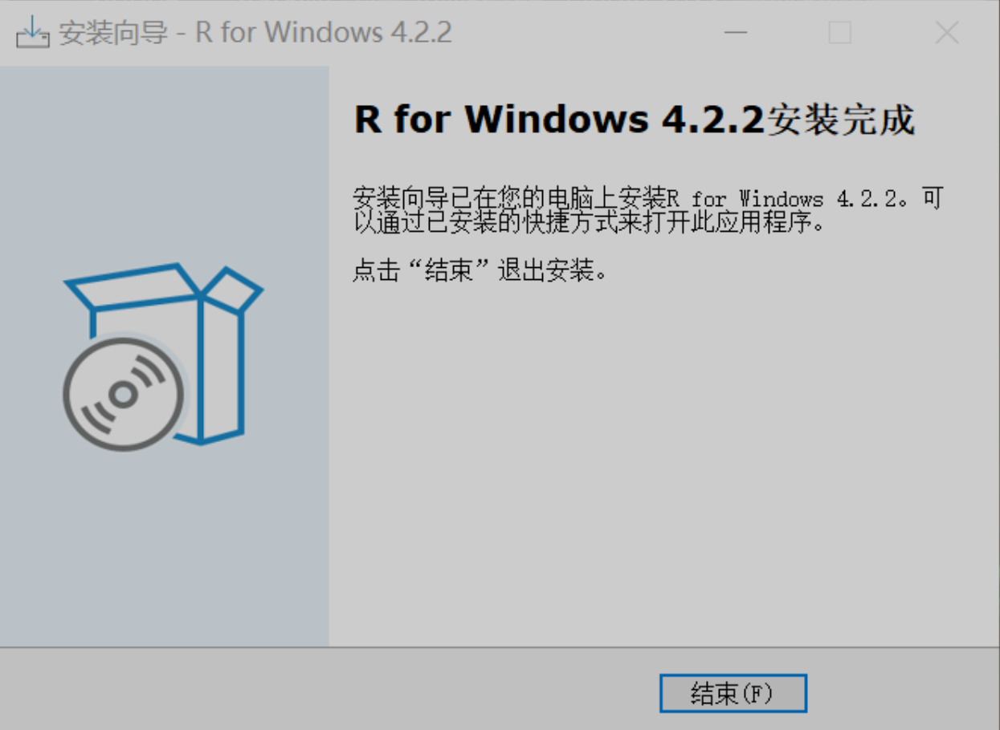
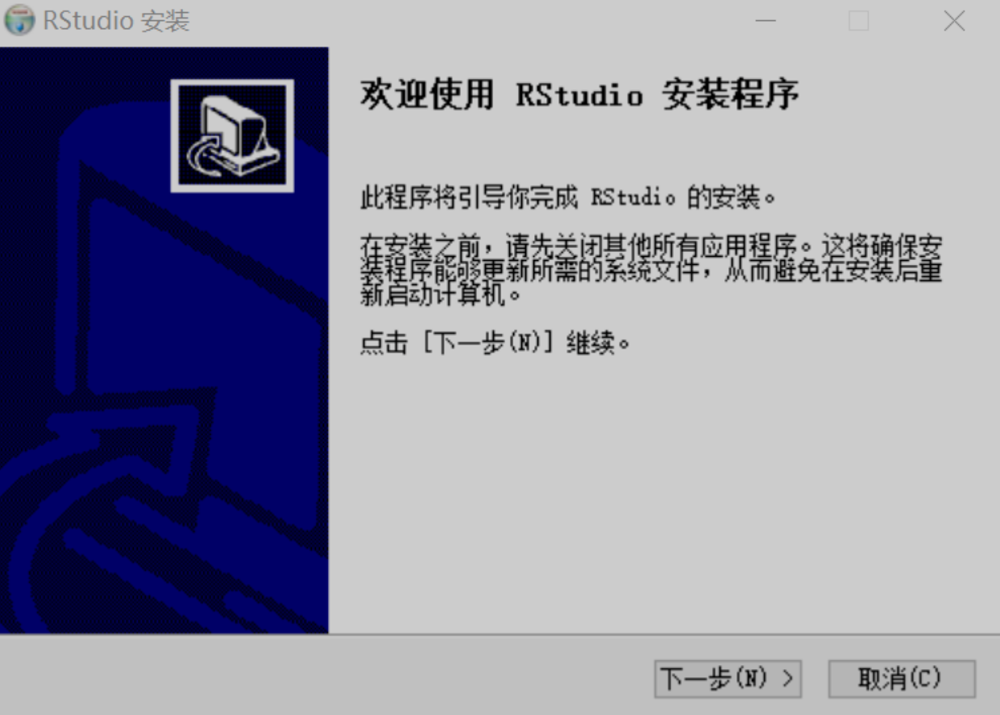
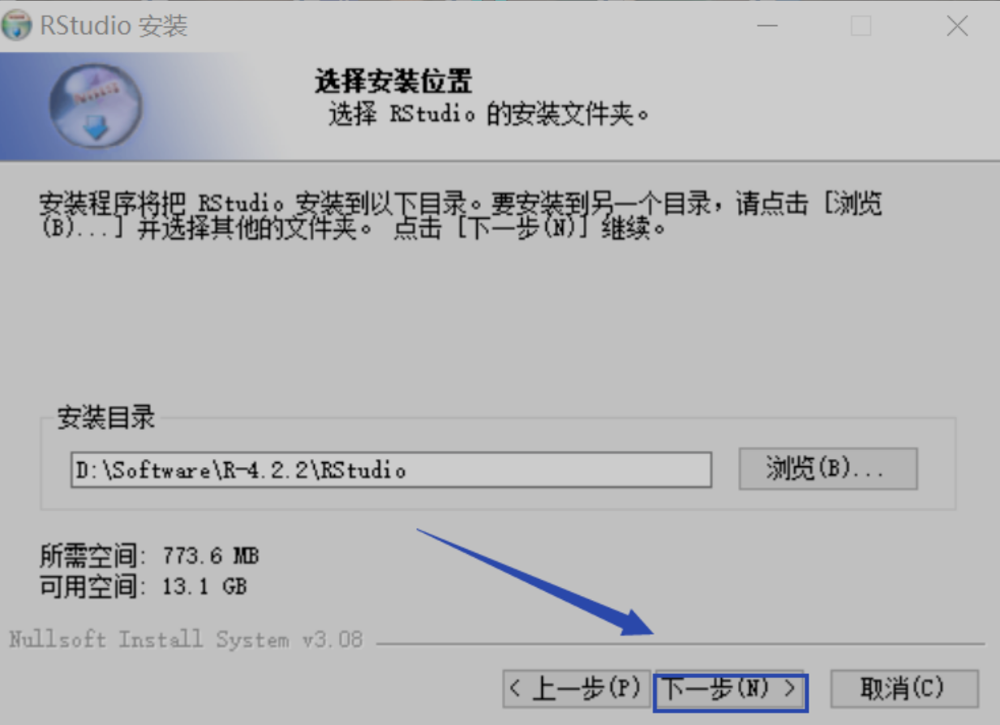
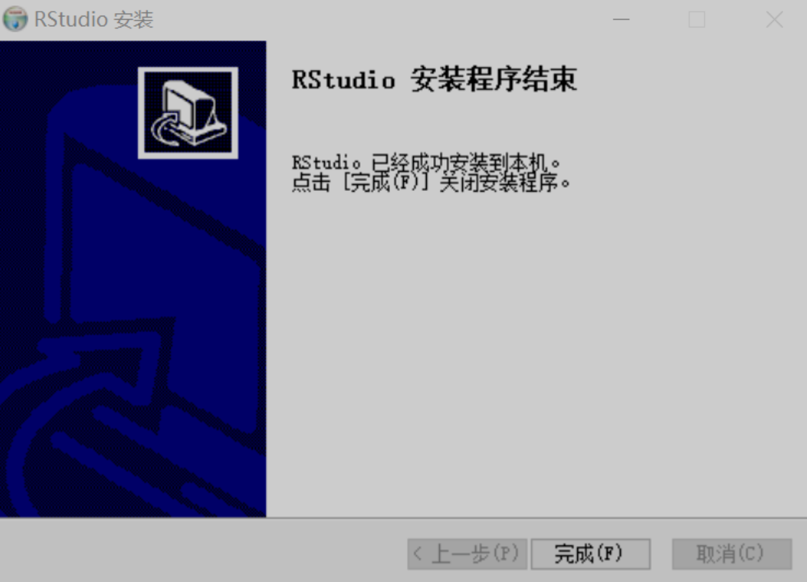
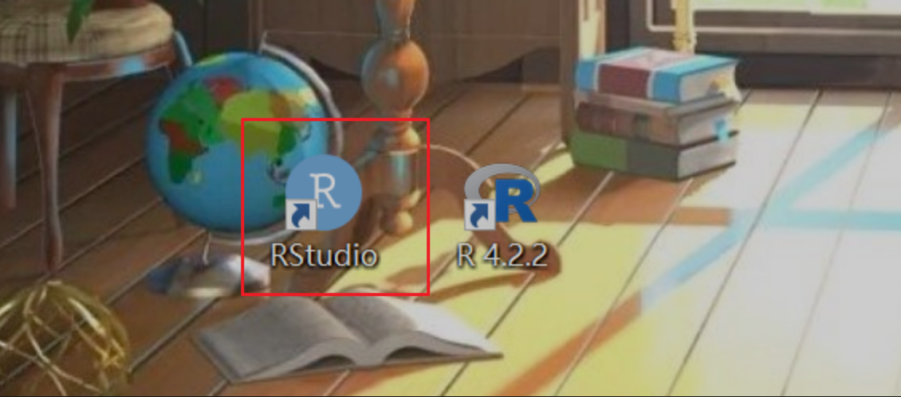
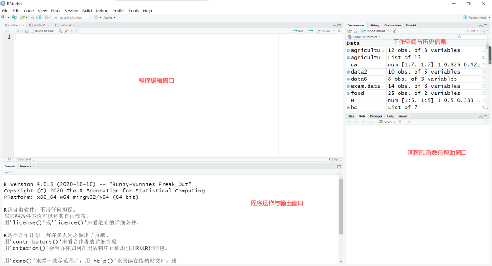

```{r setup, include=FALSE, warning=FALSE}
options(digits = 4, 
        dplyr.print_min = 6, 
        dplyr.print_max = 6,
        htmltools.dir.version = FALSE, 
        formatR.indent = 2, 
        width = 55
        )

knitr::opts_chunk$set(
                      echo = TRUE, 
                      warning = FALSE, 
                      message = FALSE,
                      fig.width = 6, 
                      fig.height = 4,
                      fig.showtext = TRUE
                      )
```

# R安装与入门

## r与Rstudio的安装

### R简介

R（语言）是一套完整的数据处理、计算和制图软件系统。其功能包括：数据存储和处理系统，数组运算工具，完整连贯的统计分析工具，优秀的统计制图功能。R软件具有简便而强大的编程语言工具。

官方的 R 软件环境是GNU 软件包中的开源自由软件环境，可在GNU 通用公共许可证下获得。它主要用C、Fortran和 R 本身（部分自托管）编写，为各种操作系统提供了预编译的可执行文件。

R有一个命令行界面。还提供多个第三方图形用户界面，例如集成开发环境RStudio。 RStudio是一个功能强大、节省成本的反删除和数据恢复软件，且具有强大、简洁、易操作的编程软件。RStudio是辅助R进行编辑的语言工具，而它自身不附带R程序。所以必须先安装R软件，再安装RStudio软件，而编程操作都在RStudio中完成。

### R下载

-   官网：

    R官网：<https://www.r-project.org/>

    Rstudio官网：<https://www.rstudio.com/products/rstudio/>

-   百度云：

    链接：<https://pan.baidu.com/s/1lr5ks5FiTgCrS-jrXdNZQQ?pwd=ab5q>

    提取码：ab5q

### R的安装

{width="100%"}

-   选择【R-4.2.1】，右击选择【以管理员身份运行】,选择【中文（简体）】

{width="100%"}

-   打开后会显示安装向导，点击【下一步】开始安装。

{width="100%"}

-   选择安装位置，默认的是C盘，安装路径必须是非中文路径。建议选择其他位置

{width="100%"}

-   以下全部为默认，点击【下一步】，直到完成安装。

{width="100%"}

### 安装Rstudio

-   双击安装程序

-   欢迎界面，点击【下一步】

{width="100%"}

-   选择安装位置：选择与R-4.2.1一样的安装路径。

{width="100%"}

-   一路默认安装，直至完成

{width="100%"}

-   双击Rstudio图标打开



-   Rstudio 初始界面

{width="100%"}

## R入门 {.unnumbered}

推荐教程：李东风 [R语言教程](https://www.math.pku.edu.cn/teachers/lidf/docs/Rbook/html/_Rbook/index.html)
