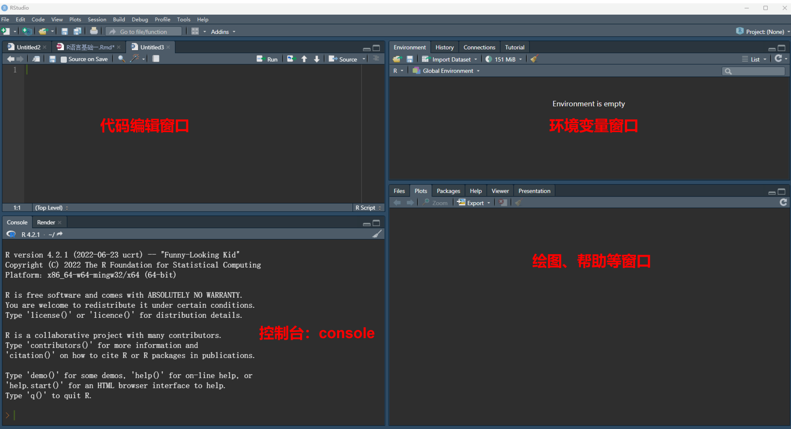
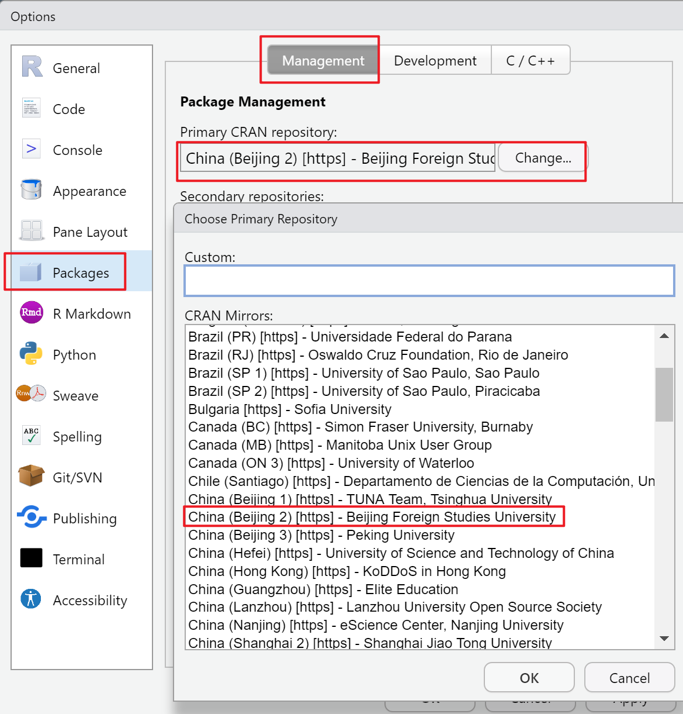
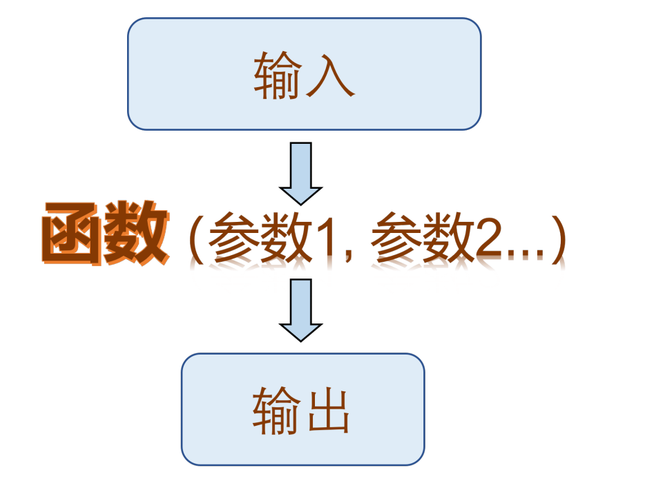
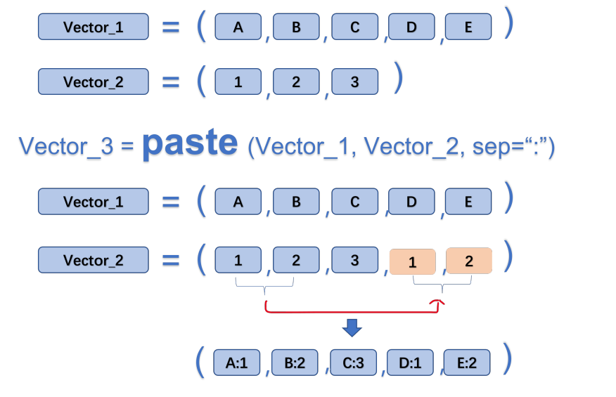

# R入门

```{r setup, include=FALSE}
options(digits = 4, 
        dplyr.print_min = 6, 
        dplyr.print_max = 6,
        htmltools.dir.version = FALSE, 
        formatR.indent = 2, 
        width = 55
        )

knitr::opts_chunk$set(
                      echo = TRUE, 
                      warning = FALSE, 
                      message = FALSE,
                      fig.width = 6, 
                      fig.height = 4,
                      fig.showtext = TRUE
                      )
library(tidyverse)
library(ggplot2)
library(readxl)
library(showtext)
```

## 基础拾遗

### Rstudio 设置

-   初识Rstudio

Rstudio 默认由四个窗口组成，分别为：代码编辑窗口，环境变量窗口，控制台，以及绘图帮助窗口。窗口可以通过拖动分割柱移动。

{width="100%"}

-   个性化

Tools -\> Global Options -\> Appearance -\> 设定喜欢的编辑界面

-   packages 下载镜像设置

Tools -\> Global Options -\> Packages -\> primary CRAN repository -\>changes(选择距离你最近的镜像)

{width="100%"}

```{r eval=FALSE}
# 下载 R 包：
install.packages("tidyverse")  注意打上英文的引号哦！ Ctrl+enter 运行！！
```

```{r}
# 加载 R 包：
library(tidyverse) # 注意并不需要引号哦！
```

**注意！ R 包安装成功后，要及时注释安装语句，避免重复安装。**

```{r}
# install.packages("tidyverse")
```

**注释： R 语言中，在代码前面加 "\#" 号表示该行后面的内容为解释性语句，默认不运行。快捷键:Ctrl+shift+C**

### 创建一个 R 脚本

快捷键 Ctrl+shift+N, 或点击右上角绿色加号 -\> R Script。

R 脚本（后缀名.R）是我们在上面编写程序以实现特定功能的文档。

-   写脚本的注意事项:

1.  脚本不应太长，一个脚本实现一个任务；
2.  养成注释的好习惯 (ctrl+shift+c)；

-   保存脚本：

-   打开脚本：

    如果出现中文为乱码，则点击 File -\> Reopen with Encoding -\> 选择其他中文编码。常见的中文编码类型有； UTF-8， GBK 等。

### 演示：

-   设定工作路径:

```{r eval=FALSE}
# set working directory
setwd("D:\\数据") # 注意：斜杠与反斜杠，双反斜杠的不同
```

-   加载 R 包：

```{r eval=FALSE}
library(tidyverse)
```

-   读取数据:

```{r}
mydata <- read.csv("data/CardiovascularDataset.csv",header = T) 
# header=True 表示有表头
```

这个语句里面， read.csv 表示在当前工作路径下，读取一个名为 data.csv 的文档； header=T 表示表头为真， T 为 TRUE 的缩写。然后，通过赋值符号"\<-"将读取的数据存储在变量 mydata 这里

-   查看数据:

```{r eval=FALSE}
colnames(mydata) #col 为 colnumn 的前三个字母
```

```{r}
# 查看数据结构
str(mydata)# str 为 structure 的前三个字母
```

```{r}
# 查看分类变量的取值（唯一值）
unique(mydata$sex) # 美元符号 $ 表示索引，按变量名索引。
```

```{r eval=FALSE}
unique(mydata$target)
```

### 一些快捷键

1.  窗口可以通过拖动分割柱移动，也可以使用快捷键控制。比如：**Ctrl+shift+1**(2\\3\\4)

2.  创建一个R脚本 ------**Ctrl+shift+N**

3.  快速注释------**Ctrl+shift+C**

4.  善于利用小标题实现功能分区（**ctrl+shift+r**）

5.  **ctrl+alt+r** ------快速插入代码框

6.  注释（Ctrl+shift+c）； \# ；

7.  赋值（Alt+-）： =, \<- ;

8.  函数的标志： ();

9.  变量索引： \$;

10. 管道操作符： %\>%， \|\>：读作 "然后" ;

11. 比较或判断： \>, \< , \>=, \<=, ==, != ；

12. 逻辑运算： &(与), \|(或), !(非) ;

13. 算数运算： +， -， \*， /, \^, %%(取余), %/%(整除)。

## 数据基本操作

### 读取数据

```{r eval=FALSE}
mydata <- read_csv("data/CardiovascularDataset.csv") # 读取数据
# knitr::kable(mydata, align = "c")

colnames(mydata) # 查看表头
str(mydata) # 查看数据结构
unique(mydata$cause) # 查看分类变量的取值（唯一值）
# 其他查看数据的函数
# summary(mydata)
# head(mydata)
# tail(mydata)
```

### 选择数据

```{r}
mydata2 <- mydata |> # 管道操作符： %>% 或者 |> ，读作然后
    filter(sex== 1) |>
    filter(target==1)
mydata2
```

这里面出现了管道操作符号" \|\> ", 这个符号读作：然后。所以这个语句的意思是：首先，选中 mydata，然后，选择 cause 为"HIV/AIDS" 的行，然后，选择年份为 2019 年的行，最后，将选择好的数据赋值给 mydata2。

特别注意： = 是赋值符， == 为判断符。

### 保存数据

```{r eval=FALSE}
write.csv(mydata2, # 将 mydata2 这个数据
"data/sex1_target.csv") # 保存为 HIV.csv 文件

save(mydata2, file = "mydata2.Rdata")
load("mydata2.Rdata")
```

## 数据类型与数据结构

### 常见的数据类型

R 语言常见数据类型有：数值类型（numeric），字符串（character），逻辑（logical），其他： POSIXct,POSIXt 等。

-   数值类型： 1， 2， 3， 4.5,3.8;

```{r}
class(1)
typeof(4.5)
```

-   字符串类型："字符"， "123"， "ASIR"， "HIV"

```{r}
class("123")
typeof("ASIR")
```

-   逻辑： TRUE， FALSE, T, F;

```{r}
class(T)
typeof(FALSE)
```

### 特殊数据类型： NaN,Inf， NA， NULL

-   NaN:Not a number, 计算出错时候出现，比如 0/0,Inf/Inf

-   Inf : 无穷

-   NA：not availabel，缺失值。 NA 值具有传染性，任何数值与之发生关系均会变为 NA

-   NULL：空值。空值与 NA 的区别：比如一个教室稀稀拉拉坐了十几个学生，那么没有学生的位置可以视为缺失，而空值表示连座位也没有。

### 数据类型的转换

-   numeric 与 logical 可以转化为 character，而 character 转化为 numeric 或者 logical 有可能出错，产生 NA 值。

```{r}
a <- as.character(1990)
class(a)
```

```{r}
b <- as.numeric("1990")
class(b)
```

```{r}
c <- as.numeric("ABC")
## Warning: 强制改变过程中产生了NA
c
```

-   logical 可以转化为数值 0/1, 而在进行逻辑判断的时候， 0/1 也会被认为是 F/T

```{r}
as.numeric(TRUE)
as.logical(1)
```

### 数据结构

-   标量

单个元素组成的数据结构，比如"A",123,TRUE 等。

\### 向量

多个标量组成的一维的数据结构，比如 Vector。

```{r}
# 生成向量
a <- c(1990:2019)
a
b <- c(1,2,3,4,5,6)
b
c <- rep("A",3) #repeat 前三个字母
c
d <- seq(from=1,to=10,by=2) #sequence 前三个字母
d
```

-   矩阵 (matrix)，数据框 (data.frame)， tipple

-   列表 (list) 与数组 (array)

## 函数

### 函数的结构

R 语言函数一般由三个部分构成：函数体（body），参数（formals） , 环境（environment）。可以通过相应的函数查看函数的相应部分。以常见的 "粘贴" 函数 paste() 为例：

```{r}
# paste() 函数可以将两个向量对应的元素粘贴在一起。
a <- c("A","B","C")
b <- c(1:3)
c <- paste(a,b,sep = ":",collapse = NULL)
c
```

我们分别使用 body， formals, environment 函数查看 paste() 函数的相应部分。

```{r}
# 查看函数结构
body(paste)
# 查看函数参数
formals(paste)
# 查看函数来自哪个包
environment(paste)
```

### 函数的功能

函数就像一个加工厂，可以将 "原料" 通过一系列转变，然后输出相应的 "产品"

{width="100%"}

这里的输入，可以是某个值、向量、 data.frame，或者是其他类型的数据；

输出，可以是数据，文档，图片等等。

### 函数的分类

R 语言的函数包括内置函数，外来函数（R 包），自编函数三大类。

-   实用的内置函数

```{r eval=FALSE}
# 查看R语言自带数据集
data()
# 描述性统计类
sum()
cumsum()
mean()
median()
sd()
quantile()
# 生成随机数
runif(n = , min = , max = ) # uniform，生成 n 个服从均匀分布的小数
round(runif(n=,min=,max=),# round() 函数空值小数点的位数
      digits = 0)# 生成 n 个服从均匀分布的整数
```

-   实用的外来函数（tidyverse）

```{r eval=FALSE}
# 根据变量取值进行筛选
filter()
# 选择变量
select()
# 生成变量
mutate()
# 排序
arrange()
# 分组统计
group_by() |>
  summarize()
```

-   演示（使用R自带数据）

```{r}
# 加载数据
data("ToothGrowth")
# 查看表头
colnames(ToothGrowth)

# 查看数据结构
str(ToothGrowth)

# 查看分组变量的取值
unique(ToothGrowth$supp)

# 生成变量（生成两个标签）
ToothGrowth <- ToothGrowth |>
  mutate(剂量=ifelse(dose==0.5,"0.5mg",
                   ifelse(dose==1.0,"1.0mg","2.0mg"))) |>
  mutate(补充喂养=ifelse(supp=="VC"," 维 C"," 橙汁"))

# 分组统计
summary_data <- ToothGrowth |>
  group_by(补充喂养, 剂量) |>
  summarize(
    n=n(),
    mean=mean(len),
    sd=sd(len))
```

-   自编函数

### 查看函数帮助

```{r eval=FALSE}
# 如果知道具体的函数名字：
? # 查看函数的帮助，比如 ?filter
help() # 同？
?? # 查看 R 包的帮助，比如??dplyr
# 如果不知道具体的函数名字
apropos("norm")# apropos: 就... 而言
```

## 向量及其操作

向量为一系列标量的集合

### 创建向量

```{r eval=FALSE}
c()
seq()
rep()
```

### 向量的类型

-   字符串，数值， logical 类型

```{r}
# 字符串型：
a <- c("A","A","B","B","C","C")
# 数值类型
b <- c(1:10)
# logical 类型
c <- c(T,T,F,F)
```

-   因子类型

R 语言有一类非常重要的变量类型，名为因子（factor）。因子可以视为分类变量的特殊类型，它既有值，又对值进行了排序（levels）。

```{r}
# 如何生成因子
name1 <- c(0,1,2)
name2 <- factor(name1,
                levels = c(0,1,2), #levels 必须与原始数据取值相同
                labels = c("Male","Female","Both")) #labels 是为了
class(name1)
class(name2)
```

### 向量的运算

```{r}
# 简单统计
a <- c(1:20)
mean(a)

# 算数运算
b <- 2*a # 标量与向量
c <- b+a # 标量与向量
```

### 重要：向量的循环补齐机制

```{r}
a <- c("A","B","C","D","E")
b <- c(1:3)
c <- paste(a,b,sep = ":")
c
```

{width="100%"}

### 交、并、补

```{r}
# 向量的交、并、补集，找不同，找相同，找不同（背熟）

# 取交集
a <- c(1:15)
b <- c(10:20)
intersect(a,b) 

# 取并集
union(a,b)

# 找不同
setdiff(a,b)
setdiff(b,a)

# 去除重复
aa <- c(rep("A",3),4:6)
unique(aa)
```

### 向量的下标索引

```{r}
# 已经知道向量 x
x <- c(" 张三"," 小明"," 王五"," 李思齐")
# 如何选择李思齐？
x[4]

# 如何同时选择小明与李思齐？
x[c(2,4)]

# 如何不选择张三
x[-1]
```

## 数据框及其操作

数据框是 R 语言最常用的二维表。

### 生成数据框

```{r eval=FALSE}
# 通过 read.csv 函数等读取
df <- read_csv()
```

```{r}
# 通过向量组合生成
age <- c(20,30,18,26)
name <- c(" 赵"," 钱"," 孙"," 李")
score <- c(99,65,77,88)
df <- data.frame(age=age,
                 name=name,
                 score=score)
```

### 数据框的下标索引

```{r}
# 数据框下标索引中间有逗号，逗号前表示行，逗号后表示列 [row,col]
# 选择 df 前两列
df[,2] # 空着表示全选

df[2,] # 选择 df 前两行

df[2,2] # 选择 df 第二行第二列

df[-3,] # 不选择第三行

df[c(1,3),2] # 选择 1， 3 行； 2 列

df[df$name==" 李",] # 选择姓李的数据
```

### 数据框如何生成新的列

```{r}
# 比如生成身高数据
height <- c(178,180,169,175)
df$height <- height
df
```
