---
---
---

```{r setup, include=FALSE, warning=FALSE}
options(digits = 4, 
        dplyr.print_min = 6, 
        dplyr.print_max = 6,
        htmltools.dir.version = FALSE, 
        formatR.indent = 2, 
        width = 55
        )

knitr::opts_chunk$set(
                      echo = TRUE, 
                      warning = FALSE, 
                      message = FALSE,
                      fig.width = 6, 
                      fig.height = 4,
                      fig.showtext = TRUE
                      )
```

# MIMIC数据库介绍

## 数据库简介

### 基本情况

MIMIC （官网：<https://mimic.mit.edu/>）是一个重症医学数据库，全称是Medical Information Mart for Intensive Care。2003年，在NIH的资助下，来自贝斯以色列女执事医疗中心(Beth Israel Deaconess Medical Center)、麻省理工(MIT)、牛津大学和麻省总医院(MGH)的急诊科医生、重症科医生、计算机科学专家等共同建立的一个数据库。

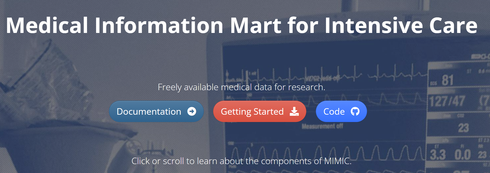{width="100%"}

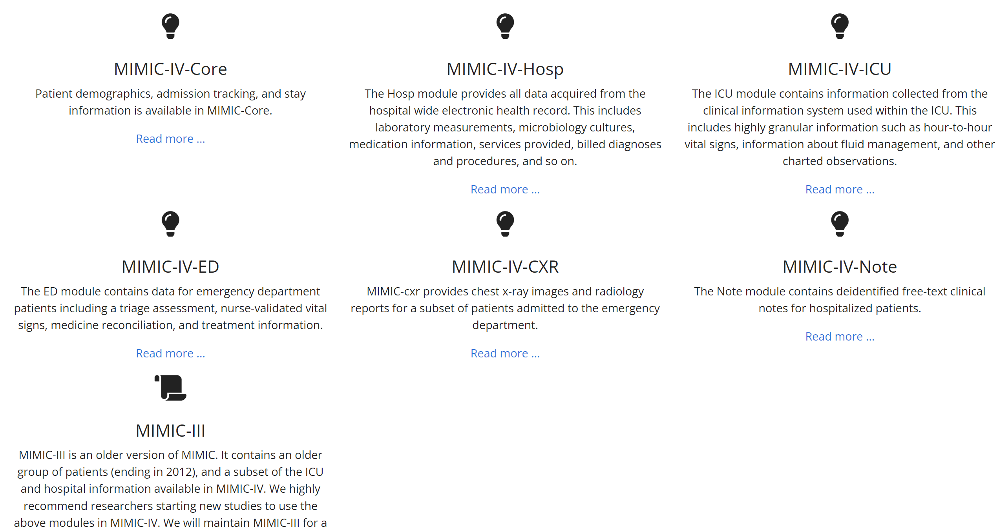{width="100%"}

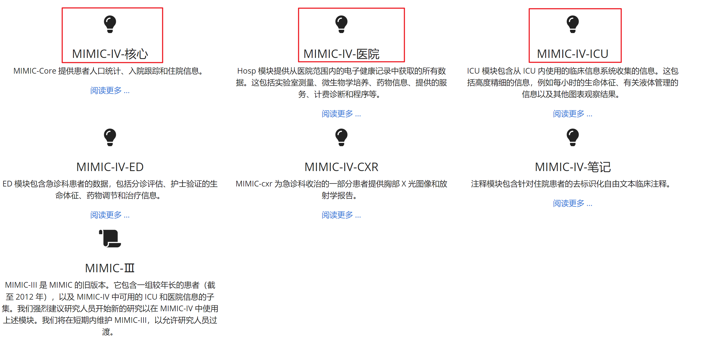{width="100%"}

在进行隐私数据脱敏后，提供了数十万患者在急诊和ICU治疗期间基本信息（年龄、性别、基础病史），住院期间完整的诊疗信息（治疗措施、药物，生命体征、实验室检查等）以及临床结局等信息。让临床医生无需经过痛苦的收集信息的过程就可以接触到数十万患者的海量临床信息，验证自己的临床思路，发表高质量文章。

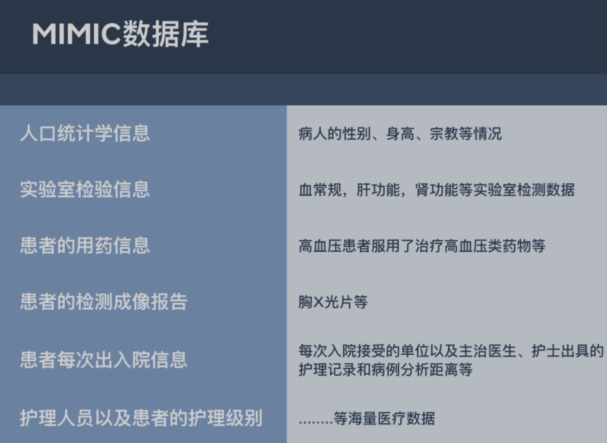{width="100%"}

### 版本介绍

MIMIC从开发至今，共存在三个大版本：MIMIC-II，MIMIC-III，MIMIC-IV。

-   MIMIC-II：MIMIC-II包含2001-2008年的数据。数据是主要从CareVue监视器收集的。MIMIC-II现在已不再公开，但如果想要提取数据，可以从MIMIC-III中获取数据，利用筛选数据库来源为CareVue来提取MIMIC-II的数据。

-   MIMIC-III：MIMIC-III包含2001-2012年的数据。患者数据是从Metavision和CareVue两个地方采集的。MIMIC-III 数据库当前最新版本是v1.4。这个版本是在2016年9月2日发布，此次发布提高了数据库中的数据质量，为Metavision数据库中的病人提供了大量的补充数据。MIMIC-III v1.4从2016年至今，未再进一步的修正，这也是MIMIC-III 数据库的最终版本。

-   MIMIC-IV：MIMIC-IV是对MIMIC-III的更新，MIMIC-IV包含2008年至2019年（含）的数据。最近推出的生物标志物将可用。MIMIC-IV来自两个院内数据库系统：一个是定制的医院范围的数字电子健康记录（EHR）、一个是重症监护室（ICU）特定的临床信息系统。目*前已更新到2.1版本（2022.11.16更新）*。[由于小版本刚更新不稳定，本次主要已**2.0版本**为基础进行介绍。]{.underline}

### MIMIC-IV创建流程

-   **收购**

    从各自的医院数据库中提取了入住BIDMC急诊室或其中一个重症监护病房的患者的数据。创建了一个主患者列表，其中包含与2008年至2019年期间入住ICU或急诊室的患者相对应的所有医疗记录编号。所有源表都筛选为仅与主患者列表中的患者相关的行。

-   **制备**

    从各自的医院数据库中提取了入住BIDMC急诊室或其中一个重症监护病房的患者的数据。创建了一个主患者列表，其中包含与2008年至2019年期间入住ICU或急诊室的患者相对应的所有医疗记录编号。所有源表都筛选为仅与主患者列表中的患者相关的行。

-   **去识别化**

    HIPAA 规定的患者标识符已被删除。使用随机密码替换患者标识符，导致患者，住院和ICU住院的整数标识符去识别化。结构化数据是使用查找表格和允许列表过滤的。如有必要，应用了自由文本去识别化算法从自由文本中删除 PHI。[**最后，日期和时间使用以天为单位的偏移量随机移动到将来。为每个subject_id分配了一个日期班次。因此，单个患者的数据在内部是一致的。**]{.underline}例如，如果数据库中两个度量值之间的时间在原始数据中为4 小时，则 MIMIC-IV 中计算的时间差也将为 4 小时。相反，不同的患者在时间上不具有可比性。也就是说，[**2130年入院的两名患者不一定在同一年入院**]{.underline}。

### MIMIC-IV内容组成

MIMIC-IV主要分为三大模块，分别是**core、hosp、icu**。

-   **core** 模块存储使用MIMIC-IV进行任何数据分析所需的患者跟踪信息。内容包含三个表：**入院表**、**患者表**和**转移表**。这些表提供了患者的人口统计数据、每次住院的记录以及住院期间每个病房住宿的记录。

    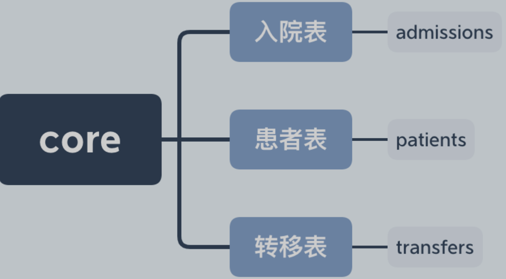{width="100%"}

-   **hosp** 模块包含从医院范围的EHR 派生的数据。这些测量结果主要记录在**住院期间**，尽管有些表格也包括来自医院外的数据（例如，在实验室活动中进行的门诊实验室检查）。信息包括**实验室测量**、**微生物培养**、提供者订单、药物管理、**药物处方**、医院账单信息和服务相关信息。

    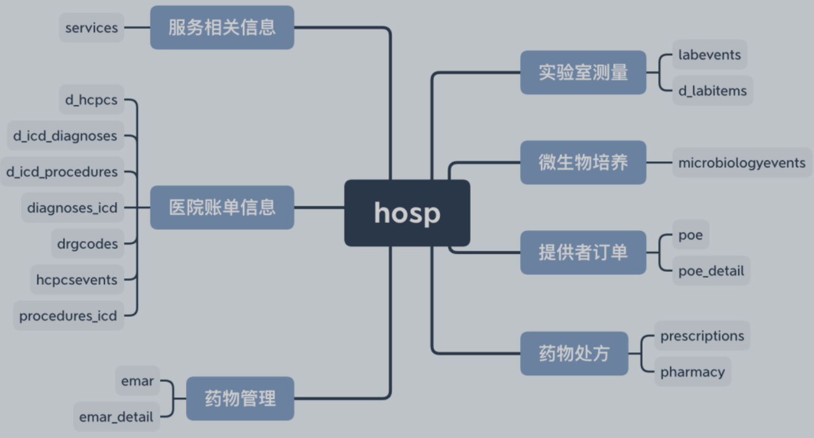{width="100%"}

-   **icu** 模块包含来自BIDMC：MetaVision（iMDSoft）的临床信息系统的数据。MetaVision表被非规范化以创建一个星形架构，其中icustays和d_items表链接到一组数据表，所有数据表都以"事件"为后缀。icu模块中记录的数据包括**静脉注射和液体输入**（输入事件）、患者输出（输出事件）、程序（程序事件）、记录为日期或时间的信息（日期时间事件）以及**其他图表信息（图表事件）**。所有事件表都包含一个stay_id列，用于识别icustays中的相关ICU患者，以及一个允许识别d_items中记录的概念的 itemid 列。

    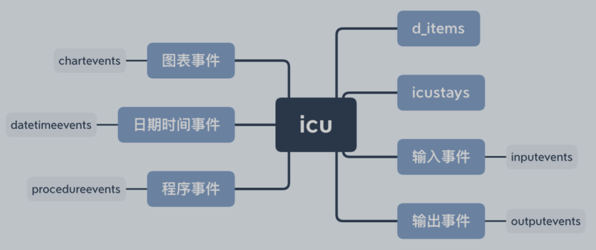{width="100%"}

-   数据总览

    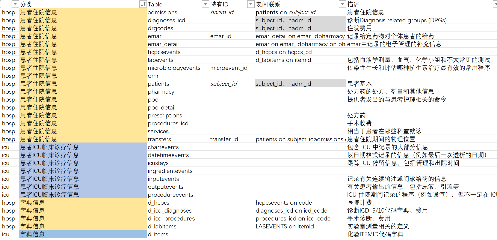{width="100%"}

## 数据库申请

### 注册Physionet账号

-   进入网址：[www.physionet.org](www.physionet.org)，注册账号。

    建议使用机构/学校邮箱申请，注册后邮箱会收到激活账号链接，点击网址激活。

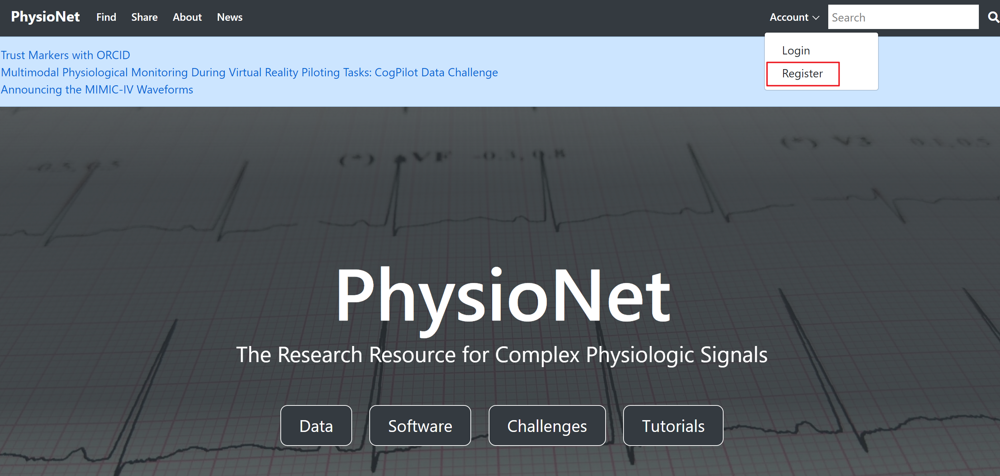{width="100%"}

-   登录后选设置

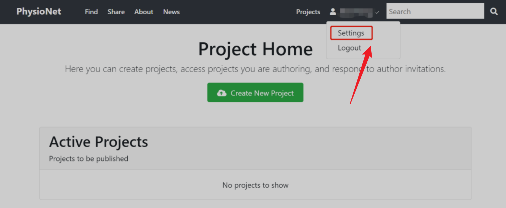{width="100%"}

-   然后点Credentialing，apply for access

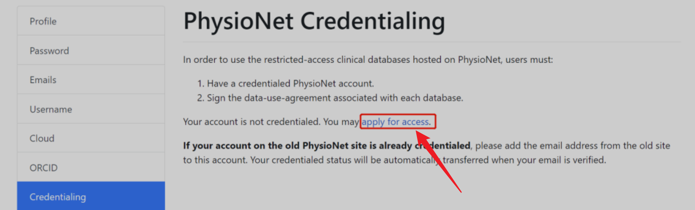{width="100%"}

就会提示你为了获得认证，需要通过相关培训认证，培训认证，是在CITI这个网站提供的。

### 注册CITI账号

①复制这句话："Massachusetts Institute of Technology Affiliates"，表示是MIT附属单位，这样才能免费获取课程。

②在Physionet网页上点击或者直接访问（[https://about.citiprogram.org](https://about.citiprogram.org/，点Register)），注意要贴上之前复制的文字。

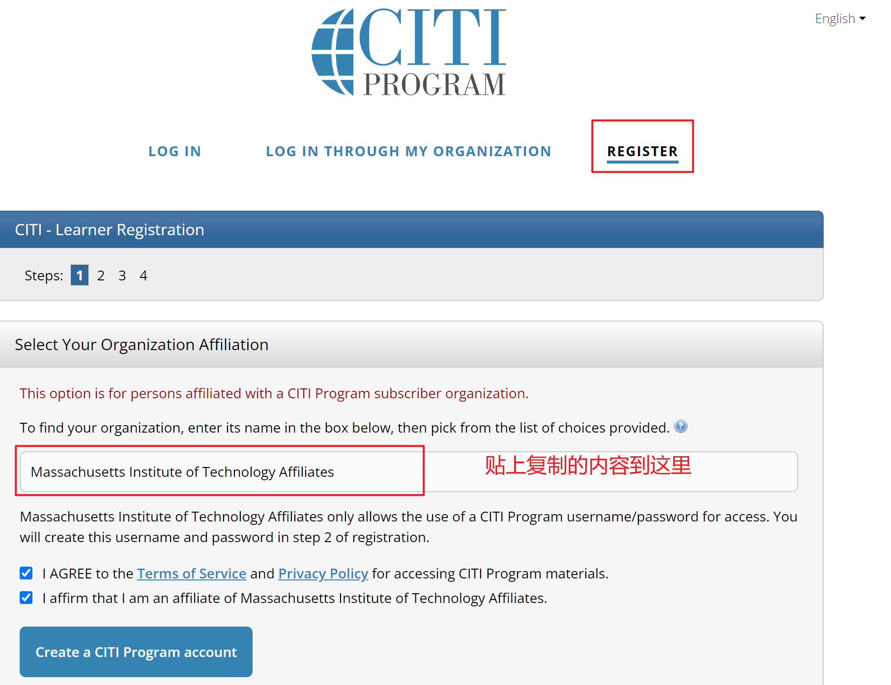{width="100%"}

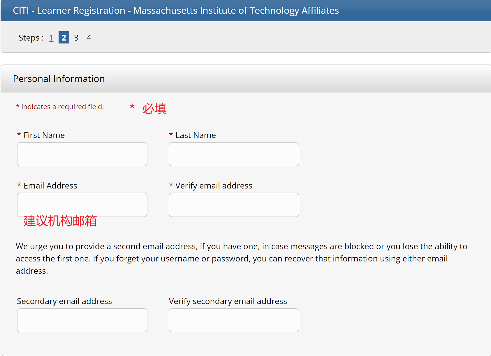{width="100%"}

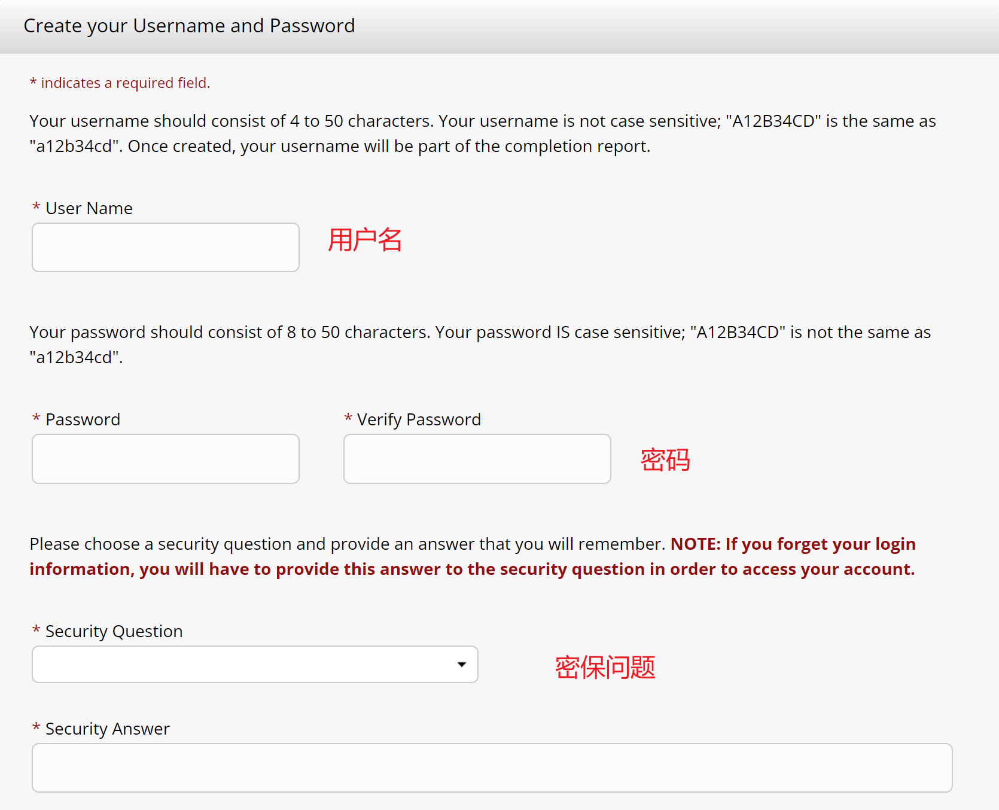{width="100%"}

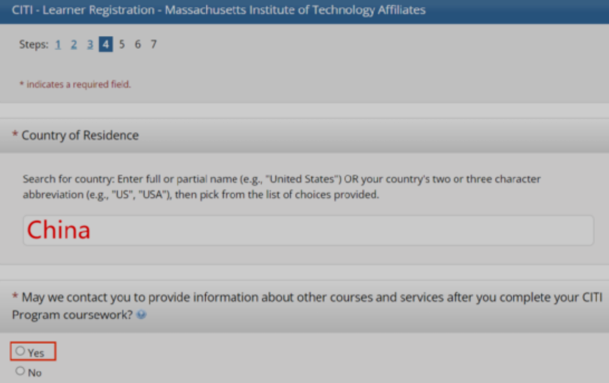{width="100%"}

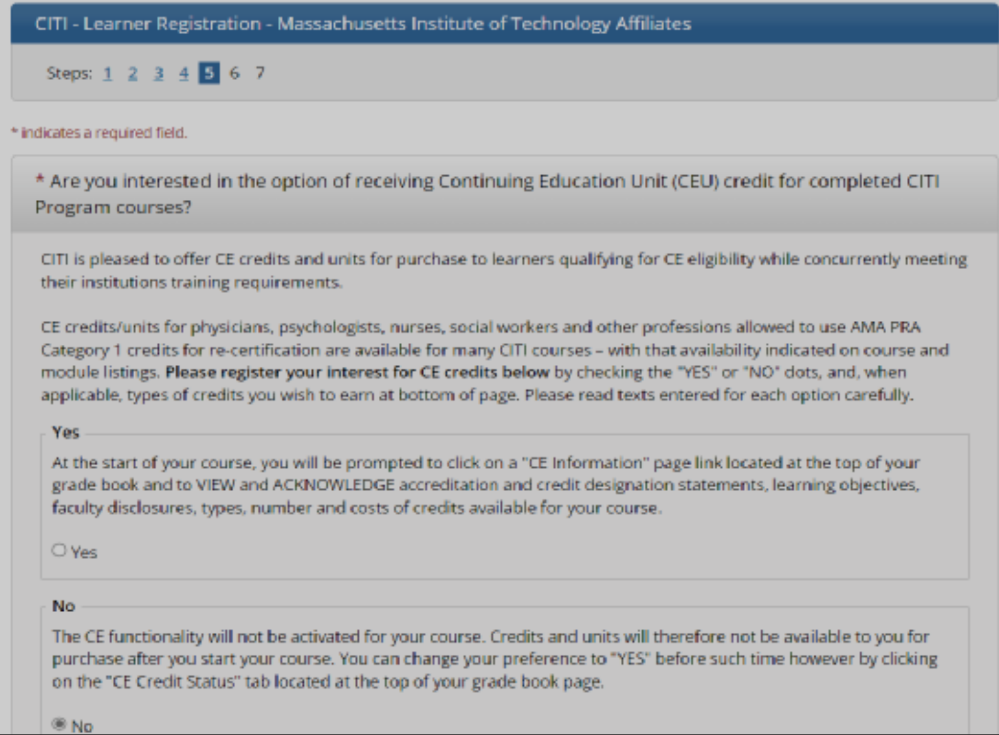{width="100%"}

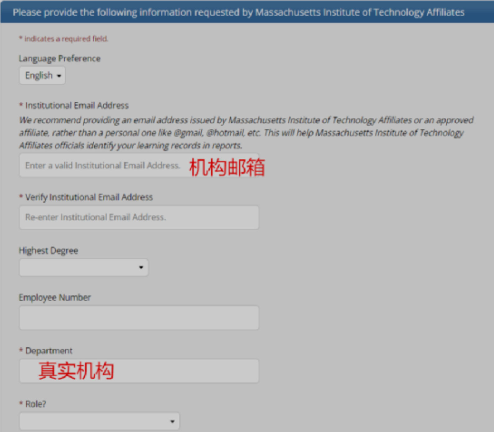{width="100%"}

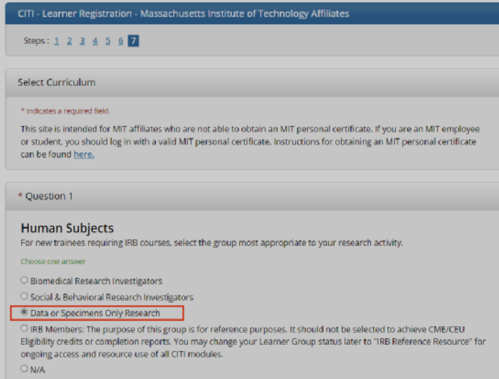{width="100%"}

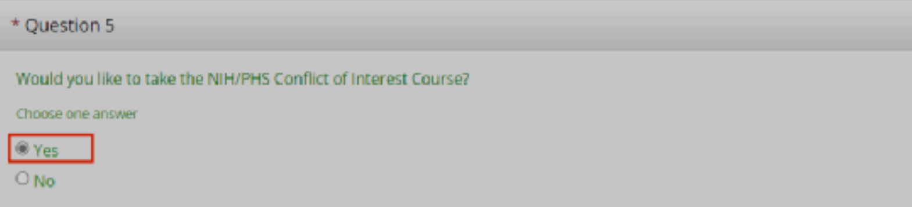{width="100%"}

-   注册完成，登录进去就可以看到课程。

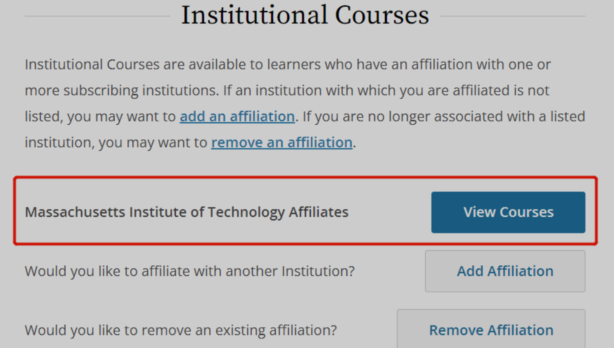{width="100%"}

两个都考

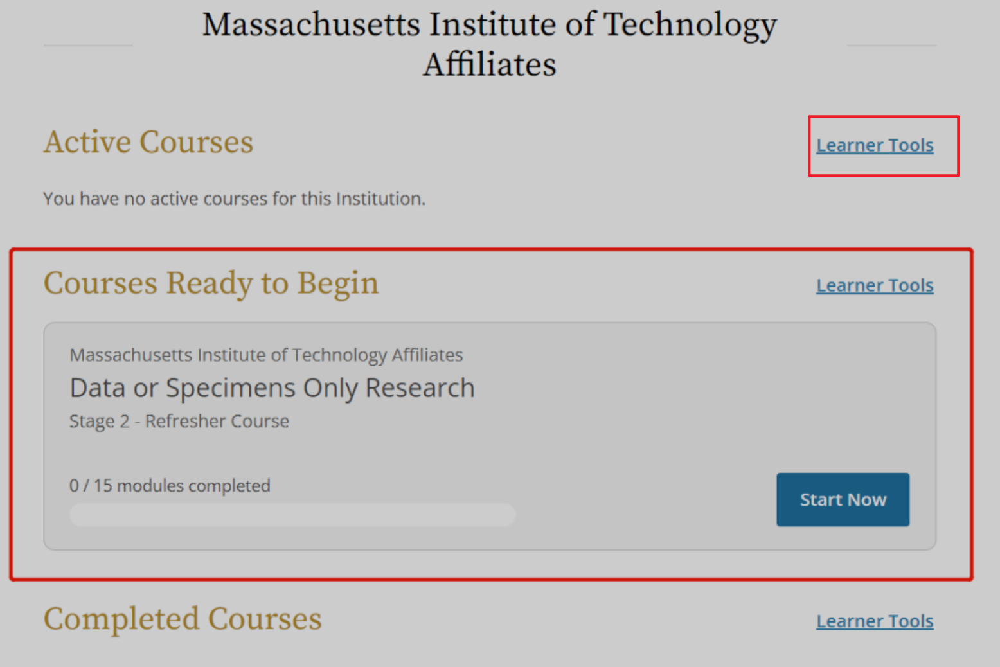{width="100%"}

第一门有两个模块，第二门有九个模块。

**考试可反复参加，90%以上正确率才合格，完成考试后需下载报告。**

> 部分试题答案：
>
> Which of the followingproposed studies would constitute human subjects research as defined under thefederal regulations?
>
> A researcher from a school of social workobtains access to students' academic records (including identifiableinformation) to assess the effect of drug awareness programs on studentacademic achievement.
>
>  
>
> Which of the followingactivities meets the federal definitions of research?
>
> Collection of elementary school test scoresto evaluate the effectiveness of an experimental program to teach reading
>
>  
>
> Which of the followingconstitutes both a breach of a confidentiality (the research data have beendisclosed, counter to the agreement between researcher and subjects) and aviolation of subjects' privacy (the right of the individuals to be protectedagainst intrusion into their personal lives or affairs)?
>
> A faculty member makes identifiable dataabout sexual behavior available to graduate students, although the subjectswere assured that the data would be de-identified.
>
>  
>
> Which of the following isa measure researchers can use to protect the confidentiality of subject data?
>
> Keep sensitive and identifiable data inencrypted files on a password protected hard drive.
>
>  
>
> When the primarypotential harm is the breach of individually identifiable data, to protectagainst such disclosure the researcher should.
>
> Encrypt the data and store it in passwordprotected files.
>
>  
>
> Which of the followingstatements about individually identifiable research data is correct?
>
> Researchers may be required to releaseindividually identifiable information outside the research setting.
>
>  
>
> Which of the followingresearch activities with children qualifies for exemption?
>
> A researcher observing children in aplayground to identify bullying behaviors.
>
>  
>
> In accordance withfederal regulations, which of the following statements best describes whenresearch with children may be exempt?
>
> Only certain exemption categories can beused with research involving children.
>
>  
>
> Which of the followingactivities constitutes engagement in research?
>
> Obtaining informed consent and conductingresearch interviews.
>
>  
>
> If federally fundedresearch involves collaboration with an organization that is"engaged" in research in a foreign country, the foreign organizationcan rely on the US researcher's institution's IRB for its review.
>
> \
>
>  
>
> Which of the followingpractices is an example of how the principle of beneficence is applied to astudy involving human subjects?
>
> Ensuring that risks are reasonable inrelationship to anticipated benefits.
>
>  
>
> A researcher fails toinform subjects about the risks and benefits of being in a focus group. Whichof the following describes the ethical principle violated by the researcher?
>
> Respect for persons
>
>  
>
> When evaluating risks ofharm IRBs must determine that:
>
> isks are reasonable in relation toanticipated benefits.
>
>  
>
> According to the criteriafor IRB approval, when considering equitable treatment of subjects, specialcare must be taken with which of the following populations?
>
> prisoners
>
>  
>
> Which statement iscorrect about informed consent?
>
> It requires disclosure of any benefits tothe subject or to others that may reasonably be expected
>
>  
>
> The informed consentdocument, regardless of the research topic, must always include the following:
>
> A statement describing the extent, if any,to which confidentiality of records identifying the subject will be maintained.
>
>  
>
> A graduate student inCommunications intends to write her thesis, as part of a federally-fundedstudy, on the effect of print versus televised media on people's daily lives.The researcher wishes to conduct the study in a local prison because of limitedresources for subject recruitment. The subjects will be asked for 15 minutes oftheir time. The questionnaire appears innocuous and the risks appear to beminimal. The IRB should:
>
> Not approve this project because theresearch question could be answered without the participation of prisoners.
>
>  
>
> A researcher wishes toconduct a study on the relationship between paternal care giving (that is, thecare the prisoner subjects received as children from their fathers) andincarceration, using a short 15-minute survey. Which category applies to thisresearch?
>
> Study of the possible causes, effects, andprocesses of incarceration, and of criminal behavior, provided that the studypresents no more than minimal risk and no more than inconvenience to thesubjects (Category i)
>
> Comment
>
>  
>
> Providing parentsinformation about a study, in lieu of active parental permission, is allowedwhen:
>
> An IRB has approved a waiver of therequirement for parental permission
>
>  
>
> When research isconducted in educational settings with children, when is the assent ofpotential student subjects required?
>
> When the IRB has determined that studentsare capable of providing assent.

### 上传成绩单及个人信息，等待人工审核

考试通过后，回到Physionet，acount，credentialing那里，把所有的信息都填上，上传CITI的成绩单，提交申请，等待通过，注意Reference这里一定要认真填写，邮箱要正确。

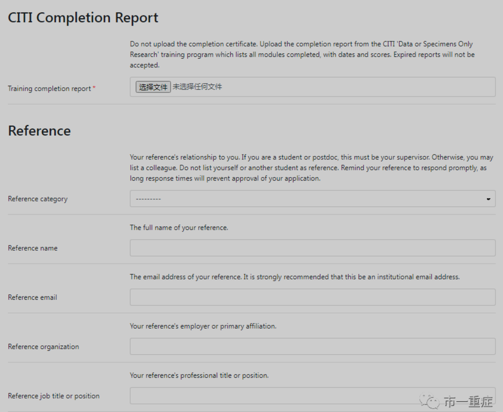{width="100%"}

-   等待.....邮件通知通过注册。

### 通过后签署同意书，下载数据

审核通过后，就可以在Physionet首页，Data这里点击进去，下载数据，你会看到，除了MIMIC以外，这里还有好多其他数据集。

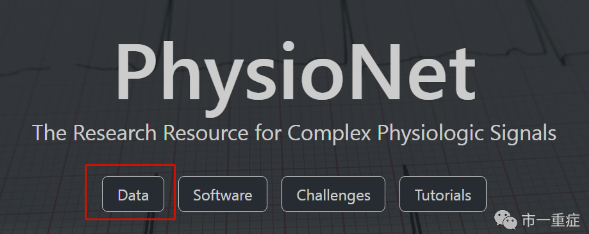{width="100%"}

## 数据库下载与安装

### 数据下载

通过注册后，进入<https://physionet.org/content/mimiciv/2.0/> 签署知情同意

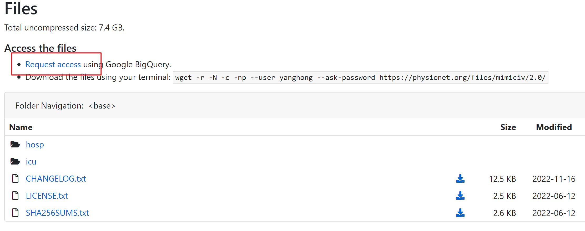{width="100%"}

正常是在Files有一个下载的链接：

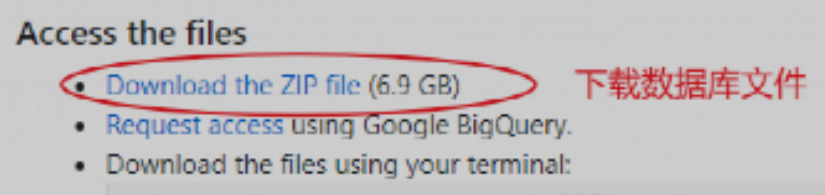{width="50%"}

但是由于版本更新，2.0目前无下载链接。

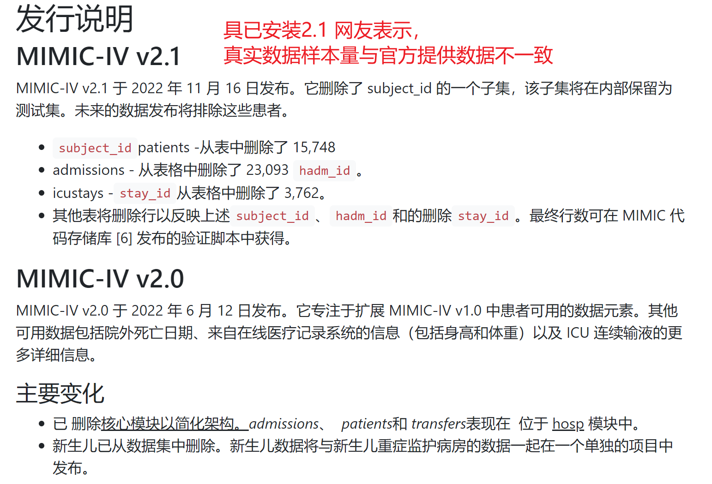{width="100%"}

所以使用我提供的数据进行演练（**仅供内部练习使用，没有获得权限无法发表文章**）

百度云地址：（留好足够空间，建议80G以上）

<https://pan.baidu.com/s/1FMYJh4IFuqMpH1f69OuJXw?pwd=ed5c>

提取码：ed5c

### 数据安装

#### 官方教程的安装

> 安装比较难....流程都一样，但会出现各种莫名奇妙的问题，推荐几个安装教程，大家自己尝试下。
>
> 1.  [MIMIC-IV数据库安装过程更简化（电脑小白保姆版）](https://mp.weixin.qq.com/s?__biz=MzIyMTEyOTEzNg==&mid=2247520947&idx=1&sn=68496f2fef007667a34a080b95bab421&chksm=97c3a26ca0b42b7a784a8db0afba3c84d9966bd49ff7fb1b4347e632a66e55529ddf773fd1b9&scene=21#wechat_redirect)
> 2.  [手把手教你MIMIC-IV数据库安装](https://mp.weixin.qq.com/s?__biz=MzIyMTEyOTEzNg==&mid=2247505644&idx=1&sn=cc5192e325c63f2670147923a993fcf4&scene=21#wechat_redirect)
> 3.  [前方有雷！MIMIC-IV数据库安装排雷指南](https://mp.weixin.qq.com/s?__biz=MzIyMTEyOTEzNg==&mid=2247511241&idx=3&sn=2689e66ec9850f567d81577f7dfd9054&chksm=97c39c16a0b41500b05f77b2c036fbadb8482953c8fee958a79f6ed858ba368e1a67a3cafca5&scene=21#wechat_redirect)
> 4.  [智慧ICU](https://mp.weixin.qq.com/mp/appmsgalbum?__biz=MzI3OTkxNjEyNw==&action=getalbum&album_id=1844026174826446849&scene=173&from_msgid=2247485252&from_itemidx=1&count=3&nolastread=1#wechat_redirect)

-   我们再次进入mimic官网（<https://mimic.physionet.org/gettingstarted/access/>）

-   点击getting started，拉到下面点击 Local database setup

    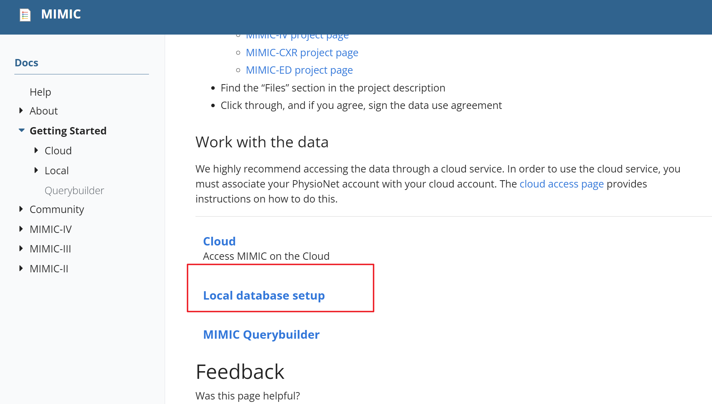{width="100%"}

-   [按照教程页面安装](https://mimic.mit.edu/docs/gettingstarted/local/install-mimic-locally-windows/)PostgreSQL、7-zip，随后在命令框输入教程代码进行配置数据库即可。

    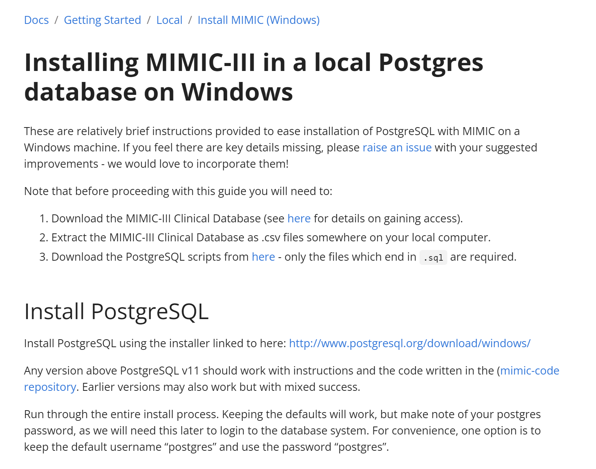{width="100%"}

#### Navicat 的安装

按照官方教程安装完成后，下面再进行安装Navicat软件，[官网](http://www.navicat.com.cn/)提供14天免费的试用功能。大家可以下载安装（提供的百度云链接里也有安装包）。

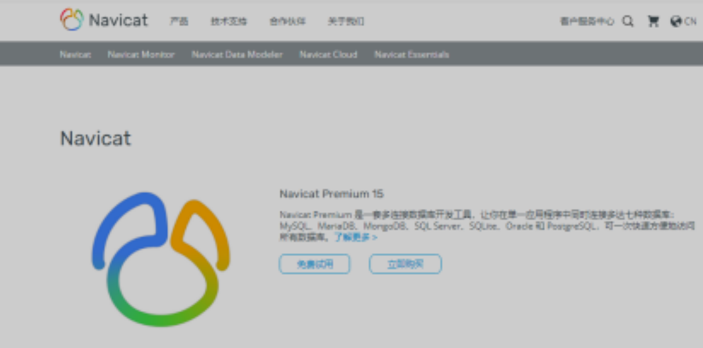{width="100%"}

-   打开Navicat，点击连接-PostgreSQL，如下图；

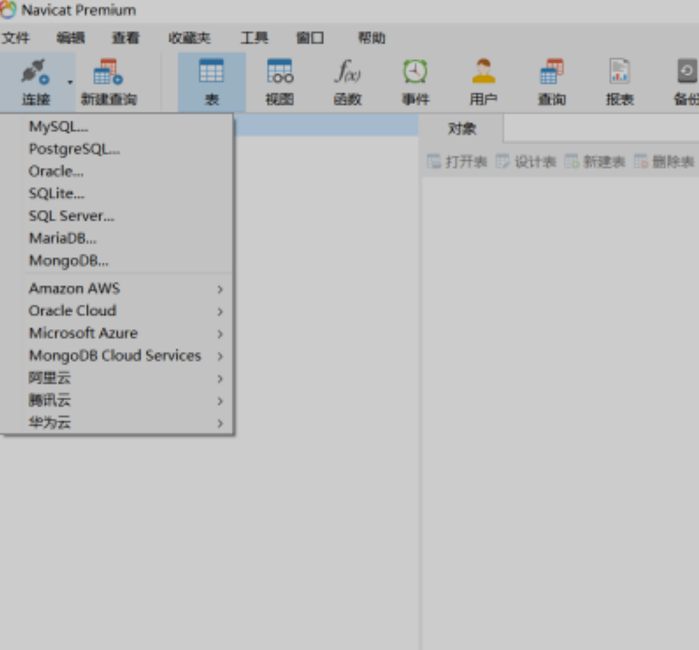{width="100%"}

-   进入如下界面，在连接名里随意输入名称，密码填之前设置的超级管理员postgres的密码；

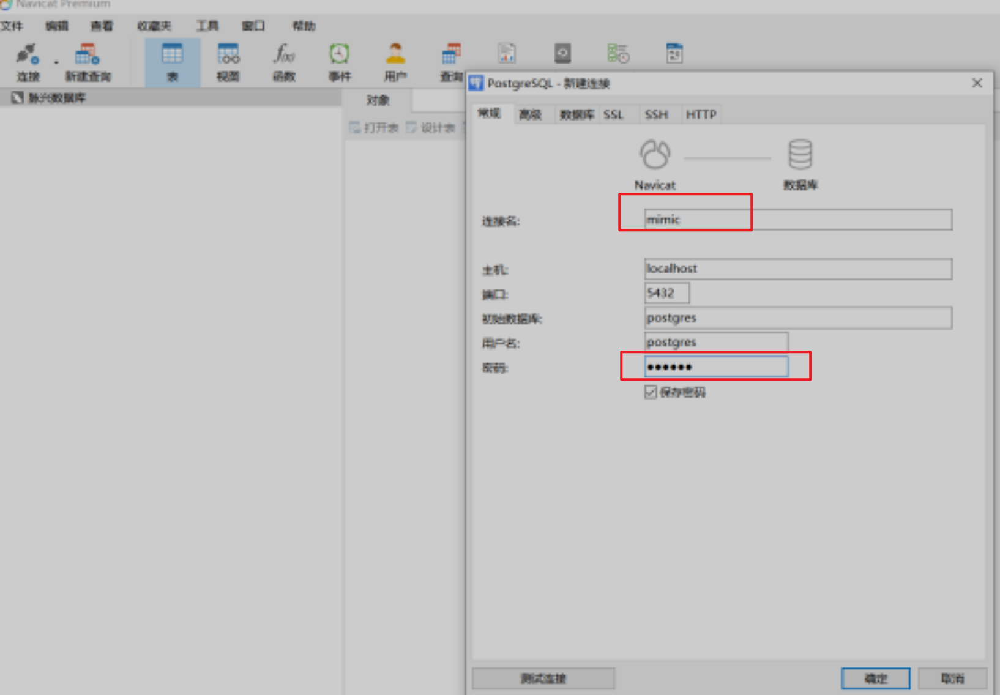{width="100%"}

-   点击确定，连接成功，这是可在左侧看到我们连接到的mimic iv数据库。

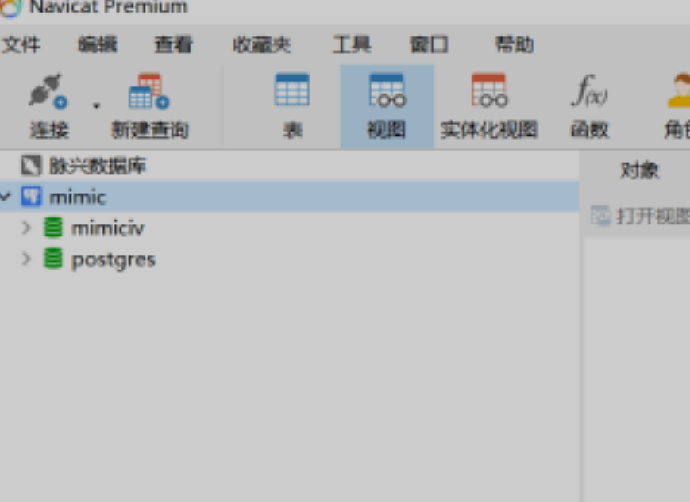{width="100%"}

-   观看\<科研杂录\>安装教程

## 数据提取
