# 关于课程 {.unnumbered}

## **课程目标** {.unnumbered}

-   了解临床预测模型相关概念与构建流程

-   了解Python与R语言基本使用与案例实操

-   了解MIMIC与NHANES公共数据库

## **课程大纲** {.unnumbered}

### **案例教学** {.unnumbered}

1.  **临床预测模型概述**
    -   应用场景

    -   模型构建流程

    -   模型报告

    -   传统统计与机器学习
2.  **案例介绍**
    -   案例背景

    -   数据描述

    -   分析思路

    -   代码预览

### **实操教学** {.unnumbered}

1.  **Anaconda安装与包的安装**

    -   如何打开.ipynb文件

    -   Anaconda Prompt 基本命令

    -   使用**conda**或**pip**安装包

2.  **Python入门基**础

    -   数据读取

    -   模型构建等基础语法

    -   案例实操：代码与对应结果详细解释

        -   数据描述

        -   数据预处理

        -   模型构建

3.  **R安装与入门**

    -   数据读取

    -   模型构建等基础语法

    -   案例实操：代码与对应结果详细解释

4.  **NHANES**数据库简介、数据提取

5.  **MIMIC IV 数据库**简介、申请、安装、提取

## **上课要求** {.unnumbered}

-   自带电脑（课程以windows系统为例）

-   软件安装、代码运行实操

## **如何提问** {.unnumbered}

-   鼓励先自己动手查询（[baidu](www.baidu.com)、[biying](https://cn.bing.com/)、[github](https://github.com/)、[CSDN](https://www.csdn.net/)）

-   想获得快速帮助，请描述以下内容（**问题截全图**）

    -   想解决的问题是什么？

    -   代码是什么？

    -   报错信息是什么？

## **课程用到的软件** {.unnumbered}

> Anaconda
>
> R、Rstudio
>
> Postgresql、Navicat、7z

## **需要安装的包** {.unnumbered}

-   Python


```python
pip install scikit-learn
pip install pandas_profiling
pip install matplotlib
```

**或者缺少什么包安装什么包**


```python
conda install 包名
```

-   R


```r
my_packages <- 
   c("tidyverse", "dlookr", "plotROC", "pROC", "e1071", "caret",
     "ggplot2", "rms", "regplot","nhanesA", "haven","glmnet")
```


```r
install.packages(my_packages, dependencies = T)

for (pkg in my_packages)
{
  if (!require(pkg, character.only = TRUE)) {
    install.packages(pkg)
  }
}
```

**或者缺少什么包安装什么包**


```r
install.packages("包名")
```

<!--chapter:end:index.Rmd-->

# 案例教学 {.unnumbered}


# 临床预测模型

当今医学从经验医学发展到循证医学，再到精准医学，临床数据的应用也随着大数据时代的来临越来越受到重视。


**循证医学缺点：**

①降低了疾病深层机制和特殊人群特点的影响权重，将导致普遍性与特殊性之间的巨大偏差；

②高质量的循证研究费时费力(各种RCT)。

**精准医学**克服循证医学一些系统性的劣势。

临床预测模型就是在精准医学研究思维模式的基础上应运而生，成为当下最炙手可热的临床领域之一。


> 在PubMed以"Clinical Prediction Model" 搜索，自1964年发表的第一篇文章以来，到2015年论文发表数量以极快的趋势增长，其火热程度可见一斑。

## 临床预测模型应用场景

### 什么是临床预测模型？

-   **预测模型**

    -   数学方程（数理）

    -   回归模型（统计）

    -   算法（计算机）

    -   规则（普通）

-   ***临床*****预测模型**

    -   应用与临床

    -   针对个体患者

    -   结局预测

        -   医学事件：死亡、再住院、复发等

        -   结局值：住院天数、住院费用

-   **临床预测模型(Clinical Prediction Models)**

    是指利用多因素模型估算患有某病的概率或者将来某结局发生的概率。

### 应用场景

临床预测模型的应用场景主要是临床，针对个体患者，进行结局预测，例如预测医学事件：某种疾病的发生率、复发率、伤残率、并发症的发生以及死亡率等，也可以用于预测结局值：住院天数、住院费用等。

-   **临床领域的应用**

    -   预测急性心肌梗死患者30天的死亡率

    -   新型抗癌药物在某种癌症患者中的有效率

    -   新冠肺炎患者转为危重症的发生概率

    -   判断咳嗽患者发生哮喘的概率

-   **应用价值**

    -   **量化**对患者预测的结果

    -   更**直观**地展示疾病的危险性和治疗方案一定程度上缓和了医患之间**信息不对称**

-   **公共卫生领域（三级预防体系中发挥作用）**

    -   根据特定人群的健康状态，**量化**未来患病的概率

    -   构建高灵敏度和特异度的**诊断模型**

    -   利用**预后模型**对疾病的复发、死亡、伤残以及出现并发症的概率进行预测

-   实现价值

    -   **为健康教育和行为干预提供直观参考**

    -   将无创痛、经济性、便利性的指标用于疾病筛查，实现**"早发现、早诊断、早治疗"**的二级预防

    -   **指导个体化治疗和康复方案的制定**，防止病情恶化，预防并发症和伤残，提高患者生存质量

### 为什么做临床预测模型？

**临床医生可能常常面临这样的困惑：**

①患者询问医生，体检发现血脂高，未来十年得冠心病的可能性是多少？需不需要吃药？

②慢乙肝免疫耐受期患者抗不抗病毒？现在治疗和延迟治疗哪个更好？哪个花钱多？

③如果能提前预测患者的病情，比如提前预测肝癌患者是否有微血管浸润，可能有助于外科医生在标准切除和扩大切除这两个完全不同的切除方式之间作出选择，患者结局或许不同。

临床预测模型就可以解答这些困惑。

**临床预测模型具有两方面的意义：**

一方面是**临床价值**，借助临床预测模型，医生可以更精准地做出临床决策，帮助患者实现更有利的价值选择，卫生管理部门可以更合理地配置医疗资源；

另一方面是**对医生发展的影响**，临床预测模型目前已成为SCI期刊发表论文的热门，更是SCI高分期刊的宠儿，通过收集数据，构建临床预测模型，能够快速地发表学术论文，提升职称，完成医生的高级进阶。

## 临床预测模型怎么构建

### 完整构建流程


### 确定研究问题和预测模型类型

最常见的两种类型

-   诊断模型：

    主要是基于研究对象的临床特征，预测当前患有某种疾病的概率，多见于**横断面研究**;

-   预后模型：

    是研究对象在患某种疾病时，预测其未来疾病的复发、死亡、伤残等转归情况的概率，多见于纵向研究，如**队列研究**等。


**预测模型的类型取决于感兴趣的结局**

-   结局类型：

    -   分类变量？ -\> 二分类？多分类？

    -   连续变量？

    -   有无考虑"生存时间"？

不同结局类型确定选用的模型 ------\> **数据决定模型**

### 数据的预处理

-   数据的收集：现有的试验、队列研究、登记注册或管理的数据集

    数据集中样本量越大、患者信息越多，构建的预测模型就越准确

    > 注意：数据预处理前做好数据"**整洁**" 避免"**脏**"数据！

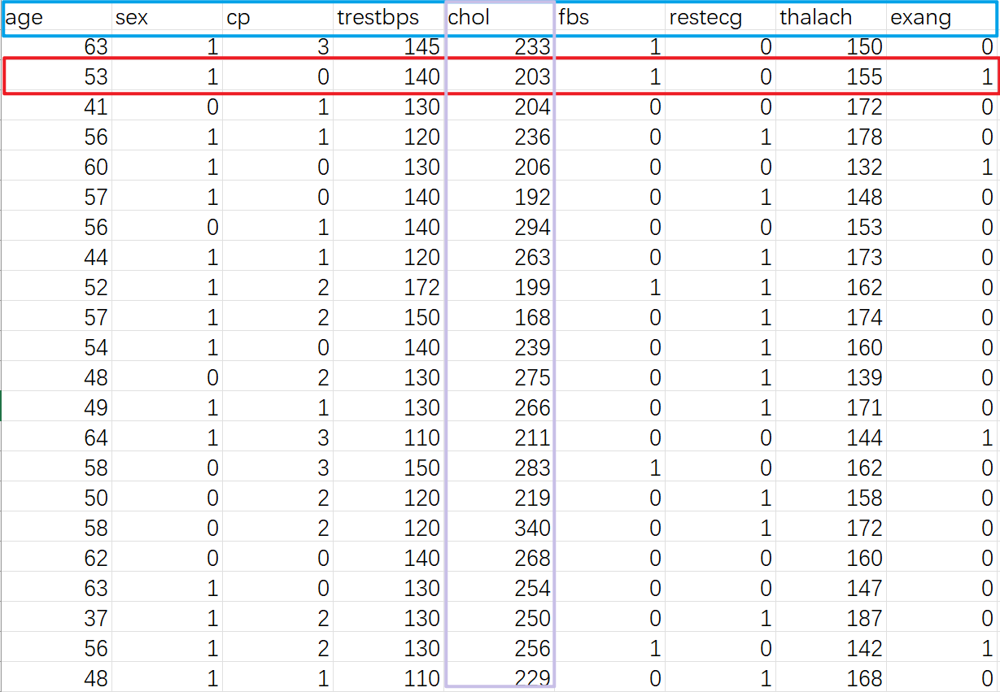

> **"整洁"数据：**
>
> -   一**行**是一个样本所有信息
>
> -   一**列**是一个variable
>
> -   中间无乱码、不规范表达


> **"脏"数据：**
>
> -   变量名不规范
>
> -   数值中英文混杂
>
> -   标点符号

-   数据预处理：

    -   离群值、异常值

    -   缺失值：删除？填补？

    -   协变量的类型

        -   连续变量

        -   分类、有序多分类、无序多分类

    -   协变量的编码与转换

        -   one-hot encoding

        -   Leave-one-out

        -   对数转化等（[参考知乎讨论](https://www.zhihu.com/question/22012482)）


### 变量筛选


### 模型的选择

**传统模型梳理**


**机器学习类型**


### 模型的构建


### 模型的评价

-   **常用概率解释**

    -   假阳率：模型预测为正例实际负例的样本

        False Positive Rate = 实负测正 / 实负 = FP / (FP + TN)

    -   假阴率：模型预测为负例实际为正例的样本

        False Negative Rate = 实正测负 / 实正 = FN / (TP + FN)

    -   真阳率：模型预测为正例实际为正例的样本

        True Positive Rate = 实正测正 / 实正 = TP / (TP + FN)

    -   真阴率：模型预测为负例实际为负例的样本

        True Negative Rate = 实负测负 / 实负 = TN / (FP + TN)

-   分类结果混淆矩

| 真值/预测值 |  预测的正类  |  预测的负类  |
|:-----------:|:------------:|:------------:|
| 真实的正类  | TP（真正率） | FN（假负率） |
| 真实的负类  | FP（假正率） | TN（真负率） |

-   常用指标

    -   准确率（Accuracy）

        正例和负例中分别被正确预测的样本数量占总样本数量的比例

    -   AUC

        表示ROC曲线下的面积，即ROC曲线与x轴、（1，0）-（1，1）围绕的面积，评估的是随机给定一个正例和一个负例，模型对正例的预测概率大于模型对于负例预测概率的概率。

    -   召回率（Recall）

        以实际样本为基础，实际样本为正例，被模型预测正确的正例占总体实际样本正例的比例。

    -   精确度（Pecision）

        以预测结果为基础，被模型预测为正例的样本中是正确的比例。预测为正例的结果分两种，要么实际是正例TP，要么实际是负例FP。

    -   F1 score

        精确度和召回率是一对矛盾的度量，一般来说，精确度高时，召回率值往往偏低；而精确度值低时，召回率值往往偏高。当分类置信度高时，精确度偏高；分类置信度低时，召回率偏高。为了能够综合考虑这两个指标，F1 score被提出。

    -   ......

-   [**Diagnostic testing**](https://en.wikipedia.org/wiki/F-score)


### 模型的展示

-   应用程序网页

-   Nomogram

-   评分系统

-   彩色打分卡

> **应用程序网页**

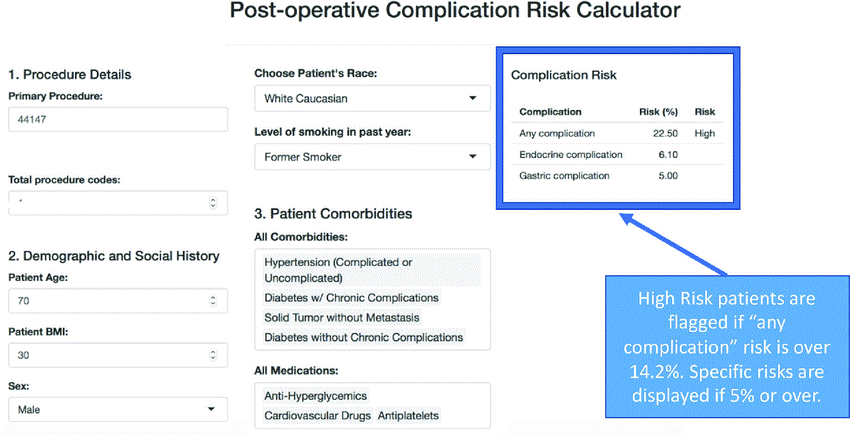


> **Nomogram**


> **评分系统**


> **彩色打分卡**


+------------------+--------------------+--------------------+
|                  | 优 势              | 劣 势              |
+:================:+:==================:+:==================:+
| **应用程序网页** | 结果快速精确       | 开发和使用成本较高 |
|                  |                    |                    |
|                  | 可嵌入常规诊疗系统 |                    |
+------------------+--------------------+--------------------+
| **Nomogram**     | 无需电子设备       | 肉眼比对不精确     |
|                  |                    |                    |
|                  | 只需简单加法       |                    |
+------------------+--------------------+--------------------+
| 评分系统         | 很少使用           | 连续变量需切割     |
|                  |                    |                    |
|                  |                    | 结果不精确         |
+------------------+--------------------+--------------------+
| 彩色打分卡       | 很少使用           | 连续变量需切割     |
|                  |                    |                    |
|                  |                    | 结果不精确         |
|                  |                    |                    |
|                  |                    | 预测因子不能太多   |
+------------------+--------------------+--------------------+

## 模型报告

只有对预测模型各方面的信息进行全面和明确的报告，才能充分评估预测模型的偏倚风险和潜在有用性。

个体预后或诊断多变量预测模型透明报告**Transparent Reporting of a multivariable prediction model for Individual Prognosis Or Diagnosis ([TRIPOD](https://www.equator-network.org/reporting-guidelines/tripod-statement/))**为开发、验证或更新预测模型的研究报告提出了一套建议。

### 临床预测模型报告规范（TRIPOD）


**TRIPOD条目解读**


### 临床预测模型指南


### 研究设计和方法学评价：PROBAST


-   [**机器学习构建流程总结**](https://www.mubucm.com/doc/3mH9_G3rgIg)

## [机器学习 VS 传统统计](https://www.datasciencecentral.com/machine-learning-vs-traditional-statistics-different-philosophi-1/)


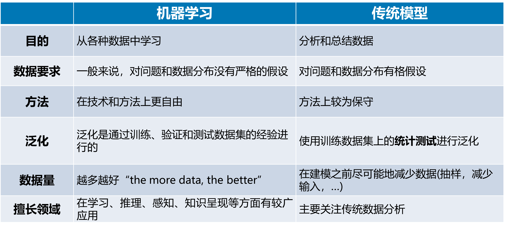


<!--chapter:end:01-clinical_prediction_model.Rmd-->


# 案例介绍

## 案例背景

### 数据来源

案例选自[**UCI**](http://archive.ics.uci.edu/ml/datasets/Heart+Disease)机器学习库中的 Heart Disease Data Set数据集。

该数据库包含76个属性，但是所有已发布的实验都引用了其中**14个属性的子集**。特别是，克利夫兰数据库是迄今为止ML研究人员使用的唯一数据库。

数据来源：[https://archive.ics.uci.edu/ml/datasets/Heart+Disease](https://archive.ics.uci.edu/ml/datasets/Heart+Diseasehttps://archive.ics.uci.edu/ml/datasets/Heart+Disease)

### 疾病背景

-   **冠心病（Coronary Heart Disease,CHD）**


心血管疾病是全球第一大死亡原因，每年夺去约1790万人的生命，占全球死亡人数的31%。5例心血管疾病中有4例死于心脏病和中风，其中1 / 3的死亡发生在70岁以下的过早死亡中。

**患有心血管疾病或心血管风险高的人**(由于存在高血压、糖尿病、高脂血症或已经确定的疾病等一种或多种风险因素)需要**早期检测和管理**，其中机器学习模型可以提供很大的帮助。

-   **目前把冠心病分类两大类：**

    ① 急性冠脉综合征：

    不稳定型心绞痛（UA）；非ST段抬高性心肌梗死（NSTEMI）；ST段抬高性心肌梗死（STEMI）

    ② 慢性冠脉综合征：

    慢性稳定型心绞痛；冠脉正常的心绞痛（如X综合征）；无症状性心肌缺血；缺血性心力衰竭；

-   **冠心病有"5+3"危险因素：**

    ① 五种可防可控的危险因素：

    高血压；血脂异常；糖尿病以及糖耐量的异常；吸烟；肥胖

    ② 三种不可防不可控的危险因素：

    性别；年龄；家族史

-   **目前，冠心病的诊断流程极其繁琐：**

    ① 怀疑冠心病的患者最开始可能会安排这3项检查：常规心电图、超声心动图和血液的心肌标志物检查；

    ② 上述检查后如果没有查出明显病变，但是患者仍有冠心病相关症状的话，医生可能会安排进行运动负荷试验或动态心电图检查；

    ③ 进行完基础检查后如果怀疑患者冠心病的可能性极大，医生可能会建议进行CTA或心肌血流灌注检查；

    ④ 也有些医生会直接建议患者进行心脏冠状动脉造影检查，因为冠状动脉造影检查是诊断冠心病最准确的办法；

**在本项研究中，研究者负责分析导致患者的冠心病的因素，并探索各个变量的影响程度。他们希望能够通过有效的机器学习算法构建模型，用于预测患者是否有冠心病。**

### **研究目的**

-   如何快速准确判断患者是否有冠心病？

-   影响冠心病的危险因素有哪些？

## 数据描述

-   数据展示（选取前10行）


| age | sex | cp | trestbps | chol | fbs | restecg | thalach | exang | oldpeak | slope | ca | thal | target |
|:---:|:---:|:--:|:--------:|:----:|:---:|:-------:|:-------:|:-----:|:-------:|:-----:|:--:|:----:|:------:|
| 63  |  1  | 3  |   145    | 233  |  1  |    0    |   150   |   0   |   2.3   |   0   | 0  |  1   |   1    |
| 53  |  1  | 0  |   140    | 203  |  1  |    0    |   155   |   1   |   3.1   |   0   | 0  |  3   |   0    |
| 41  |  0  | 1  |   130    | 204  |  0  |    0    |   172   |   0   |   1.4   |   2   | 0  |  2   |   1    |
| 56  |  1  | 1  |   120    | 236  |  0  |    1    |   178   |   0   |   0.8   |   2   | 0  |  2   |   1    |
| 60  |  1  | 0  |   130    | 206  |  0  |    0    |   132   |   1   |   2.4   |   1   | 2  |  3   |   0    |
| 57  |  1  | 0  |   140    | 192  |  0  |    1    |   148   |   0   |   0.4   |   1   | 0  |  1   |   1    |
| 56  |  0  | 1  |   140    | 294  |  0  |    0    |   153   |   0   |   1.3   |   1   | 0  |  2   |   1    |
| 44  |  1  | 1  |   120    | 263  |  0  |    1    |   173   |   0   |   0.0   |   2   | 0  |  3   |   1    |
| 52  |  1  | 2  |   172    | 199  |  1  |    1    |   162   |   0   |   0.5   |   2   | 0  |  3   |   1    |
| 57  |  1  | 2  |   150    | 168  |  0  |    1    |   174   |   0   |   1.6   |   2   | 0  |  2   |   1    |

-   数据集变量信息


```
## Rows: 303
## Columns: 14
## $ age      <dbl> 63, 53, 41, 56, 60, 57, 56, 44, 52, …
## $ sex      <dbl> 1, 1, 0, 1, 1, 1, 0, 1, 1, 1, 1, 0, …
## $ cp       <dbl> 3, 0, 1, 1, 0, 0, 1, 1, 2, 2, 0, 2, …
## $ trestbps <dbl> 145, 140, 130, 120, 130, 140, 140, 1…
## $ chol     <dbl> 233, 203, 204, 236, 206, 192, 294, 2…
## $ fbs      <dbl> 1, 1, 0, 0, 0, 0, 0, 0, 1, 0, 0, 0, …
## $ restecg  <dbl> 0, 0, 0, 1, 0, 1, 0, 1, 1, 1, 1, 1, …
## $ thalach  <dbl> 150, 155, 172, 178, 132, 148, 153, 1…
## $ exang    <dbl> 0, 1, 0, 0, 1, 0, 0, 0, 0, 0, 0, 0, …
## $ oldpeak  <dbl> 2.3, 3.1, 1.4, 0.8, 2.4, 0.4, 1.3, 0…
## $ slope    <dbl> 0, 0, 2, 2, 1, 1, 1, 2, 2, 2, 2, 2, …
## $ ca       <dbl> 0, 0, 0, 0, 2, 0, 0, 0, 0, 0, 0, 0, …
## $ thal     <dbl> 1, 3, 2, 2, 3, 1, 2, 3, 3, 2, 2, 2, …
## $ target   <dbl> 1, 0, 1, 1, 0, 1, 1, 1, 1, 1, 1, 1, …
```

> 303个受试者（行：Sample）;
>
> 14列变量属性(列：Feature)；
>
> 变量属性包括：年龄、性别、胸痛经历、静息血压、胆固醇、空腹血糖、静息心电图、最大心率、运动引起的 ST 压低、峰值运动ST段的斜率、运动诱发的心绞痛、主要供血血管的数量、地中海贫血、**心脏病**


> **这些变量包括以下几类：**
>
> **① 不可改变的危险因素：**年龄、性别、家族史（收集了地中海贫血）
>
> **② 可改变的危险因素：**静息血压、胆固醇、空腹血糖
>
> **③ 临床检查：**心电图相关、运动触发相关、冠脉检查相关

## 分析思路


-   诊断模型：主要是基于研究对象的临床特征，预测当前患有某种疾病的概率，多见于横断面研究;

-   结局类型：分类变量 -\> 二分类

-   数据预处理：

    -   "整洁"数据：一行是一个样本所有信息、一列是一个variable、中间无乱码、不规范表达

    -   离群值，异常值、缺失值、协变量的类型等

-   模型的选择：Logistic、随机森林、支持向量机

-   其他具体信息，建模中探索

## 算法简介

### Logistic


### 随机森林

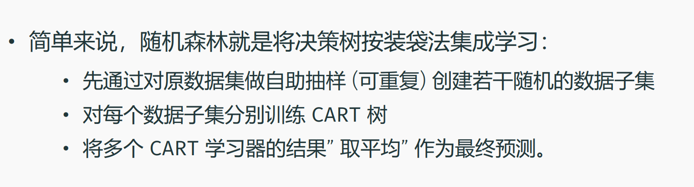

### 支持向量机


## 代码预览

<!--chapter:end:02-example.Rmd-->


# 实操教学 {.unnumbered}

# R 实操

## **机器学习模型构建**

### **加载需要的r包**


```r
# rm(list = ls())
library(tidyverse) # 数据整理
library(dlookr) # 自动化EDA
library(plotROC) # 绘制ROC
library(pROC) # 计算AUC
library(e1071) # 支持向量机
library(caret) # 机器学习包
library(ggplot2)
library(rms) # 计算校准曲线\绘制nomo
library(glmnet) # lasso
```

### **加载数据**


```r
data <- read_csv("data/CardiovascularDataset.csv")
# dlookr 是一个自动输出一份数据诊断报告包，可以自行探索
# eda_report(data) # 输出诊断报告
# eda_report(data, target = 1) # 添加按照target的分组信息
```

-   查看数据情况


```r
# 查看前10行树
head(data,10)
```

```
## # A tibble: 10 × 14
##     age   sex    cp trest…¹  chol   fbs restecg thalach
##   <dbl> <dbl> <dbl>   <dbl> <dbl> <dbl>   <dbl>   <dbl>
## 1    63     1     3     145   233     1       0     150
## 2    53     1     0     140   203     1       0     155
## 3    41     0     1     130   204     0       0     172
## 4    56     1     1     120   236     0       1     178
## 5    60     1     0     130   206     0       0     132
## 6    57     1     0     140   192     0       1     148
## # … with 4 more rows, 6 more variables: exang <dbl>,
## #   oldpeak <dbl>, slope <dbl>, ca <dbl>, thal <dbl>,
## #   target <dbl>, and abbreviated variable name
## #   ¹​trestbps
```


```r
# 查看数据变量属性
str(data)
```

```
## spc_tbl_ [303 × 14] (S3: spec_tbl_df/tbl_df/tbl/data.frame)
##  $ age     : num [1:303] 63 53 41 56 60 57 56 44 52 57 ...
##  $ sex     : num [1:303] 1 1 0 1 1 1 0 1 1 1 ...
##  $ cp      : num [1:303] 3 0 1 1 0 0 1 1 2 2 ...
##  $ trestbps: num [1:303] 145 140 130 120 130 140 140 120 172 150 ...
##  $ chol    : num [1:303] 233 203 204 236 206 192 294 263 199 168 ...
##  $ fbs     : num [1:303] 1 1 0 0 0 0 0 0 1 0 ...
##  $ restecg : num [1:303] 0 0 0 1 0 1 0 1 1 1 ...
##  $ thalach : num [1:303] 150 155 172 178 132 148 153 173 162 174 ...
##  $ exang   : num [1:303] 0 1 0 0 1 0 0 0 0 0 ...
##  $ oldpeak : num [1:303] 2.3 3.1 1.4 0.8 2.4 0.4 1.3 0 0.5 1.6 ...
##  $ slope   : num [1:303] 0 0 2 2 1 1 1 2 2 2 ...
##  $ ca      : num [1:303] 0 0 0 0 2 0 0 0 0 0 ...
##  $ thal    : num [1:303] 1 3 2 2 3 1 2 3 3 2 ...
##  $ target  : num [1:303] 1 0 1 1 0 1 1 1 1 1 ...
##  - attr(*, "spec")=
##   .. cols(
##   ..   age = col_double(),
##   ..   sex = col_double(),
##   ..   cp = col_double(),
##   ..   trestbps = col_double(),
##   ..   chol = col_double(),
##   ..   fbs = col_double(),
##   ..   restecg = col_double(),
##   ..   thalach = col_double(),
##   ..   exang = col_double(),
##   ..   oldpeak = col_double(),
##   ..   slope = col_double(),
##   ..   ca = col_double(),
##   ..   thal = col_double(),
##   ..   target = col_double()
##   .. )
##  - attr(*, "problems")=<externalptr>
```

### 划分数据集

使用caret包来生成并比较不同的模型与性能。

使用sample()函数，将数据集按照8:2随机拆分为训练集（264例）和测试集（61例）


```r
set.seed(1002)
trainset <- sample(nrow(data), 0.8*nrow(data))
testset <- data[-trainset,]
trainset <- data[trainset, ]
```

-   为方便后续建模，将target转为factor


```r
trainset$target <- ifelse(trainset$target == 1, "yes", "no")
testset$target <- ifelse(testset$target == 1, "yes", "no")
trainset$target <- as.factor(trainset$target)
testset$target <- as.factor(testset$target)
```


```r
str(trainset$target)
```

```
##  Factor w/ 2 levels "no","yes": 1 2 1 2 2 1 1 1 1 1 ...
```

```r
# str(testset)
```

### lasso变量筛选

在统计学习中存在一个重要理论：**方差权衡**。一般常理认为模型建立得越复杂，分析和预测效果应该越好。而方差权衡恰恰指出了其中的弊端。复杂的模型一般对已知数据（training sample）的拟合（fitting）大过于简单模型，但是**复杂模型很容易对数据出现过度拟合（over-fitting）**。因为所有实际数据都会有各种形式的误差，过度拟合相当于把误差也当做有用的信息进行学习。**所以在未知数据（test sample）上的分析和预测效果会大大下降。**

下图说明了方差权衡的结果。模型复杂度在**最低的时候（比如线性回归）预测的偏差比较大，但是方差很小**。随着模型复杂度的增大，对已知数据的预测误差会一直下降（因为拟合度增大），而对未知数据却出现拐点，一旦过于复杂，预测方差会变大，模型变得非常不稳定。

{width="100%"}

因此在很多实际生活应用中，线性模型因为其预测方差小，参数估计稳定可靠，仍然起着相当大的作用。正如上面的方差权衡所述，**建立线性模型中一个重要的问题就是变量选择（或者叫模型选择），指的是选择建立线性模型所用到的独立变量的选择。**在实际问题例如疾病风险控制中，独立变量一般会有200 \~ 300个之多。如果使用所有的变量，很可能会出现模型的过度拟合。所以对**变量的选择显得尤为重要**。

传统的变量选择是采用逐步回归法（stepwise selection），其中又分为向前（forward）和向后（backward）的逐步回归。向前逐步是从0个变量开始逐步加入变量，而向后逐步是从所有变量的集合开始逐次去掉变量。加入或去掉变量一般按照标准的统计信息量来决定。**这种传统的变量选择的弊端是模型的方差一般会比较高，而且灵活性较差**。

近年来回归分析中的一个重大突破是引入了正则化回归（regularized regression）的概念, 而最受关注和广泛应用的**正则化回归**是1996年由现任斯坦福教授的Robert Tibshirani提出的**LASSO回归**。**LASSO回归最突出的优势在于通过对所有变量系数进行回归惩罚（penalized regression）, 使得相对不重要的独立变量系数变为0，从而排除在建模之外。**

LASSO方法不同于传统的逐步回归的最大之处是**它可以对所有独立变量同时进行处理，而不是逐步处理**。这一改进使得建模的**稳定性大大增加**。除此以外，LASSO还具有**计算速度快**，模型容易解释等很多优点。而模型发明者Tibshirani教授也因此获得当年的有统计学诺贝尔奖之称的考普斯总统奖（COPSS award）。

#### 训练集中变量筛选

1.  首先告诉软件，哪些是你的分类变量。分类变量转为因子


```r
data1 <- trainset

data1[,c(2,3,6,7,9,11:13)] <- lapply(data1[, c(2,3,6,7,9,11:13)], factor)

str(data1)
```

```
## tibble [242 × 14] (S3: tbl_df/tbl/data.frame)
##  $ age     : num [1:242] 57 41 43 37 66 46 60 57 61 44 ...
##  $ sex     : Factor w/ 2 levels "0","1": 2 2 2 2 1 2 2 2 2 2 ...
##  $ cp      : Factor w/ 4 levels "0","1","2","3": 1 3 1 3 3 3 1 1 4 1 ...
##  $ trestbps: num [1:242] 165 130 120 130 146 150 145 110 134 110 ...
##  $ chol    : num [1:242] 289 214 177 250 278 231 282 335 234 197 ...
##  $ fbs     : Factor w/ 2 levels "0","1": 2 1 1 1 1 1 1 1 1 1 ...
##  $ restecg : Factor w/ 3 levels "0","1","2": 1 1 1 2 1 2 1 2 2 1 ...
##  $ thalach : num [1:242] 124 168 120 187 152 147 142 143 145 177 ...
##  $ exang   : Factor w/ 2 levels "0","1": 1 1 2 1 1 1 2 2 1 1 ...
##  $ oldpeak : num [1:242] 1 2 2.5 3.5 0 3.6 2.8 3 2.6 0 ...
##  $ slope   : Factor w/ 3 levels "0","1","2": 2 2 2 1 2 2 2 2 2 3 ...
##  $ ca      : Factor w/ 5 levels "0","1","2","3",..: 4 1 1 1 2 1 3 2 3 2 ...
##  $ thal    : Factor w/ 4 levels "0","1","2","3": 4 3 4 3 3 3 4 4 3 3 ...
##  $ target  : Factor w/ 2 levels "no","yes": 1 2 1 2 2 1 1 1 1 1 ...
```

2.  因子的处理,分类变量处理 onehot encodeing（**自由选择**）


```r
# 为了做lasso把y定义为numeric
data1$target <- as.numeric(data1$target)
# 分类变量转为factor
x.factors <- model.matrix(data1$target ~ data1$sex + data1$cp+data1$fbs+data1$restecg+data1$exang+data1$slope+data1$ca+data1$thal)[,-1]
```


```r
#生成自变量和因变量矩阵
x=as.matrix(data.frame(x.factors,data1[,c(1,4:5,8,10)]))
```


```r
#定义y
y=data1$target
```

-   进行拟合，默认为L1也就是Lasso


```r
fit1 <- glmnet(x,y,family="binomial")
#解释偏差百分比以及相应的λ值
print(fit1)
```

```
## 
## Call:  glmnet(x = x, y = y, family = "binomial") 
## 
##    Df %Dev Lambda
## 1   0  0.0 0.2410
## 2   1  2.9 0.2200
## 3   1  5.3 0.2000
## 4   3  8.3 0.1830
## 5   4 11.5 0.1660
## 6   4 14.5 0.1520
## 7   5 17.1 0.1380
## 8   5 19.4 0.1260
## 9   7 21.5 0.1150
## 10  7 23.5 0.1050
## 11  8 25.6 0.0952
## 12 10 28.0 0.0868
## 13 11 30.3 0.0791
## 14 11 32.3 0.0720
## 15 12 34.2 0.0656
## 16 12 36.1 0.0598
## 17 12 37.7 0.0545
## 18 12 39.2 0.0496
## 19 12 40.5 0.0452
## 20 14 41.6 0.0412
## 21 14 42.8 0.0376
## 22 14 43.8 0.0342
## 23 14 44.7 0.0312
## 24 14 45.6 0.0284
## 25 14 46.4 0.0259
## 26 14 47.1 0.0236
## 27 15 47.7 0.0215
## 28 16 48.3 0.0196
## 29 16 48.8 0.0178
## 30 16 49.3 0.0163
## 31 16 49.7 0.0148
## 32 17 50.0 0.0135
## 33 17 50.4 0.0123
## 34 18 50.7 0.0112
## 35 18 51.0 0.0102
## 36 19 51.2 0.0093
## 37 19 51.5 0.0085
## 38 19 51.8 0.0077
## 39 20 52.0 0.0070
## 40 20 52.2 0.0064
## 41 20 52.4 0.0058
## 42 20 52.5 0.0053
## 43 20 52.6 0.0049
## 44 20 52.8 0.0044
## 45 21 52.9 0.0040
## 46 21 52.9 0.0037
## 47 21 53.0 0.0033
## 48 21 53.1 0.0031
## 49 21 53.1 0.0028
## 50 21 53.2 0.0025
## 51 21 53.2 0.0023
## 52 21 53.2 0.0021
## 53 21 53.2 0.0019
## 54 21 53.3 0.0017
## 55 21 53.3 0.0016
## 56 21 53.3 0.0014
## 57 21 53.3 0.0013
## 58 21 53.3 0.0012
## 59 21 53.3 0.0011
## 60 21 53.3 0.0010
## 61 21 53.4 0.0009
## 62 21 53.4 0.0008
## 63 21 53.4 0.0008
## 64 21 53.4 0.0007
## 65 21 53.4 0.0006
## 66 21 53.4 0.0006
## 67 21 53.4 0.0005
## 68 21 53.4 0.0005
## 69 21 53.4 0.0004
## 70 21 53.4 0.0004
## 71 21 53.4 0.0004
## 72 21 53.4 0.0003
```

```r
#解释偏差不再随着λ值的增加而减小，因此而停止
```


```r
#画出收缩曲线图
plot(fit1,label = FALSE)
```


```r
plot(fit1,label = TRUE,xvar = "lambda")#系数值如何随着λ的变化而变化
```


```r
plot(fit1,label = TRUE,xvar = "dev")#偏差与系数之间的关系图
```


```r
#指定lamda给出相应参数
lasso.coef <- predict(fit1, type = "coefficients",s = 0.040 )
lasso.coef
```

```
## 23 x 1 sparse Matrix of class "dgCMatrix"
##                        s1
## (Intercept)    -0.5051894
## data1.sex1     -0.4472455
## data1.cp1       .        
## data1.cp2       0.6233575
## data1.cp3       .        
## data1.fbs1      .        
## data1.restecg1  0.0148096
## data1.restecg2  .        
## data1.exang1   -0.6849315
## data1.slope1   -0.2724767
## data1.slope2    0.1970313
## data1.ca1      -0.9084992
## data1.ca2      -0.9740841
## data1.ca3      -0.6171345
## data1.ca4       .        
## data1.thal1     .        
## data1.thal2     0.1821188
## data1.thal3    -0.7726354
## age             .        
## trestbps       -0.0004619
## chol            .        
## thalach         0.0129917
## oldpeak        -0.2474481
```

glmnet包在使用cv.glmnet()估计λ值时，默认使用10折交叉验证。在K折交叉验证中，数据被划分成k个相同的子集（折），#每次使用k-1个子集拟合模型，然后使用剩下的那个子集做测试集，最后将k次拟合的结果综合起来（一般取平均数），确定最后的参数。

在这个方法中，每个子集只有一次用作测试集。在glmnet包中使用K折交叉验证非常容易，结果包括每次拟合的λ值和响应的MSE。默认设置为α=1。

-   进行交叉验证，选择最优的惩罚系数lambada


```r
set.seed(317)
cv.fit <- cv.glmnet(x,y,family="binomial")
#cv.fit <- cv.glmnet(x,y,family="binomial",type.measure = "auc")#AUC和λ的关系
#cv.fit <- cv.glmnet(x,y,family="binomial")#不要反复运行
plot(cv.fit)
```


```r
#显示一个标准误的系数
coef(cv.fit, s = "lambda.1se")
```

```
## 23 x 1 sparse Matrix of class "dgCMatrix"
##                       s1
## (Intercept)    -0.570950
## data1.sex1     -0.429630
## data1.cp1       .       
## data1.cp2       0.610299
## data1.cp3       .       
## data1.fbs1      .       
## data1.restecg1  0.007149
## data1.restecg2  .       
## data1.exang1   -0.678984
## data1.slope1   -0.261868
## data1.slope2    0.194103
## data1.ca1      -0.883563
## data1.ca2      -0.944469
## data1.ca3      -0.586744
## data1.ca4       .       
## data1.thal1     .       
## data1.thal2     0.200315
## data1.thal3    -0.752414
## age             .       
## trestbps       -0.000139
## chol            .       
## thalach         0.012869
## oldpeak        -0.245773
```


```r
#选择交叉验证误差最小的lambda
cv.fit$lambda.min
```

```
## [1] 0.0123
```

```r
cv.fit$lambda.1se
```

```
## [1] 0.04122
```

```r
coef(cv.fit, s = "lambda.min")
```

```
## 23 x 1 sparse Matrix of class "dgCMatrix"
##                       s1
## (Intercept)     1.718543
## data1.sex1     -1.058682
## data1.cp1       0.171712
## data1.cp2       1.200687
## data1.cp3       0.727069
## data1.fbs1      .       
## data1.restecg1  0.204794
## data1.restecg2  .       
## data1.exang1   -0.776428
## data1.slope1   -0.609627
## data1.slope2    0.276892
## data1.ca1      -1.635310
## data1.ca2      -1.885126
## data1.ca3      -1.390527
## data1.ca4       0.131830
## data1.thal1     .       
## data1.thal2     .       
## data1.thal3    -1.084248
## age             .       
## trestbps       -0.011442
## chol           -0.001332
## thalach         0.015735
## oldpeak        -0.324021
```


```r
#画出收缩系数图，及最小的lambda曲线
plot(cv.fit$glmnet.fit,xvar="lambda")
abline(v=log(c(cv.fit$lambda.min,cv.fit$lambda.1se)),lty=2)
```


```r
#系数不为0的结果为Lasso筛选后的值
predict(cv.fit,type='coefficient',s=cv.fit$lambda.min)
```

```
## 23 x 1 sparse Matrix of class "dgCMatrix"
##                       s1
## (Intercept)     1.718543
## data1.sex1     -1.058682
## data1.cp1       0.171712
## data1.cp2       1.200687
## data1.cp3       0.727069
## data1.fbs1      .       
## data1.restecg1  0.204794
## data1.restecg2  .       
## data1.exang1   -0.776428
## data1.slope1   -0.609627
## data1.slope2    0.276892
## data1.ca1      -1.635310
## data1.ca2      -1.885126
## data1.ca3      -1.390527
## data1.ca4       0.131830
## data1.thal1     .       
## data1.thal2     .       
## data1.thal3    -1.084248
## age             .       
## trestbps       -0.011442
## chol           -0.001332
## thalach         0.015735
## oldpeak        -0.324021
```

```r
predict(cv.fit,type='coefficient',s=cv.fit$lambda.1se)
```

```
## 23 x 1 sparse Matrix of class "dgCMatrix"
##                       s1
## (Intercept)    -0.570950
## data1.sex1     -0.429630
## data1.cp1       .       
## data1.cp2       0.610299
## data1.cp3       .       
## data1.fbs1      .       
## data1.restecg1  0.007149
## data1.restecg2  .       
## data1.exang1   -0.678984
## data1.slope1   -0.261868
## data1.slope2    0.194103
## data1.ca1      -0.883563
## data1.ca2      -0.944469
## data1.ca3      -0.586744
## data1.ca4       .       
## data1.thal1     .       
## data1.thal2     0.200315
## data1.thal3    -0.752414
## age             .       
## trestbps       -0.000139
## chol            .       
## thalach         0.012869
## oldpeak        -0.245773
```

```r
predict(cv.fit,type='coefficient',s=0.1)
```

```
## 23 x 1 sparse Matrix of class "dgCMatrix"
##                       s1
## (Intercept)    -1.129256
## data1.sex1      .       
## data1.cp1       .       
## data1.cp2       0.135400
## data1.cp3       .       
## data1.fbs1      .       
## data1.restecg1  .       
## data1.restecg2  .       
## data1.exang1   -0.454297
## data1.slope1    .       
## data1.slope2    0.052755
## data1.ca1      -0.036494
## data1.ca2       .       
## data1.ca3       .       
## data1.ca4       .       
## data1.thal1     .       
## data1.thal2     0.614504
## data1.thal3    -0.220414
## age             .       
## trestbps        .       
## chol            .       
## thalach         0.008586
## oldpeak        -0.146561
```

#### 测试集\\验证集中 验证


```r
library(rms)
#导入验证集
test <- testset
str(test)
```

```
## tibble [61 × 14] (S3: tbl_df/tbl/data.frame)
##  $ age     : num [1:61] 63 56 44 64 58 58 57 61 60 54 ...
##  $ sex     : num [1:61] 1 0 1 1 0 1 0 0 1 1 ...
##  $ cp      : num [1:61] 3 1 1 3 2 2 0 0 0 0 ...
##  $ trestbps: num [1:61] 145 140 120 110 120 132 120 130 130 124 ...
##  $ chol    : num [1:61] 233 294 263 211 340 224 354 330 253 266 ...
##  $ fbs     : num [1:61] 1 0 0 0 0 0 0 0 0 0 ...
##  $ restecg : num [1:61] 0 0 1 0 1 0 1 0 1 0 ...
##  $ thalach : num [1:61] 150 153 173 144 172 173 163 169 144 109 ...
##  $ exang   : num [1:61] 0 0 0 1 0 0 1 0 1 1 ...
##  $ oldpeak : num [1:61] 2.3 1.3 0 1.8 0 3.2 0.6 0 1.4 2.2 ...
##  $ slope   : num [1:61] 0 1 2 1 2 2 2 2 2 1 ...
##  $ ca      : num [1:61] 0 0 0 0 0 2 0 0 1 1 ...
##  $ thal    : num [1:61] 1 2 3 2 2 3 2 2 3 3 ...
##  $ target  : Factor w/ 2 levels "no","yes": 2 2 2 2 2 1 2 1 1 1 ...
```

```r
test$target <- as.numeric(test$target)
#制作x矩阵
test[,c(2,3,6,7,9,11:13)] <- lapply(test[, c(2,3,6,7,9,11:13)], factor)

x.factors_test <- model.matrix(test$target ~ test$sex + test$cp+test$fbs+test$restecg+test$exang+test$slope+test$ca+test$thal)[,-1]

newx=as.matrix(data.frame(x.factors_test,test[,c(1,4:5,8,10)]))
```

-   利用lasso在测试集中保存预测值，验证集当中的预测值


```r
test.y <- predict(cv.fit, newx = newx, type = "response", s=cv.fit$lambda.1se)
library(rms)
#在R当中做calibration plot
test <- data.frame(test,test.y)
# write.csv(test,file="test0.csv")
# str(test)
##########val.prob#####
val.prob(test$s1,test$target)
```


```
##        Dxy    C (ROC)         R2          D   D:Chi-sq 
##  9.143e-01  9.571e-01  6.671e-01  6.701e-01  4.187e+01 
##        D:p          U   U:Chi-sq        U:p          Q 
##         NA -3.602e-01 -1.997e+01  1.000e+00  1.030e+00 
##      Brier  Intercept      Slope       Emax        E90 
##  1.134e+00 -6.258e-02  2.432e+00  1.180e+00  1.168e+00 
##       Eavg        S:z        S:p 
##  1.016e+00 -6.885e+00  5.791e-12
```

### 训练集建立模型

-   训练Logistic


```r
fitControl = trainControl(method = "none", classProbs = TRUE)

set.seed(10101) # 设置种子数，复现结果
LR_model <- train(target~. ,
                  data = trainset,
                  method = "glm",
                  trControl = fitControl,
                  metric = "ROC")
```

-   训练随机森林


```r
set.seed(10101) # 设置种子数，复现结果
RF_model <- train(target~. ,
                  data = trainset,
                  method = "parRF",
                  trControl = fitControl,
                  metric = "ROC")
```

-   训练SVM


```r
set.seed(10101) # 设置种子数，复现结果
SVM_model <- train(target~. ,
                  data = trainset,
                  method = "svmRadial",
                  trControl = fitControl,
                  metric = "ROC")
```

### 测试集评价模型

-   获得模型测试集风险概率


```r
LR_pro <- predict (LR_model, newdata =testset, type= "prob") 
RF_pro <- predict (RF_model, newdata =testset, type= "prob") 
SVM_pro <-  predict (SVM_model, newdata =testset, type= "prob")

testset$LR <- LR_pro$yes
testset$RF <- RF_pro$yes
testset$SVM <- SVM_pro$yes
```

-   使用plotROC包和ggplot2绘制ROC曲线


```r
ROC <- melt_roc(testset, "target", c("LR", "RF", "SVM"))
ROC_plot <- ggplot(ROC, aes(d = D.target, m = M, color = name)) +
    geom_roc(n.cuts = 0) +
    labs(title = "三种模型测试集ROC曲线") + 
    theme(plot.title = element_text(hjust = 0.5))+
    geom_abline()
# theme(text = element_text(size = 50)) 设置所有字体大小
```


```r
ROC_plot
```


-   pROC包的roc()和auc()函数，计算AUC


```r
roc_LR <- roc(testset$target, testset$LR)
auc_LR <- auc(roc_LR)
auc_LR   # Area under the curve: 0.956
```

```
## Area under the curve: 0.956
```

```r
roc_RF <- roc(testset$target, testset$RF)
auc_RF <- auc(roc_RF)
auc_RF   # Area under the curve: 0.935
```

```
## Area under the curve: 0.935
```

```r
roc_SVM <- roc(testset$target, testset$SVM)
auc_SVM <- auc(roc_SVM)
auc_SVM  # Area under the curve: 0.969
```

```
## Area under the curve: 0.969
```

### Logistic DCA曲线

<div>

> DCA曲线横坐标是判断恶性/良性的风险阈值（0\~1），纵坐标为不同阈值对应的临床净获益（net benifit）。主要比较了根据四种模型划分恶性/良性患者（针对性干预），相比于把所有患者都看作恶性实施干预（ALL曲线）和所有患者都不干预（None曲线），是否有临床净获益。
>
> 006年首次介绍了DCA曲线，并提供了使用R语言绘制DCA曲线的dca()函代码下载链接：<https://www.mskcc.org/departments/epidemiology-biostatistics/biostatistics/decision-curve-analysis>

</div>


```r
testset$target <- ifelse(testset$target == "yes", 1, 0)
# write_csv(testset, file = "data/testset.csv")
```


```r
source("dca/dca.r")
testset1 <- read.csv("data/testset.csv")
DCA <- dca(data = testset1, outcome = "target",
           predictors = c("LR"))
```


能够看到，当风险阈值范围在0\~1 时，模型的临床净获益均高于ALL曲线和None曲线，能够取得临床净获益的阈值范围还是比较大的，但应该注意的是，随着阈值增大，模型的临床净获益也在减小。

### Logistic的Nomogram绘制


```r
# 解决"variable 变量名 does not have limits defined by datadist"
dd <- datadist(testset)
options(datadist="dd")

# 设置变量标签
testset$sex <- factor(testset$sex,levels=c(0,1),labels=c("Female","Male"))
# 构建LR模型
f1 <- lrm(target~ age+sex+chol+oldpeak, data= testset, x = T, y = T)
```


```r
# 绘制Nomogram
nom <- nomogram(f1,
                fun=function(x)1/(1+exp(-x)),
                #也可fun=plogis,fun.at概率坐标范围
                fun.at=c(.001,.01,.05,seq(.1,.9,by=.1),.95,.99,.999),
                funlabel="Risk of target",
                conf.int=F,
                abbrev=F,
                minlength=1,
                #lp线性预测值
                lp=F)
plot(nom)
```


-   另外一种


```r
library(regplot)
regplot(f1)
```

```
## [1] "note: points tables not constructed unless points=TRUE "
```


<!--chapter:end:03-r_example.Rmd-->


# Python 安装与入门

## Anaconda 的安装

### Anaconda简介

Anaconda，是一个开源的Python发行版本，其包含了conda、Python以及一大堆安装好的工具包及依赖项，比如numpy、pandas、matplotlib等。

conda是一个开源的包、环境管理器，可以用于在同一个机器上安装不同版本的软件包及其依赖，并能够在不同的环境之间切换。不同的Python项目常常会对应不同的Python版本和依赖包版本，使用conda就可以方便的对不同的环境进行管理。

Anaconda还附带了数据分析常用的**Jupyter Notebook**，之前被称为 IPython notebook，是一个交互式笔记本。Jupyter Notebook 的本质是一个 Web应用程序，可以将代码、图像和文档全部组合到一个web文档中，便于创建和共享程序文档，支持实时代码，数学方程，可视化和markdown，在数据清理和转换，数据分析，统计建模，机器学习等方面应用广泛。

### Anaconda 下载

-   官网：<https://www.anaconda.com/>

-   百度云：

    链接：<https://pan.baidu.com/s/1lr5ks5FiTgCrS-jrXdNZQQ?pwd=ab5q>

    提取码：ab5q

### 安装步骤

-   双击安装包进行安装，点击下一步。


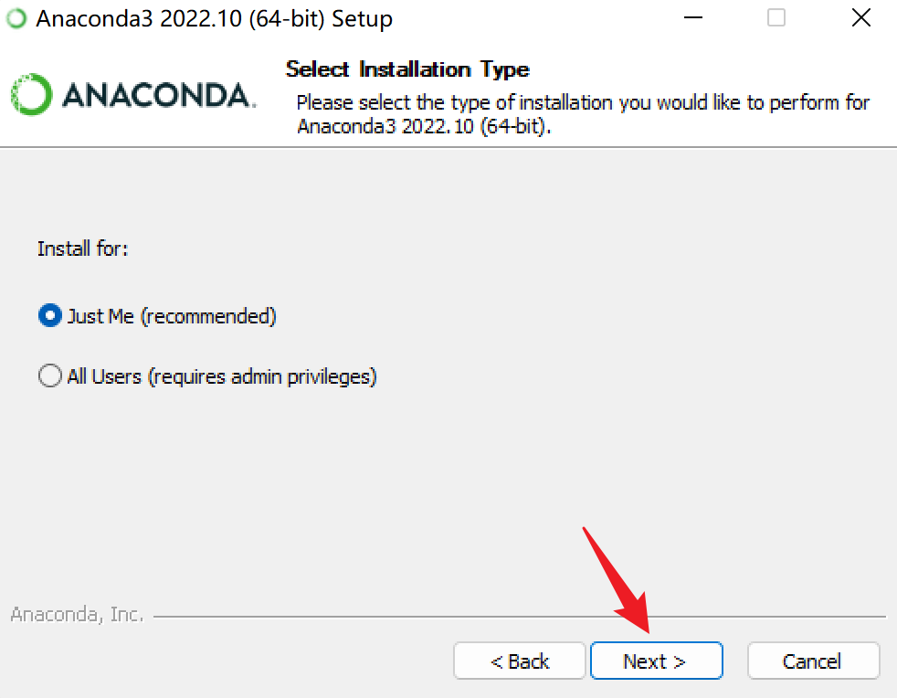

-   选择安装位置，一定要记住。

出现下面的界面，选择安装路径，尽量不要装入系统盘，系统盘的空间资源很宝贵。建议安装到**其他盘**，注意安装路径**不要包含汉字并且尽量不要包含空格**。选择后安装路径之后，点击 next。

比如，我安装位置为：G:\\develop\\anaconda


-   这一步是选择是否勾选环境变量，这里暂时先不勾选，后面再配置好了。之后点击install进行安装即可。

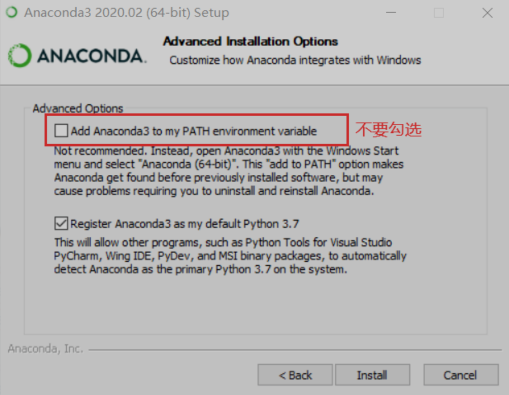{width="100%"}

-   安装进行中，等待安装完成。 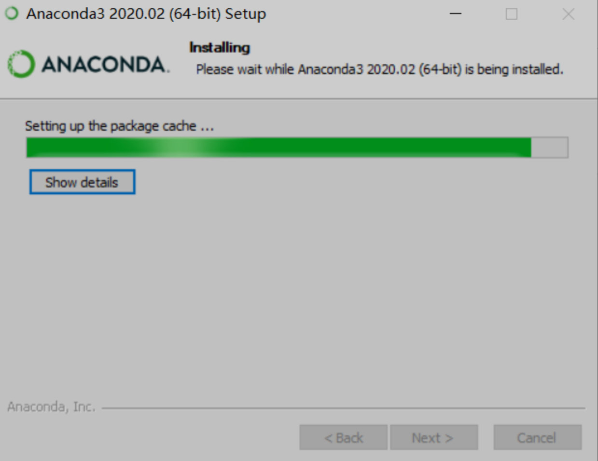{width="100%"}

<!-- -->

-   一会儿之后就会安装完成，根据如下提示进行勾选和不勾选即可，点击finish，表示安装完成。 {width="100%"}

<!-- -->

-   安装完成后手动添加环境变量

**第一步：此电脑\>右键\>属性\>高级系统设置**

{width="100%"}

**第二步：点击环境变量**

{width="100%"}

**第三步：选择系统变量中的path\>编辑**

{width="100%"}

**第四步：新建环境变量**

{width="100%"}

**第五步：输入本地的anaconda的相关目录，注意这个目录是你自己的安装目录。**

下面是我的anaconda相关目录：

G:\\develop\\anaconda

G:\\develop\\anaconda\\Library\\mingw-w64\\bin

G:\\develop\\anaconda\\Library\\usr\\bin

G:\\develop\\anaconda\\Library\\bin

G:\\develop\\anaconda\\Scripts

要把以上目录修改成自己的anaconda安装目录。比如你的anaconda安装在E盘下，那么就写成E:\\anaconda，E:\\anaconda\\Library\\mingw-w64\\bin 等等。

{width="100%"}

**第六步：依次点击确定关闭所有的windows窗口，重启cmd**

> win+R
>
> 输入：cmd

**第七步：输入conda \--version验证（注意空格，注意两个横线）**

如果如下图所示，就代表配置成功了。conda后面的数字可以不一样，这个是conda的版本信息

{width="100%"}

### conda\pip 基本命令

-   添加镜像


```bash
# 为了装包速度快点，添加国内镜像

conda config --add channels https://mirrors.tuna.tsinghua.edu.cn/anaconda/pkgs/free/
conda config --add channels https://mirrors.tuna.tsinghua.edu.cn/anaconda/pkgs/main/
conda config --add channels https://mirrors.tuna.tsinghua.edu.cn/anaconda/cloud/conda-forge/
conda config --add channels https://mirrors.tuna.tsinghua.edu.cn/anaconda/cloud/bioconda/
conda config --set show_channel_urls yes

```

-   基本命令


```bash
conda list    #查看当前环境所安装的包
conda install numpy # 安装包
conda install python=2.7    #安装指定版本包或软件
conda uninstall numpy  # 卸载包

pip list    #查看当前环境所安装的包
pip install numpy # 安装包

# 可以在使用pip的时候加参数-i https://pypi.tuna.tsinghua.edu.cn/simple 
# 例如：pip install -i https://pypi.tuna.tsinghua.edu.cn/simple gevent，这样就会从清华这边的镜像去安装gevent库。
```

### 打开jupyter notebook

-   将带有.ipynb 文件夹放到桌面

{width="100%"}

-   打开 anaconda prompt

{width="100%"}

-   输入： cd desktop 按回车键

{width="100%"}

-   接着输入：jupyter notebook 按回车键

{width="100%"}

-   稍等一会，打开自带浏览器，找到python这个文件，打开

{width="100%"}

-   点python-example.ipynb文件就可以了

## python 入门

推荐教程：<https://www.cainiaojc.com/python/python-tutorial.html>

简单介绍：

文档链接: <https://www.mubucm.com/doc/5y3mswgOYWg>

文档链接: <https://www.mubucm.com/doc/3U7gD8xHiWg>

<!--chapter:end:04-python_install_basis.Rmd-->


# R安装与入门

## r与Rstudio的安装

### R简介

R（语言）是一套完整的数据处理、计算和制图软件系统。其功能包括：数据存储和处理系统，数组运算工具，完整连贯的统计分析工具，优秀的统计制图功能。R软件具有简便而强大的编程语言工具。

官方的 R 软件环境是GNU 软件包中的开源自由软件环境，可在GNU 通用公共许可证下获得。它主要用C、Fortran和 R 本身（部分自托管）编写，为各种操作系统提供了预编译的可执行文件。

R有一个命令行界面。还提供多个第三方图形用户界面，例如集成开发环境RStudio。 RStudio是一个功能强大、节省成本的反删除和数据恢复软件，且具有强大、简洁、易操作的编程软件。RStudio是辅助R进行编辑的语言工具，而它自身不附带R程序。所以必须先安装R软件，再安装RStudio软件，而编程操作都在RStudio中完成。

### R下载

-   官网：

    R官网：<https://www.r-project.org/>

    Rstudio官网：<https://www.rstudio.com/products/rstudio/>

-   百度云：

    链接：<https://pan.baidu.com/s/1lr5ks5FiTgCrS-jrXdNZQQ?pwd=ab5q>

    提取码：ab5q

### R的安装

{width="100%"}

-   选择【R-4.2.1】，右击选择【以管理员身份运行】,选择【中文（简体）】

{width="100%"}

-   打开后会显示安装向导，点击【下一步】开始安装。

{width="100%"}

-   选择安装位置，默认的是C盘，安装路径必须是非中文路径。建议选择其他位置

{width="100%"}

-   以下全部为默认，点击【下一步】，直到完成安装。

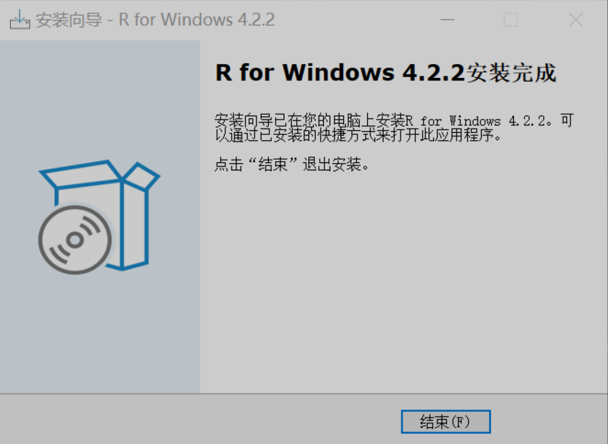{width="100%"}

### 安装Rstudio

-   双击安装程序

-   欢迎界面，点击【下一步】

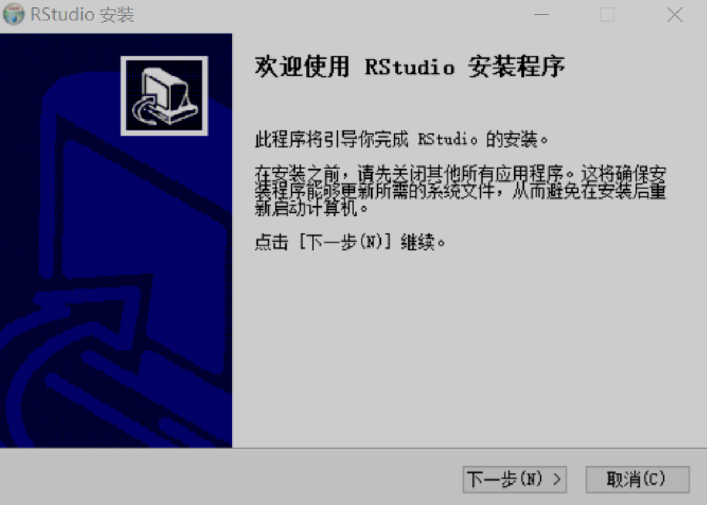{width="100%"}

-   选择安装位置：选择与R-4.2.1一样的安装路径。

{width="100%"}

-   一路默认安装，直至完成

{width="100%"}

-   双击Rstudio图标打开


-   Rstudio 初始界面

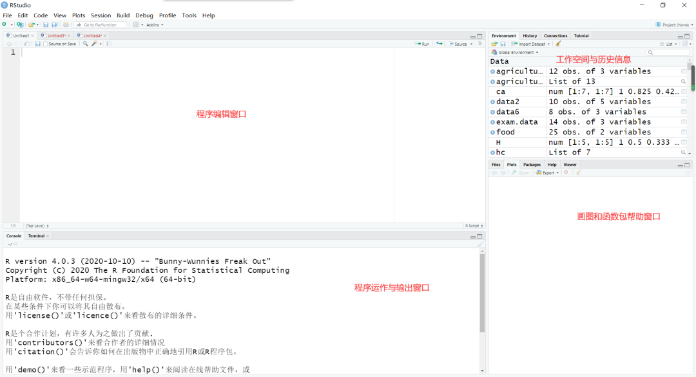{width="100%"}

## R入门 {.unnumbered}

推荐教程：李东风 [R语言教程](https://www.math.pku.edu.cn/teachers/lidf/docs/Rbook/html/_Rbook/index.html)

<!--chapter:end:05-R_install_basis.Rmd-->

---
---
---

# R入门


## 基础拾遗

### Rstudio 设置

-   初识Rstudio

Rstudio 默认由四个窗口组成，分别为：代码编辑窗口，环境变量窗口，控制台，以及绘图帮助窗口。窗口可以通过拖动分割柱移动。

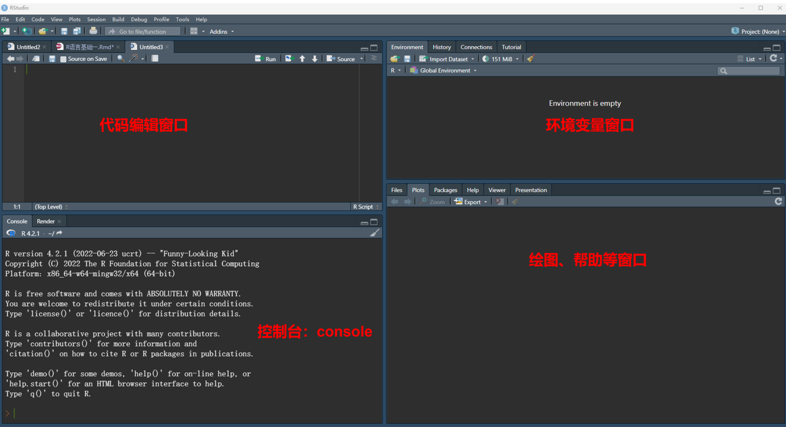{width="100%"}

-   个性化

Tools -\> Global Options -\> Appearance -\> 设定喜欢的编辑界面

-   packages 下载镜像设置

Tools -\> Global Options -\> Packages -\> primary CRAN repository -\>changes(选择距离你最近的镜像)

{width="100%"}


```r
# 下载 R 包：
install.packages("tidyverse")  注意打上英文的引号哦！ Ctrl+enter 运行！！
```


```r
# 加载 R 包：
library(tidyverse) # 注意并不需要引号哦！
```

**注意！ R 包安装成功后，要及时注释安装语句，避免重复安装。**


```r
# install.packages("tidyverse")
```

**注释： R 语言中，在代码前面加 "\#" 号表示该行后面的内容为解释性语句，默认不运行。快捷键:Ctrl+shift+C**

### 创建一个 R 脚本

快捷键 Ctrl+shift+N, 或点击右上角绿色加号 -\> R Script。

R 脚本（后缀名.R）是我们在上面编写程序以实现特定功能的文档。

-   写脚本的注意事项:

1.  脚本不应太长，一个脚本实现一个任务；
2.  养成注释的好习惯 (ctrl+shift+c)；

-   保存脚本：

-   打开脚本：

    如果出现中文为乱码，则点击 File -\> Reopen with Encoding -\> 选择其他中文编码。常见的中文编码类型有； UTF-8， GBK 等。

### 演示：

-   设定工作路径:


```r
# set working directory
setwd("D:\\数据") # 注意：斜杠与反斜杠，双反斜杠的不同
```

-   加载 R 包：


```r
library(tidyverse)
```

-   读取数据:


```r
mydata <- read.csv("data/CardiovascularDataset.csv",header = T) 
# header=True 表示有表头
```

这个语句里面， read.csv 表示在当前工作路径下，读取一个名为 data.csv 的文档； header=T 表示表头为真， T 为 TRUE 的缩写。然后，通过赋值符号"\<-"将读取的数据存储在变量 mydata 这里

-   查看数据:


```r
colnames(mydata) #col 为 colnumn 的前三个字母
```


```r
# 查看数据结构
str(mydata)# str 为 structure 的前三个字母
```

```
## 'data.frame':	303 obs. of  14 variables:
##  $ age     : int  63 53 41 56 60 57 56 44 52 57 ...
##  $ sex     : int  1 1 0 1 1 1 0 1 1 1 ...
##  $ cp      : int  3 0 1 1 0 0 1 1 2 2 ...
##  $ trestbps: int  145 140 130 120 130 140 140 120 172 150 ...
##  $ chol    : int  233 203 204 236 206 192 294 263 199 168 ...
##  $ fbs     : int  1 1 0 0 0 0 0 0 1 0 ...
##  $ restecg : int  0 0 0 1 0 1 0 1 1 1 ...
##  $ thalach : int  150 155 172 178 132 148 153 173 162 174 ...
##  $ exang   : int  0 1 0 0 1 0 0 0 0 0 ...
##  $ oldpeak : num  2.3 3.1 1.4 0.8 2.4 0.4 1.3 0 0.5 1.6 ...
##  $ slope   : int  0 0 2 2 1 1 1 2 2 2 ...
##  $ ca      : int  0 0 0 0 2 0 0 0 0 0 ...
##  $ thal    : int  1 3 2 2 3 1 2 3 3 2 ...
##  $ target  : int  1 0 1 1 0 1 1 1 1 1 ...
```


```r
# 查看分类变量的取值（唯一值）
unique(mydata$sex) # 美元符号 $ 表示索引，按变量名索引。
```

```
## [1] 1 0
```


```r
unique(mydata$target)
```

### 一些快捷键

1.  窗口可以通过拖动分割柱移动，也可以使用快捷键控制。比如：**Ctrl+shift+1**(2\\3\\4)

2.  创建一个R脚本 ------**Ctrl+shift+N**

3.  快速注释------**Ctrl+shift+C**

4.  善于利用小标题实现功能分区（**ctrl+shift+r**）

5.  **ctrl+alt+r** ------快速插入代码框

6.  注释（Ctrl+shift+c）； \# ；

7.  赋值（Alt+-）： =, \<- ;

8.  函数的标志： ();

9.  变量索引： \$;

10. 管道操作符： %\>%， \|\>：读作 "然后" ;

11. 比较或判断： \>, \< , \>=, \<=, ==, != ；

12. 逻辑运算： &(与), \|(或), !(非) ;

13. 算数运算： +， -， \*， /, \^, %%(取余), %/%(整除)。

## 数据基本操作

### 读取数据


```r
mydata <- read_csv("data/CardiovascularDataset.csv") # 读取数据
# knitr::kable(mydata, align = "c")

colnames(mydata) # 查看表头
str(mydata) # 查看数据结构
unique(mydata$cause) # 查看分类变量的取值（唯一值）
# 其他查看数据的函数
# summary(mydata)
# head(mydata)
# tail(mydata)
```

### 选择数据


```r
mydata2 <- mydata |> # 管道操作符： %>% 或者 |> ，读作然后
    filter(sex== 1) |>
    filter(target==1)
mydata2
```

```
##    age sex cp trestbps chol fbs restecg thalach exang
## 1   63   1  3      145  233   1       0     150     0
## 2   56   1  1      120  236   0       1     178     0
## 3   57   1  0      140  192   0       1     148     0
## 4   44   1  1      120  263   0       1     173     0
## 5   52   1  2      172  199   1       1     162     0
## 6   57   1  2      150  168   0       1     174     0
## 7   54   1  0      140  239   0       1     160     0
## 8   49   1  1      130  266   0       1     171     0
## 9   64   1  3      110  211   0       0     144     1
## 10  37   1  2      130  250   0       1     187     0
## 11  47   1  0      112  204   0       1     143     0
## 12  42   1  1      120  295   0       1     162     0
## 13  41   1  1      110  235   0       1     153     0
## 14  62   1  1      128  208   1       0     140     0
## 15  57   1  0      110  201   0       1     126     1
## 16  64   1  0      128  263   0       1     105     1
## 17  43   1  0      115  303   0       1     181     0
## 18  70   1  1      156  245   0       0     143     0
## 19  48   1  2      124  255   1       1     175     0
## 20  57   1  0      132  207   0       1     168     1
## 21  52   1  2      138  223   0       1     169     0
## 22  53   1  0      142  226   0       0     111     1
## 23  52   1  0      108  233   1       1     147     0
## 24  43   1  2      130  315   0       1     162     0
## 25  53   1  2      130  246   1       0     173     0
## 26  42   1  3      148  244   0       0     178     0
## 27  59   1  3      178  270   0       0     145     0
## 28  42   1  2      120  240   1       1     194     0
## 29  50   1  2      129  196   0       1     163     0
## 30  69   1  3      160  234   1       0     131     0
## 31  57   1  2      150  126   1       1     173     0
## 32  43   1  0      110  211   0       1     161     0
## 33  55   1  1      130  262   0       1     155     0
## 34  41   1  2      130  214   0       0     168     0
## 35  56   1  3      120  193   0       0     162     0
## 36  59   1  0      138  271   0       0     182     0
## 37  44   1  2      120  226   0       1     169     0
## 38  42   1  2      130  180   0       1     150     0
## 39  66   1  0      160  228   0       0     138     0
## 40  64   1  3      170  227   0       0     155     0
## 41  47   1  2      130  253   0       1     179     0
## 42  35   1  1      122  192   0       1     174     0
## 43  58   1  1      125  220   0       1     144     0
## 44  56   1  1      130  221   0       0     163     0
## 45  56   1  1      120  240   0       1     169     0
## 46  41   1  1      120  157   0       1     182     0
## 47  38   1  2      138  175   0       1     173     0
## 48  38   1  2      138  175   0       1     173     0
## 49  43   1  0      150  247   0       1     171     0
## 50  59   1  0      135  234   0       1     161     0
## 51  44   1  2      130  233   0       1     179     1
## 52  42   1  0      140  226   0       1     178     0
## 53  61   1  2      150  243   1       1     137     1
## 54  40   1  3      140  199   0       1     178     1
## 55  59   1  2      150  212   1       1     157     0
## 56  51   1  2      110  175   0       1     123     0
## 57  53   1  2      130  197   1       0     152     0
## 58  65   1  0      120  177   0       1     140     0
## 59  44   1  1      130  219   0       0     188     0
## 60  54   1  2      125  273   0       0     152     0
## 61  51   1  3      125  213   0       0     125     1
## 62  54   1  2      150  232   0       0     165     0
## 63  48   1  1      130  245   0       0     180     0
## 64  45   1  0      104  208   0       0     148     1
## 65  39   1  2      140  321   0       0     182     0
## 66  52   1  1      120  325   0       1     172     0
## 67  44   1  2      140  235   0       0     180     0
## 68  47   1  2      138  257   0       0     156     0
## 69  66   1  0      120  302   0       0     151     0
## 70  62   1  2      130  231   0       1     146     0
## 71  52   1  1      134  201   0       1     158     0
## 72  48   1  0      122  222   0       0     186     0
## 73  45   1  0      115  260   0       0     185     0
## 74  34   1  3      118  182   0       0     174     0
## 75  54   1  1      108  309   0       1     156     0
## 76  52   1  3      118  186   0       0     190     0
## 77  41   1  1      135  203   0       1     132     0
## 78  58   1  2      140  211   1       0     165     0
## 79  51   1  2      100  222   0       1     143     1
## 80  44   1  1      120  220   0       1     170     0
## 81  54   1  2      120  258   0       0     147     0
## 82  51   1  2       94  227   0       1     154     1
## 83  29   1  1      130  204   0       0     202     0
## 84  51   1  0      140  261   0       0     186     1
## 85  51   1  2      125  245   1       0     166     0
## 86  59   1  1      140  221   0       1     164     1
## 87  52   1  1      128  205   1       1     184     0
## 88  58   1  2      105  240   0       0     154     1
## 89  41   1  2      112  250   0       1     179     0
## 90  45   1  1      128  308   0       0     170     0
## 91  52   1  3      152  298   1       1     178     0
## 92  68   1  2      118  277   0       1     151     0
## 93  46   1  1      101  197   1       1     156     0
##    oldpeak slope ca thal target
## 1      2.3     0  0    1      1
## 2      0.8     2  0    2      1
## 3      0.4     1  0    1      1
## 4      0.0     2  0    3      1
## 5      0.5     2  0    3      1
## 6      1.6     2  0    2      1
## 7      1.2     2  0    2      1
## 8      0.6     2  0    2      1
## 9      1.8     1  0    2      1
## 10     3.5     0  0    2      1
## 11     0.1     2  0    2      1
## 12     0.0     2  0    2      1
## 13     0.0     2  0    2      1
## 14     0.0     2  0    2      1
## 15     1.5     1  0    1      1
## 16     0.2     1  1    3      1
## 17     1.2     1  0    2      1
## 18     0.0     2  0    2      1
## 19     0.0     2  2    2      1
## 20     0.0     2  0    3      1
## 21     0.0     2  4    2      1
## 22     0.0     2  0    3      1
## 23     0.1     2  3    3      1
## 24     1.9     2  1    2      1
## 25     0.0     2  3    2      1
## 26     0.8     2  2    2      1
## 27     4.2     0  0    3      1
## 28     0.8     0  0    3      1
## 29     0.0     2  0    2      1
## 30     0.1     1  1    2      1
## 31     0.2     2  1    3      1
## 32     0.0     2  0    3      1
## 33     0.0     2  0    2      1
## 34     2.0     1  0    2      1
## 35     1.9     1  0    3      1
## 36     0.0     2  0    2      1
## 37     0.0     2  0    2      1
## 38     0.0     2  0    2      1
## 39     2.3     2  0    1      1
## 40     0.6     1  0    3      1
## 41     0.0     2  0    2      1
## 42     0.0     2  0    2      1
## 43     0.4     1  4    3      1
## 44     0.0     2  0    3      1
## 45     0.0     0  0    2      1
## 46     0.0     2  0    2      1
## 47     0.0     2  4    2      1
## 48     0.0     2  4    2      1
## 49     1.5     2  0    2      1
## 50     0.5     1  0    3      1
## 51     0.4     2  0    2      1
## 52     0.0     2  0    2      1
## 53     1.0     1  0    2      1
## 54     1.4     2  0    3      1
## 55     1.6     2  0    2      1
## 56     0.6     2  0    2      1
## 57     1.2     0  0    2      1
## 58     0.4     2  0    3      1
## 59     0.0     2  0    2      1
## 60     0.5     0  1    2      1
## 61     1.4     2  1    2      1
## 62     1.6     2  0    3      1
## 63     0.2     1  0    2      1
## 64     3.0     1  0    2      1
## 65     0.0     2  0    2      1
## 66     0.2     2  0    2      1
## 67     0.0     2  0    2      1
## 68     0.0     2  0    2      1
## 69     0.4     1  0    2      1
## 70     1.8     1  3    3      1
## 71     0.8     2  1    2      1
## 72     0.0     2  0    2      1
## 73     0.0     2  0    2      1
## 74     0.0     2  0    2      1
## 75     0.0     2  0    3      1
## 76     0.0     1  0    1      1
## 77     0.0     1  0    1      1
## 78     0.0     2  0    2      1
## 79     1.2     1  0    2      1
## 80     0.0     2  0    2      1
## 81     0.4     1  0    3      1
## 82     0.0     2  1    3      1
## 83     0.0     2  0    2      1
## 84     0.0     2  0    2      1
## 85     2.4     1  0    2      1
## 86     0.0     2  0    2      1
## 87     0.0     2  0    2      1
## 88     0.6     1  0    3      1
## 89     0.0     2  0    2      1
## 90     0.0     2  0    2      1
## 91     1.2     1  0    3      1
## 92     1.0     2  1    3      1
## 93     0.0     2  0    3      1
```

这里面出现了管道操作符号" \|\> ", 这个符号读作：然后。所以这个语句的意思是：首先，选中 mydata，然后，选择 cause 为"HIV/AIDS" 的行，然后，选择年份为 2019 年的行，最后，将选择好的数据赋值给 mydata2。

特别注意： = 是赋值符， == 为判断符。

### 保存数据


```r
write.csv(mydata2, # 将 mydata2 这个数据
"data/sex1_target.csv") # 保存为 HIV.csv 文件

save(mydata2, file = "mydata2.Rdata")
load("mydata2.Rdata")
```

## 数据类型与数据结构

### 常见的数据类型

R 语言常见数据类型有：数值类型（numeric），字符串（character），逻辑（logical），其他： POSIXct,POSIXt 等。

-   数值类型： 1， 2， 3， 4.5,3.8;


```r
class(1)
```

```
## [1] "numeric"
```

```r
typeof(4.5)
```

```
## [1] "double"
```

-   字符串类型："字符"， "123"， "ASIR"， "HIV"


```r
class("123")
```

```
## [1] "character"
```

```r
typeof("ASIR")
```

```
## [1] "character"
```

-   逻辑： TRUE， FALSE, T, F;


```r
class(T)
```

```
## [1] "logical"
```

```r
typeof(FALSE)
```

```
## [1] "logical"
```

### 特殊数据类型： NaN,Inf， NA， NULL

-   NaN:Not a number, 计算出错时候出现，比如 0/0,Inf/Inf

-   Inf : 无穷

-   NA：not availabel，缺失值。 NA 值具有传染性，任何数值与之发生关系均会变为 NA

-   NULL：空值。空值与 NA 的区别：比如一个教室稀稀拉拉坐了十几个学生，那么没有学生的位置可以视为缺失，而空值表示连座位也没有。

### 数据类型的转换

-   numeric 与 logical 可以转化为 character，而 character 转化为 numeric 或者 logical 有可能出错，产生 NA 值。


```r
a <- as.character(1990)
class(a)
```

```
## [1] "character"
```


```r
b <- as.numeric("1990")
class(b)
```

```
## [1] "numeric"
```


```r
c <- as.numeric("ABC")
## Warning: 强制改变过程中产生了NA
c
```

```
## [1] NA
```

-   logical 可以转化为数值 0/1, 而在进行逻辑判断的时候， 0/1 也会被认为是 F/T


```r
as.numeric(TRUE)
```

```
## [1] 1
```

```r
as.logical(1)
```

```
## [1] TRUE
```

### 数据结构

-   标量

单个元素组成的数据结构，比如"A",123,TRUE 等。

\### 向量

多个标量组成的一维的数据结构，比如 Vector。


```r
# 生成向量
a <- c(1990:2019)
a
```

```
##  [1] 1990 1991 1992 1993 1994 1995 1996 1997 1998 1999
## [11] 2000 2001 2002 2003 2004 2005 2006 2007 2008 2009
## [21] 2010 2011 2012 2013 2014 2015 2016 2017 2018 2019
```

```r
b <- c(1,2,3,4,5,6)
b
```

```
## [1] 1 2 3 4 5 6
```

```r
c <- rep("A",3) #repeat 前三个字母
c
```

```
## [1] "A" "A" "A"
```

```r
d <- seq(from=1,to=10,by=2) #sequence 前三个字母
d
```

```
## [1] 1 3 5 7 9
```

-   矩阵 (matrix)，数据框 (data.frame)， tipple

-   列表 (list) 与数组 (array)

## 函数

### 函数的结构

R 语言函数一般由三个部分构成：函数体（body），参数（formals） , 环境（environment）。可以通过相应的函数查看函数的相应部分。以常见的 "粘贴" 函数 paste() 为例：


```r
# paste() 函数可以将两个向量对应的元素粘贴在一起。
a <- c("A","B","C")
b <- c(1:3)
c <- paste(a,b,sep = ":",collapse = NULL)
c
```

```
## [1] "A:1" "B:2" "C:3"
```

我们分别使用 body， formals, environment 函数查看 paste() 函数的相应部分。


```r
# 查看函数结构
body(paste)
```

```
## .Internal(paste(list(...), sep, collapse, recycle0))
```

```r
# 查看函数参数
formals(paste)
```

```
## $...
## 
## 
## $sep
## [1] " "
## 
## $collapse
## NULL
## 
## $recycle0
## [1] FALSE
```

```r
# 查看函数来自哪个包
environment(paste)
```

```
## <environment: namespace:base>
```

### 函数的功能

函数就像一个加工厂，可以将 "原料" 通过一系列转变，然后输出相应的 "产品"

{width="100%"}

这里的输入，可以是某个值、向量、 data.frame，或者是其他类型的数据；

输出，可以是数据，文档，图片等等。

### 函数的分类

R 语言的函数包括内置函数，外来函数（R 包），自编函数三大类。

-   实用的内置函数


```r
# 查看R语言自带数据集
data()
# 描述性统计类
sum()
cumsum()
mean()
median()
sd()
quantile()
# 生成随机数
runif(n = , min = , max = ) # uniform，生成 n 个服从均匀分布的小数
round(runif(n=,min=,max=),# round() 函数空值小数点的位数
      digits = 0)# 生成 n 个服从均匀分布的整数
```

-   实用的外来函数（tidyverse）


```r
# 根据变量取值进行筛选
filter()
# 选择变量
select()
# 生成变量
mutate()
# 排序
arrange()
# 分组统计
group_by() |>
  summarize()
```

-   演示（使用R自带数据）


```r
# 加载数据
data("ToothGrowth")
# 查看表头
colnames(ToothGrowth)
```

```
## [1] "len"  "supp" "dose"
```

```r
# 查看数据结构
str(ToothGrowth)
```

```
## 'data.frame':	60 obs. of  3 variables:
##  $ len : num  4.2 11.5 7.3 5.8 6.4 10 11.2 11.2 5.2 7 ...
##  $ supp: Factor w/ 2 levels "OJ","VC": 2 2 2 2 2 2 2 2 2 2 ...
##  $ dose: num  0.5 0.5 0.5 0.5 0.5 0.5 0.5 0.5 0.5 0.5 ...
```

```r
# 查看分组变量的取值
unique(ToothGrowth$supp)
```

```
## [1] VC OJ
## Levels: OJ VC
```

```r
# 生成变量（生成两个标签）
ToothGrowth <- ToothGrowth |>
  mutate(剂量=ifelse(dose==0.5,"0.5mg",
                   ifelse(dose==1.0,"1.0mg","2.0mg"))) |>
  mutate(补充喂养=ifelse(supp=="VC"," 维 C"," 橙汁"))

# 分组统计
summary_data <- ToothGrowth |>
  group_by(补充喂养, 剂量) |>
  summarize(
    n=n(),
    mean=mean(len),
    sd=sd(len))
```

-   自编函数

### 查看函数帮助


```r
# 如果知道具体的函数名字：
? # 查看函数的帮助，比如 ?filter
help() # 同？
?? # 查看 R 包的帮助，比如??dplyr
# 如果不知道具体的函数名字
apropos("norm")# apropos: 就... 而言
```

## 向量及其操作

向量为一系列标量的集合

### 创建向量


```r
c()
seq()
rep()
```

### 向量的类型

-   字符串，数值， logical 类型


```r
# 字符串型：
a <- c("A","A","B","B","C","C")
# 数值类型
b <- c(1:10)
# logical 类型
c <- c(T,T,F,F)
```

-   因子类型

R 语言有一类非常重要的变量类型，名为因子（factor）。因子可以视为分类变量的特殊类型，它既有值，又对值进行了排序（levels）。


```r
# 如何生成因子
name1 <- c(0,1,2)
name2 <- factor(name1,
                levels = c(0,1,2), #levels 必须与原始数据取值相同
                labels = c("Male","Female","Both")) #labels 是为了
class(name1)
```

```
## [1] "numeric"
```

```r
class(name2)
```

```
## [1] "factor"
```

### 向量的运算


```r
# 简单统计
a <- c(1:20)
mean(a)
```

```
## [1] 10.5
```

```r
# 算数运算
b <- 2*a # 标量与向量
c <- b+a # 标量与向量
```

### 重要：向量的循环补齐机制


```r
a <- c("A","B","C","D","E")
b <- c(1:3)
c <- paste(a,b,sep = ":")
c
```

```
## [1] "A:1" "B:2" "C:3" "D:1" "E:2"
```

{width="100%"}

### 交、并、补


```r
# 向量的交、并、补集，找不同，找相同，找不同（背熟）

# 取交集
a <- c(1:15)
b <- c(10:20)
intersect(a,b) 
```

```
## [1] 10 11 12 13 14 15
```

```r
# 取并集
union(a,b)
```

```
##  [1]  1  2  3  4  5  6  7  8  9 10 11 12 13 14 15 16 17
## [18] 18 19 20
```

```r
# 找不同
setdiff(a,b)
```

```
## [1] 1 2 3 4 5 6 7 8 9
```

```r
setdiff(b,a)
```

```
## [1] 16 17 18 19 20
```

```r
# 去除重复
aa <- c(rep("A",3),4:6)
unique(aa)
```

```
## [1] "A" "4" "5" "6"
```

### 向量的下标索引


```r
# 已经知道向量 x
x <- c(" 张三"," 小明"," 王五"," 李思齐")
# 如何选择李思齐？
x[4]
```

```
## [1] " 李思齐"
```

```r
# 如何同时选择小明与李思齐？
x[c(2,4)]
```

```
## [1] " 小明"   " 李思齐"
```

```r
# 如何不选择张三
x[-1]
```

```
## [1] " 小明"   " 王五"   " 李思齐"
```

## 数据框及其操作

数据框是 R 语言最常用的二维表。

### 生成数据框


```r
# 通过 read.csv 函数等读取
df <- read_csv()
```


```r
# 通过向量组合生成
age <- c(20,30,18,26)
name <- c(" 赵"," 钱"," 孙"," 李")
score <- c(99,65,77,88)
df <- data.frame(age=age,
                 name=name,
                 score=score)
```

### 数据框的下标索引


```r
# 数据框下标索引中间有逗号，逗号前表示行，逗号后表示列 [row,col]
# 选择 df 前两列
df[,2] # 空着表示全选
```

```
## [1] " 赵" " 钱" " 孙" " 李"
```

```r
df[2,] # 选择 df 前两行
```

```
##   age name score
## 2  30   钱    65
```

```r
df[2,2] # 选择 df 第二行第二列
```

```
## [1] " 钱"
```

```r
df[-3,] # 不选择第三行
```

```
##   age name score
## 1  20   赵    99
## 2  30   钱    65
## 4  26   李    88
```

```r
df[c(1,3),2] # 选择 1， 3 行； 2 列
```

```
## [1] " 赵" " 孙"
```

```r
df[df$name==" 李",] # 选择姓李的数据
```

```
##   age name score
## 4  26   李    88
```

### 数据框如何生成新的列


```r
# 比如生成身高数据
height <- c(178,180,169,175)
df$height <- height
df
```

```
##   age name score height
## 1  20   赵    99    178
## 2  30   钱    65    180
## 3  18   孙    77    169
## 4  26   李    88    175
```

<!--chapter:end:06_R_basis.Rmd-->


# NHANES数据库介绍

## 数据库简介

National Health and Nutrition Examination Survey （NHANES数据库，网址：[https://www.cdc.gov/nchs/nhanes/index.htm）](https://www.cdc.gov/nchs/nhanes/index.htm），收集了有关美国家庭人口健康和营养信息，是一项基于人群的横断面调查。)收集了有关美国家庭人口健康和营养信息，是一项基于人群的横断面调查。

该数据库开始于80年代，生物样本包含了参与者的血清，血浆，尿液等，涉及多种测量指标。此外，还包含了大量的调查问卷数据，调查问卷涉及广泛，包括人口统计学、社会经济学、饮食和健康相关问题，体检部分包括生理测量、实验室检查等内容。

-   **观看NHANES官方视频介绍**

该数据库自20世纪末开始，每两年一个周期，更新数据，而且是免费对外开放的，研究者可以根据需要直接下载数据。

{width="100%"}

在网站首页，进入Publications and Products，我们可以进行交互式数据可视化展示，数据简报，电子病例等。比如，我们进入数据可视化页面的数据。这些数据代表了从1999-2000年到2017-2018年国家健康和营养检查调查 (NHANES) 的估计值。

{width="100%"}

虽然NHANES数据库自带分析功能并以线图、bar图和表等展示数据，但是并不能满足我们发表论文的需求。因此，我们需要学会数据的下载和处理。当然，如何把数据库数据转化为论文，还要通过相关医学文献的阅读来实现。

在NHANES数据库官网首页，点击左栏的NHANES Questionnaires, Datasets, and Related Documentation，进入调查表、数据集和相关文档。待下载的数据在Continuous NHANES选项里面。这些数据是按照年份进行上传和保存的。

-   **Step 1.** 点击1处或2处直接进入数据下载页面（如下图）

{width="100%"}

-   **Step 2.** 可以从下图中的1、2、3处下载数据。

{width="100%"}

从1或3处可以按年份下载，每个年份包含Demographics Data"（人口数据）、"Dietary Data"（饮食数据）、"Examination Data"（检查数据）、"Laboratory Data"（化验数据）、"Questionnaire Data"（问卷数据）、"Limited Access Data"（限制访问数据）。

比如，我们选取2017-2018年的数据进行下载。点击选择左栏选项中的NHANES 2017-2018或右侧Continuous NHANES里面的NHANES 2017-2018。然后页面自动跳转到2017-2018数据页面。数据内容包括四部分：①数据、文档和密码文件，包含人口统计资料、饮食数据、检查资料、实验室资料、问卷表和有限访问的数据；②详细资料，包括问卷工具、实验方法、程序手册以及小册子和知情同意文件；③使用数据，包括概述、发行说明、实验室数据概览、检查资料概览、问卷数据概览、调查途径和数据分析指南、回应率和人口统计，网站还提供了网络教程。④内容概览，主要是常见问题的汇总等。

{width="100%"}

点击要下载的数据文件，选择存储位置，点击下载。我们以Demographics Data为例。选择Data File下面的DEMO_J\_ Data进行下载（Doc_File是对访问资料的介绍，无需下载）。文件类型是.XPT，下载时对网速有要求。下载后数据可用统计软件SPSS等打开，或者用R也可以。

{width="100%"}

-   或者直接用nhanesA下载数据（速度可能比较慢）


```r
library(nhanesA)
mydata1<-nhanes('DEMO_J')
```

## 数据提取

数据下好后用R读取


```r
library(haven)
library(tidyverse)
mydata <- read_xpt("data/demo_j.xpt")
head(mydata,10)
```

```
## # A tibble: 10 × 46
##    SEQN SDDSR…¹ RIDST…² RIAGE…³ RIDAG…⁴ RIDAG…⁵ RIDRE…⁶
##   <dbl>   <dbl>   <dbl>   <dbl>   <dbl>   <dbl>   <dbl>
## 1 93703      10       2       2       2      NA       5
## 2 93704      10       2       1       2      NA       3
## 3 93705      10       2       2      66      NA       4
## 4 93706      10       2       1      18      NA       5
## 5 93707      10       2       1      13      NA       5
## 6 93708      10       2       2      66      NA       5
## # … with 4 more rows, 39 more variables:
## #   RIDRETH3 <dbl>, RIDEXMON <dbl>, RIDEXAGM <dbl>,
## #   DMQMILIZ <dbl>, DMQADFC <dbl>, DMDBORN4 <dbl>,
## #   DMDCITZN <dbl>, DMDYRSUS <dbl>, DMDEDUC3 <dbl>,
## #   DMDEDUC2 <dbl>, DMDMARTL <dbl>, RIDEXPRG <dbl>,
## #   SIALANG <dbl>, SIAPROXY <dbl>, SIAINTRP <dbl>,
## #   FIALANG <dbl>, FIAPROXY <dbl>, FIAINTRP <dbl>, …
```

-   [对照变量说明提取需要得变量](https://wwwn.cdc.gov/Nchs/Nhanes/2017-2018/DEMO_J.htm)

{width="100%"}


```r
dat1<- mydata %>% select(SEQN, # 序列号
                         RIAGENDR, # 性别
                         RIDAGEYR, # 年龄
                         RIDRETH3, # 种族
                         DMDMARTL, # 婚姻状况
                         WTINT2YR,WTMEC2YR, # 权重
                         SDMVPSU, # psu
                         SDMVSTRA) # strata
```

以上demo文件中只有人口统计学指标，提取其他信息还需要下载其他数据。假如我们想提取血糖，血糖应该在[化验室指标](https://wwwn.cdc.gov/nchs/nhanes/search/datapage.aspx?Component=Laboratory&CycleBeginYear=2017)那里，这次我们使用nhanesA包来下载。

{width="100%"}


```r
# xuetang1 <- nhanes('GLU_J') # 在线提取
xuetang <- read_xpt("data/glu_j.xpt")
knitr::kable(xuetang[1:10, ] ,align = "c")
```


| SEQN  | WTSAF2YR | LBXGLU | LBDGLUSI |
|:-----:|:--------:|:------:|:--------:|
| 93708 |  25654   |  122   |   6.77   |
| 93711 |  29226   |  107   |   5.94   |
| 93717 |  137151  |   91   |   5.05   |
| 93718 |  58883   |   89   |   4.94   |
| 93719 |    0     |   86   |   4.77   |
| 93721 |  17155   |  104   |   5.77   |
| 93722 |  294374  |  101   |   5.61   |
| 93731 |  65813   |   98   |   5.44   |
| 93732 |    0     |   NA   |    NA    |
| 93735 |  20279   |   83   |   4.61   |

提取好指标后进行合并


```r
hdata<- full_join(dat1, xuetang, by = 'SEQN', type = 'full')
knitr::kable(hdata[1:10, ] ,align = "c")
```


| SEQN  | RIAGENDR | RIDAGEYR | RIDRETH3 | DMDMARTL | WTINT2YR | WTMEC2YR | SDMVPSU | SDMVSTRA | WTSAF2YR | LBXGLU | LBDGLUSI |
|:-----:|:--------:|:--------:|:--------:|:--------:|:--------:|:--------:|:-------:|:--------:|:--------:|:------:|:--------:|
| 93703 |    2     |    2     |    6     |    NA    |   9246   |   8540   |    2    |   145    |    NA    |   NA   |    NA    |
| 93704 |    1     |    2     |    3     |    NA    |  37339   |  42567   |    1    |   143    |    NA    |   NA   |    NA    |
| 93705 |    2     |    66    |    4     |    3     |   8615   |   8338   |    2    |   145    |    NA    |   NA   |    NA    |
| 93706 |    1     |    18    |    6     |    NA    |   8549   |   8723   |    2    |   134    |    NA    |   NA   |    NA    |
| 93707 |    1     |    13    |    7     |    NA    |   6769   |   7065   |    1    |   138    |    NA    |   NA   |    NA    |
| 93708 |    2     |    66    |    6     |    1     |  13329   |  14372   |    2    |   138    |  25654   |  122   |   6.77   |
| 93709 |    2     |    75    |    4     |    2     |  12043   |  12278   |    1    |   136    |    NA    |   NA   |    NA    |
| 93710 |    2     |    0     |    3     |    NA    |  16418   |  16848   |    1    |   134    |    NA    |   NA   |    NA    |
| 93711 |    1     |    56    |    6     |    1     |  11178   |  12391   |    2    |   134    |  29226   |  107   |   5.94   |
| 93712 |    1     |    18    |    1     |    NA    |  29040   |  30337   |    2    |   147    |    NA    |   NA   |    NA    |

把它保存起来，今后的操作将在这个数据展开


```r
write.csv(hdata,file= "1.csv",row.names = F)
```

## 需要注意的点

### 结局

-   [有死亡信息](https://www.cdc.gov/nchs/data-linkage/mortality-public.htm)，需要另外页面下载。

进入死亡数据下载界面（Data Linkage------NDI Mortality Files------Public-Use Files）

{width="100%"}

Public-Use Linked Mortality Files点击FTP Site，进入死亡数据索引目录。阅读数据集说明文件及变量说明，可以对数据集内容有个基本的了解。

{width="100%"}

选择需要年份的死亡数据下载；

{width="100%"}

### 数据分析

NHANES是[复杂抽样](https://wwwn.cdc.gov/nchs/nhanes/tutorials/module2.aspx)，所以需要用到"复杂抽样"的分析方法。

并且要注意[权重的合并](https://wwwn.cdc.gov/nchs/nhanes/tutorials/module3.aspx)！

> -   NHANES样本分为四个阶段：
>
>     （a）PSU（县、县内的区域组或相邻县的组合）；
>
>     （b）PSU内的部分（普查区或区的组合）；
>
>     （c）分段内的居住单元、家庭（DU）；
>
>     （d）家庭中的个人。PSU是从美国所有县取样的。根据过采样标准，在DU级别进行筛选以识别被抽样的人（SP）。
>
> -   year:样本中年数的调整
>
>     NHANES是每年都会进行的抽样，但由于样本量的限制，经常需要合并多年以增强统计效能。但是不同年份测量的变量不一致。比如要合并6年的数据，这可能导致有的变量2年一测，有的变量3年一测，有的变量6年一测。此时不可以直接提取进行计算。
>
>     以4年的数据为例：由于4年样本设计，从原始抽样率计算的初始基本权重对应于4年样本。 这些初始基权值是基于抽样概率的， 为了产生与1年和2年样本的全国人口总数相一致的权重，需要调整因子。 例如，为了为2015-2016年NHANES和2017-2018年NHANES在公共使用文件中发布的数据创建两年样本权重，将4年基权重乘以2，以考虑2年的选择（设计中的年数除以样本中的年数，4除以2=2）。

多看官网的各种分析提供的[代码示例](https://wwwn.cdc.gov/nchs/nhanes/tutorials/module6.aspx)

### 一些技巧

-   查看指定年份和指定类别的信息


```r
library(nhanesA)
nhanesTables('EXAM', 2017)
```

{width="100%"}

-   查看详细信息

1.  假设我们需要进一步查看BPX_J的内部信息


```r
nhanesTableVars(data_group = 'Exam', nh_table = 'BPX_J', namesonly = FALSE)
```

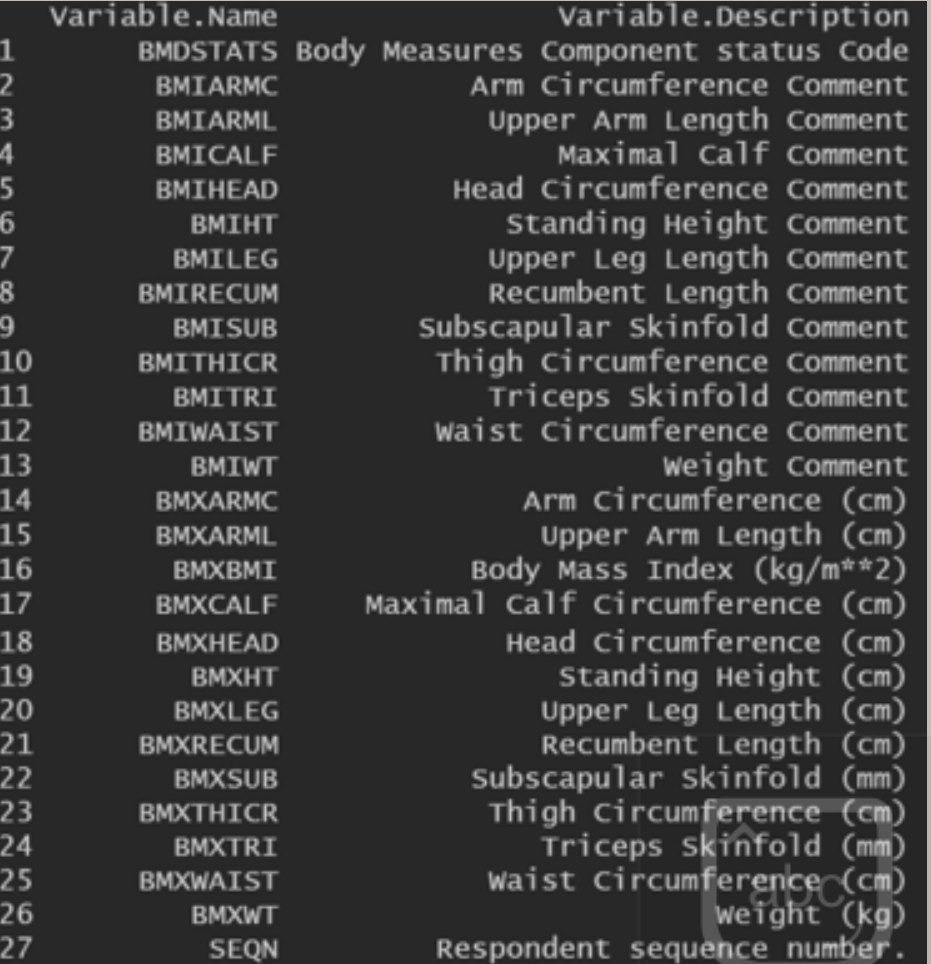{width="100%"}

可以看到，此表之中有27列。Seqn是受访者的序列号，可以用来连接各表。


<!--chapter:end:07-Nhanes.Rmd-->

---
---
---


# MIMIC数据库介绍

## 数据库简介

### 基本情况

MIMIC （官网：<https://mimic.mit.edu/>）是一个重症医学数据库，全称是Medical Information Mart for Intensive Care。2003年，在NIH的资助下，来自贝斯以色列女执事医疗中心(Beth Israel Deaconess Medical Center)、麻省理工(MIT)、牛津大学和麻省总医院(MGH)的急诊科医生、重症科医生、计算机科学专家等共同建立的一个数据库。

{width="100%"}

{width="100%"}

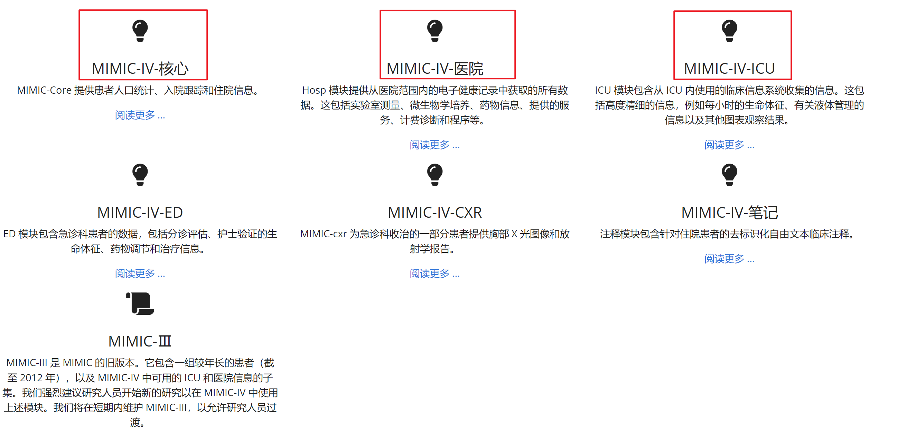{width="100%"}

在进行隐私数据脱敏后，提供了数十万患者在急诊和ICU治疗期间基本信息（年龄、性别、基础病史），住院期间完整的诊疗信息（治疗措施、药物，生命体征、实验室检查等）以及临床结局等信息。让临床医生无需经过痛苦的收集信息的过程就可以接触到数十万患者的海量临床信息，验证自己的临床思路，发表高质量文章。

{width="100%"}

### 版本介绍

MIMIC从开发至今，共存在三个大版本：MIMIC-II，MIMIC-III，MIMIC-IV。

-   MIMIC-II：MIMIC-II包含2001-2008年的数据。数据是主要从CareVue监视器收集的。MIMIC-II现在已不再公开，但如果想要提取数据，可以从MIMIC-III中获取数据，利用筛选数据库来源为CareVue来提取MIMIC-II的数据。

-   MIMIC-III：MIMIC-III包含2001-2012年的数据。患者数据是从Metavision和CareVue两个地方采集的。MIMIC-III 数据库当前最新版本是v1.4。这个版本是在2016年9月2日发布，此次发布提高了数据库中的数据质量，为Metavision数据库中的病人提供了大量的补充数据。MIMIC-III v1.4从2016年至今，未再进一步的修正，这也是MIMIC-III 数据库的最终版本。

-   MIMIC-IV：MIMIC-IV是对MIMIC-III的更新，MIMIC-IV包含2008年至2019年（含）的数据。最近推出的生物标志物将可用。MIMIC-IV来自两个院内数据库系统：一个是定制的医院范围的数字电子健康记录（EHR）、一个是重症监护室（ICU）特定的临床信息系统。目*前已更新到2.1版本（2022.11.16更新）*。[由于小版本刚更新不稳定，本次主要已**2.0版本**为基础进行介绍。]{.underline}

### MIMIC-IV创建流程

-   **收购**

    从各自的医院数据库中提取了入住BIDMC急诊室或其中一个重症监护病房的患者的数据。创建了一个主患者列表，其中包含与2008年至2019年期间入住ICU或急诊室的患者相对应的所有医疗记录编号。所有源表都筛选为仅与主患者列表中的患者相关的行。

-   **制备**

    从各自的医院数据库中提取了入住BIDMC急诊室或其中一个重症监护病房的患者的数据。创建了一个主患者列表，其中包含与2008年至2019年期间入住ICU或急诊室的患者相对应的所有医疗记录编号。所有源表都筛选为仅与主患者列表中的患者相关的行。

-   **去识别化**

    HIPAA 规定的患者标识符已被删除。使用随机密码替换患者标识符，导致患者，住院和ICU住院的整数标识符去识别化。结构化数据是使用查找表格和允许列表过滤的。如有必要，应用了自由文本去识别化算法从自由文本中删除 PHI。[**最后，日期和时间使用以天为单位的偏移量随机移动到将来。为每个subject_id分配了一个日期班次。因此，单个患者的数据在内部是一致的。**]{.underline}例如，如果数据库中两个度量值之间的时间在原始数据中为4 小时，则 MIMIC-IV 中计算的时间差也将为 4 小时。相反，不同的患者在时间上不具有可比性。也就是说，[**2130年入院的两名患者不一定在同一年入院**]{.underline}。

### MIMIC-IV内容组成

MIMIC-IV主要分为三大模块，分别是**core、hosp、icu**。

-   **core** 模块存储使用MIMIC-IV进行任何数据分析所需的患者跟踪信息。内容包含三个表：**入院表**、**患者表**和**转移表**。这些表提供了患者的人口统计数据、每次住院的记录以及住院期间每个病房住宿的记录。

    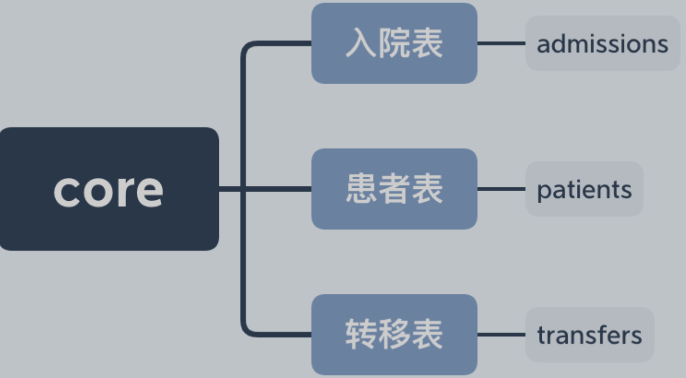{width="100%"}

-   **hosp** 模块包含从医院范围的EHR 派生的数据。这些测量结果主要记录在**住院期间**，尽管有些表格也包括来自医院外的数据（例如，在实验室活动中进行的门诊实验室检查）。信息包括**实验室测量**、**微生物培养**、提供者订单、药物管理、**药物处方**、医院账单信息和服务相关信息。

    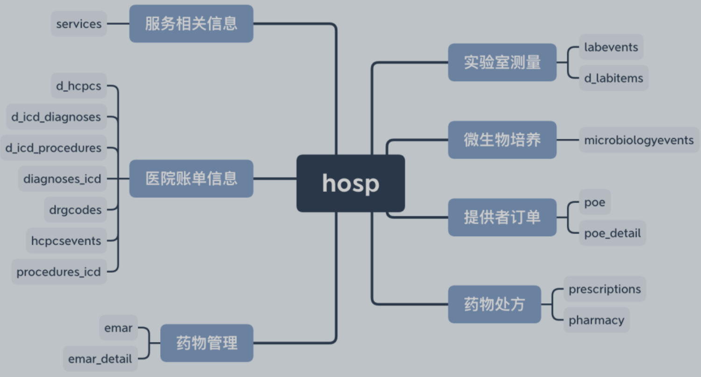{width="100%"}

-   **icu** 模块包含来自BIDMC：MetaVision（iMDSoft）的临床信息系统的数据。MetaVision表被非规范化以创建一个星形架构，其中icustays和d_items表链接到一组数据表，所有数据表都以"事件"为后缀。icu模块中记录的数据包括**静脉注射和液体输入**（输入事件）、患者输出（输出事件）、程序（程序事件）、记录为日期或时间的信息（日期时间事件）以及**其他图表信息（图表事件）**。所有事件表都包含一个stay_id列，用于识别icustays中的相关ICU患者，以及一个允许识别d_items中记录的概念的 itemid 列。

    {width="100%"}

-   数据总览

    {width="100%"}

## 数据库申请

### 注册Physionet账号

-   进入网址：[www.physionet.org](www.physionet.org)，注册账号。

    建议使用机构/学校邮箱申请，注册后邮箱会收到激活账号链接，点击网址激活。

{width="100%"}

-   登录后选设置

{width="100%"}

-   然后点Credentialing，apply for access

{width="100%"}

就会提示你为了获得认证，需要通过相关培训认证，培训认证，是在CITI这个网站提供的。

### 注册CITI账号

①复制这句话："Massachusetts Institute of Technology Affiliates"，表示是MIT附属单位，这样才能免费获取课程。

②在Physionet网页上点击或者直接访问（[https://about.citiprogram.org](https://about.citiprogram.org/，点Register)），注意要贴上之前复制的文字。

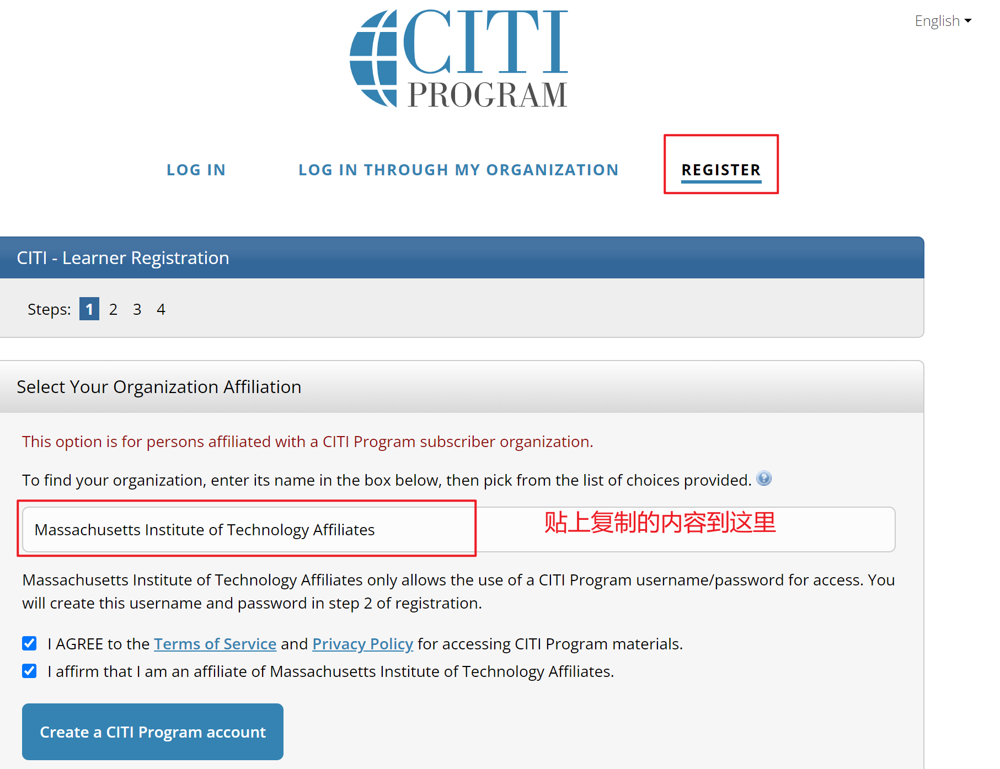{width="100%"}

{width="100%"}

{width="100%"}

{width="100%"}

{width="100%"}

{width="100%"}

{width="100%"}

{width="100%"}

-   注册完成，登录进去就可以看到课程。

{width="100%"}

两个都考

{width="100%"}

第一门有两个模块，第二门有九个模块。

**考试可反复参加，90%以上正确率才合格，完成考试后需下载报告。**

> 部分试题答案：
>
> Which of the followingproposed studies would constitute human subjects research as defined under thefederal regulations?
>
> A researcher from a school of social workobtains access to students' academic records (including identifiableinformation) to assess the effect of drug awareness programs on studentacademic achievement.
>
>  
>
> Which of the followingactivities meets the federal definitions of research?
>
> Collection of elementary school test scoresto evaluate the effectiveness of an experimental program to teach reading
>
>  
>
> Which of the followingconstitutes both a breach of a confidentiality (the research data have beendisclosed, counter to the agreement between researcher and subjects) and aviolation of subjects' privacy (the right of the individuals to be protectedagainst intrusion into their personal lives or affairs)?
>
> A faculty member makes identifiable dataabout sexual behavior available to graduate students, although the subjectswere assured that the data would be de-identified.
>
>  
>
> Which of the following isa measure researchers can use to protect the confidentiality of subject data?
>
> Keep sensitive and identifiable data inencrypted files on a password protected hard drive.
>
>  
>
> When the primarypotential harm is the breach of individually identifiable data, to protectagainst such disclosure the researcher should.
>
> Encrypt the data and store it in passwordprotected files.
>
>  
>
> Which of the followingstatements about individually identifiable research data is correct?
>
> Researchers may be required to releaseindividually identifiable information outside the research setting.
>
>  
>
> Which of the followingresearch activities with children qualifies for exemption?
>
> A researcher observing children in aplayground to identify bullying behaviors.
>
>  
>
> In accordance withfederal regulations, which of the following statements best describes whenresearch with children may be exempt?
>
> Only certain exemption categories can beused with research involving children.
>
>  
>
> Which of the followingactivities constitutes engagement in research?
>
> Obtaining informed consent and conductingresearch interviews.
>
>  
>
> If federally fundedresearch involves collaboration with an organization that is"engaged" in research in a foreign country, the foreign organizationcan rely on the US researcher's institution's IRB for its review.
>
> \
>
>  
>
> Which of the followingpractices is an example of how the principle of beneficence is applied to astudy involving human subjects?
>
> Ensuring that risks are reasonable inrelationship to anticipated benefits.
>
>  
>
> A researcher fails toinform subjects about the risks and benefits of being in a focus group. Whichof the following describes the ethical principle violated by the researcher?
>
> Respect for persons
>
>  
>
> When evaluating risks ofharm IRBs must determine that:
>
> isks are reasonable in relation toanticipated benefits.
>
>  
>
> According to the criteriafor IRB approval, when considering equitable treatment of subjects, specialcare must be taken with which of the following populations?
>
> prisoners
>
>  
>
> Which statement iscorrect about informed consent?
>
> It requires disclosure of any benefits tothe subject or to others that may reasonably be expected
>
>  
>
> The informed consentdocument, regardless of the research topic, must always include the following:
>
> A statement describing the extent, if any,to which confidentiality of records identifying the subject will be maintained.
>
>  
>
> A graduate student inCommunications intends to write her thesis, as part of a federally-fundedstudy, on the effect of print versus televised media on people's daily lives.The researcher wishes to conduct the study in a local prison because of limitedresources for subject recruitment. The subjects will be asked for 15 minutes oftheir time. The questionnaire appears innocuous and the risks appear to beminimal. The IRB should:
>
> Not approve this project because theresearch question could be answered without the participation of prisoners.
>
>  
>
> A researcher wishes toconduct a study on the relationship between paternal care giving (that is, thecare the prisoner subjects received as children from their fathers) andincarceration, using a short 15-minute survey. Which category applies to thisresearch?
>
> Study of the possible causes, effects, andprocesses of incarceration, and of criminal behavior, provided that the studypresents no more than minimal risk and no more than inconvenience to thesubjects (Category i)
>
> Comment
>
>  
>
> Providing parentsinformation about a study, in lieu of active parental permission, is allowedwhen:
>
> An IRB has approved a waiver of therequirement for parental permission
>
>  
>
> When research isconducted in educational settings with children, when is the assent ofpotential student subjects required?
>
> When the IRB has determined that studentsare capable of providing assent.

### 上传成绩单及个人信息，等待人工审核

考试通过后，回到Physionet，acount，credentialing那里，把所有的信息都填上，上传CITI的成绩单，提交申请，等待通过，注意Reference这里一定要认真填写，邮箱要正确。

{width="100%"}

-   等待.....邮件通知通过注册。

### 通过后签署同意书，下载数据

审核通过后，就可以在Physionet首页，Data这里点击进去，下载数据，你会看到，除了MIMIC以外，这里还有好多其他数据集。

{width="100%"}

## 数据库下载与安装

### 数据下载

通过注册后，进入<https://physionet.org/content/mimiciv/2.0/> 签署知情同意

{width="100%"}

正常是在Files有一个下载的链接：

{width="50%"}

但是由于版本更新，2.0目前无下载链接。

{width="100%"}

所以使用我提供的数据进行演练（**仅供内部练习使用，没有获得权限无法发表文章**）

百度云地址：（留好足够空间，建议80G以上）

<https://pan.baidu.com/s/1FMYJh4IFuqMpH1f69OuJXw?pwd=ed5c>

提取码：ed5c

### 数据安装

#### 官方教程的安装

> 安装比较难....流程都一样，但会出现各种莫名奇妙的问题，推荐几个安装教程，大家自己尝试下。
>
> 1.  [MIMIC-IV数据库安装过程更简化（电脑小白保姆版）](https://mp.weixin.qq.com/s?__biz=MzIyMTEyOTEzNg==&mid=2247520947&idx=1&sn=68496f2fef007667a34a080b95bab421&chksm=97c3a26ca0b42b7a784a8db0afba3c84d9966bd49ff7fb1b4347e632a66e55529ddf773fd1b9&scene=21#wechat_redirect)
> 2.  [手把手教你MIMIC-IV数据库安装](https://mp.weixin.qq.com/s?__biz=MzIyMTEyOTEzNg==&mid=2247505644&idx=1&sn=cc5192e325c63f2670147923a993fcf4&scene=21#wechat_redirect)
> 3.  [前方有雷！MIMIC-IV数据库安装排雷指南](https://mp.weixin.qq.com/s?__biz=MzIyMTEyOTEzNg==&mid=2247511241&idx=3&sn=2689e66ec9850f567d81577f7dfd9054&chksm=97c39c16a0b41500b05f77b2c036fbadb8482953c8fee958a79f6ed858ba368e1a67a3cafca5&scene=21#wechat_redirect)
> 4.  [智慧ICU](https://mp.weixin.qq.com/mp/appmsgalbum?__biz=MzI3OTkxNjEyNw==&action=getalbum&album_id=1844026174826446849&scene=173&from_msgid=2247485252&from_itemidx=1&count=3&nolastread=1#wechat_redirect)

-   我们再次进入mimic官网（<https://mimic.physionet.org/gettingstarted/access/>）

-   点击getting started，拉到下面点击 Local database setup

    {width="100%"}

-   [按照教程页面安装](https://mimic.mit.edu/docs/gettingstarted/local/install-mimic-locally-windows/)PostgreSQL、7-zip，随后在命令框输入教程代码进行配置数据库即可。

    {width="100%"}

#### Navicat 的安装

按照官方教程安装完成后，下面再进行安装Navicat软件，[官网](http://www.navicat.com.cn/)提供14天免费的试用功能。大家可以下载安装（提供的百度云链接里也有安装包）。

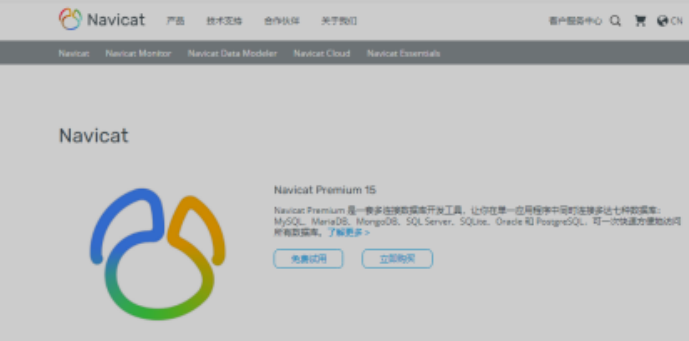{width="100%"}

-   打开Navicat，点击连接-PostgreSQL，如下图；

{width="100%"}

-   进入如下界面，在连接名里随意输入名称，密码填之前设置的超级管理员postgres的密码；

{width="100%"}

-   点击确定，连接成功，这是可在左侧看到我们连接到的mimic iv数据库。

{width="100%"}

-   观看\<科研杂录\>安装教程

## 数据提取

<!--chapter:end:08-MIMIC.Rmd-->

