# Python 安装与入门

## Anaconda 的安装

### Anaconda简介

Anaconda，是一个开源的Python发行版本，其包含了conda、Python以及一大堆安装好的工具包及依赖项，比如numpy、pandas、matplotlib等。

conda是一个开源的包、环境管理器，可以用于在同一个机器上安装不同版本的软件包及其依赖，并能够在不同的环境之间切换。不同的Python项目常常会对应不同的Python版本和依赖包版本，使用conda就可以方便的对不同的环境进行管理。

Anaconda还附带了数据分析常用的**Jupyter Notebook**，之前被称为 IPython notebook，是一个交互式笔记本。Jupyter Notebook 的本质是一个 Web应用程序，可以将代码、图像和文档全部组合到一个web文档中，便于创建和共享程序文档，支持实时代码，数学方程，可视化和markdown，在数据清理和转换，数据分析，统计建模，机器学习等方面应用广泛。

### Anaconda 下载

-   官网：<https://www.anaconda.com/>

-   百度云：

    链接：<https://pan.baidu.com/s/1lr5ks5FiTgCrS-jrXdNZQQ?pwd=ab5q>

    提取码：ab5q

### 安装步骤

-   双击安装包进行安装，点击下一步。

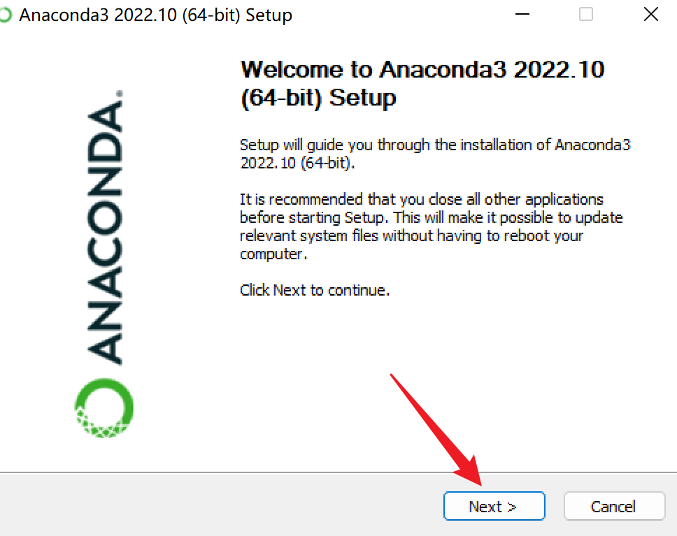

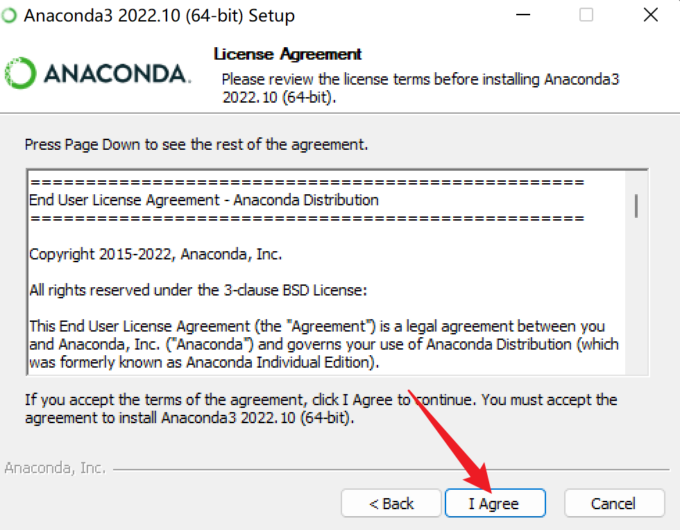

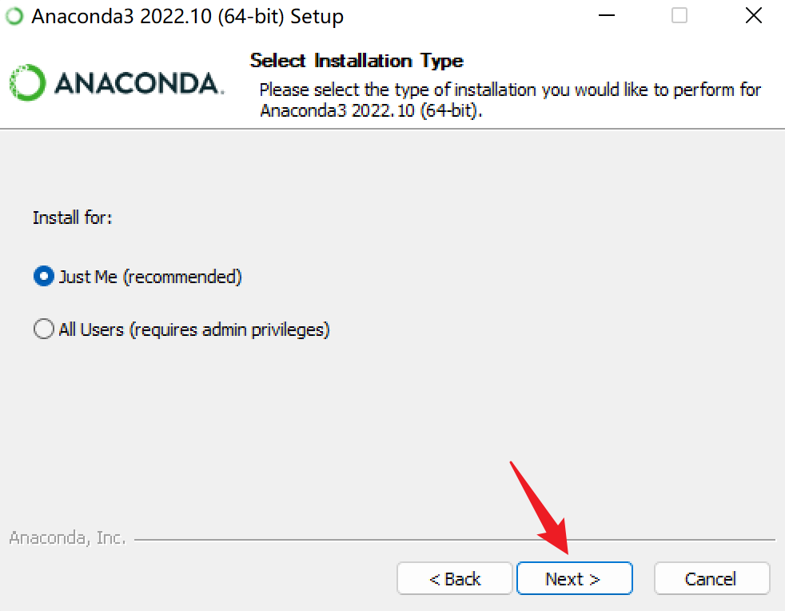

-   选择安装位置，一定要记住。

出现下面的界面，选择安装路径，尽量不要装入系统盘，系统盘的空间资源很宝贵。建议安装到**其他盘**，注意安装路径**不要包含汉字并且尽量不要包含空格**。选择后安装路径之后，点击 next。

比如，我安装位置为：G:\\develop\\anaconda

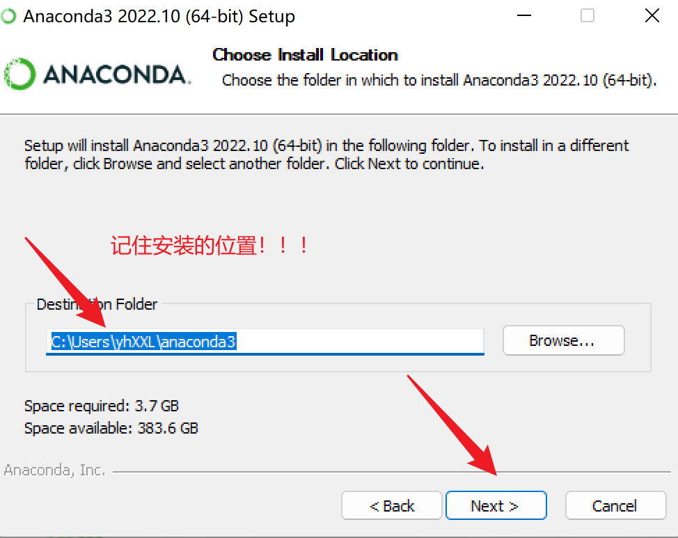

-   这一步是选择是否勾选环境变量，这里暂时先不勾选，后面再配置好了。之后点击install进行安装即可。

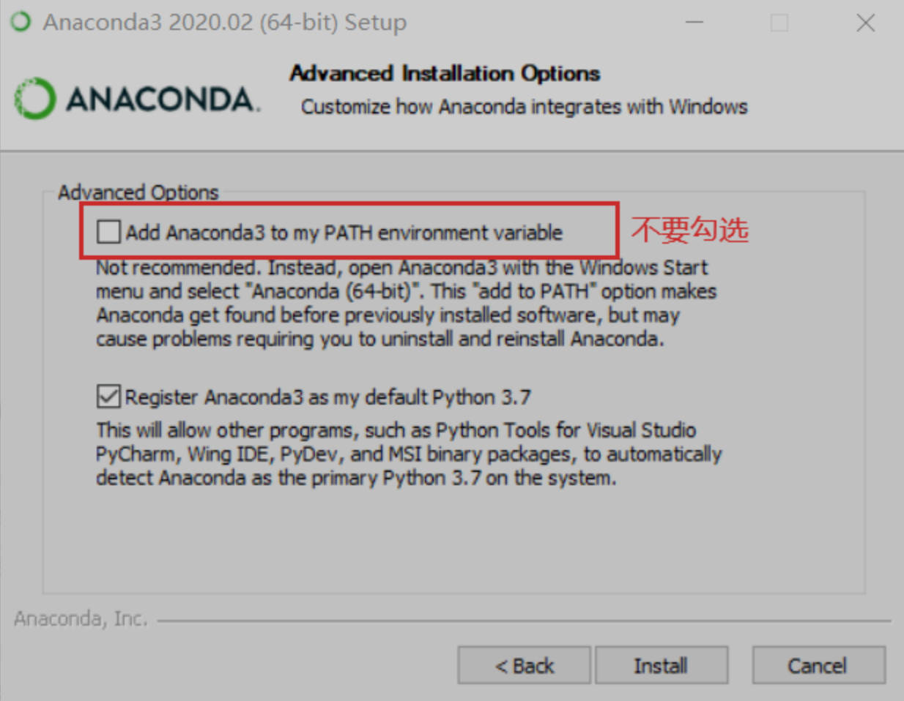{width="100%"}

-   安装进行中，等待安装完成。 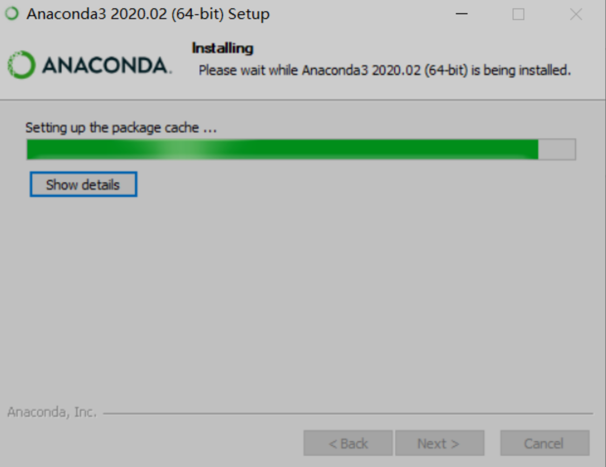{width="100%"}

<!-- -->

-   一会儿之后就会安装完成，根据如下提示进行勾选和不勾选即可，点击finish，表示安装完成。 {width="100%"}

<!-- -->

-   安装完成后手动添加环境变量

**第一步：此电脑\>右键\>属性\>高级系统设置**

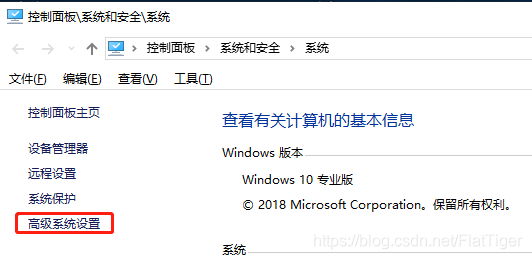{width="100%"}

**第二步：点击环境变量**

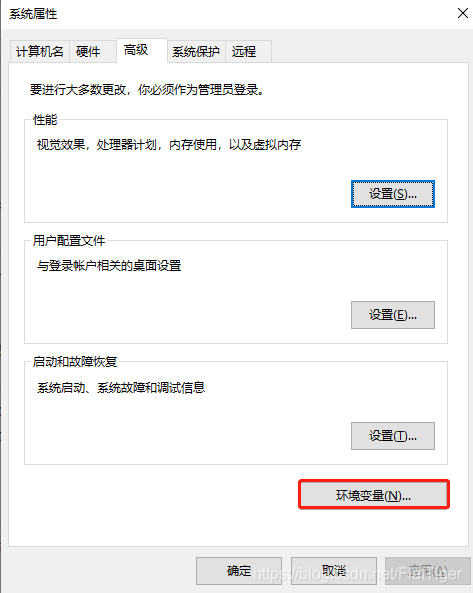{width="100%"}

**第三步：选择系统变量中的path\>编辑**

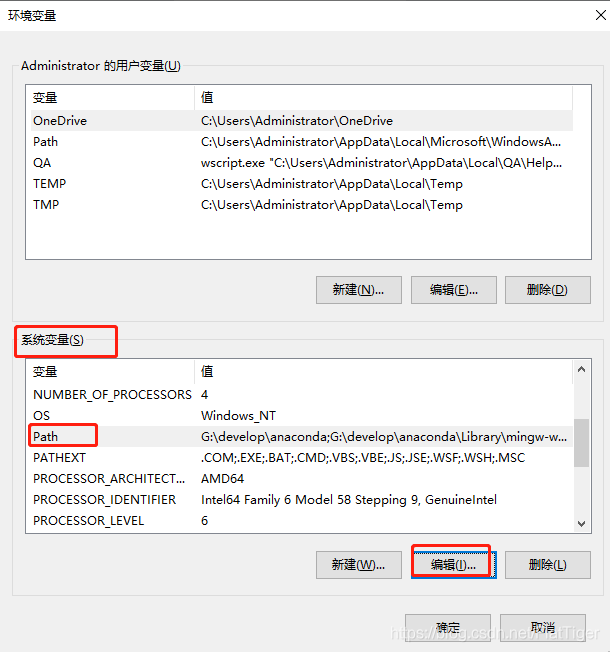{width="100%"}

**第四步：新建环境变量**

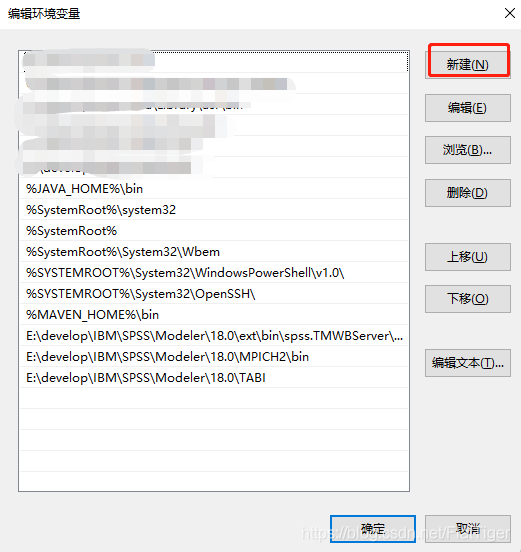{width="100%"}

**第五步：输入本地的anaconda的相关目录，注意这个目录是你自己的安装目录。**

下面是我的anaconda相关目录：

G:\\develop\\anaconda

G:\\develop\\anaconda\\Library\\mingw-w64\\bin

G:\\develop\\anaconda\\Library\\usr\\bin

G:\\develop\\anaconda\\Library\\bin

G:\\develop\\anaconda\\Scripts

要把以上目录修改成自己的anaconda安装目录。比如你的anaconda安装在E盘下，那么就写成E:\\anaconda，E:\\anaconda\\Library\\mingw-w64\\bin 等等。

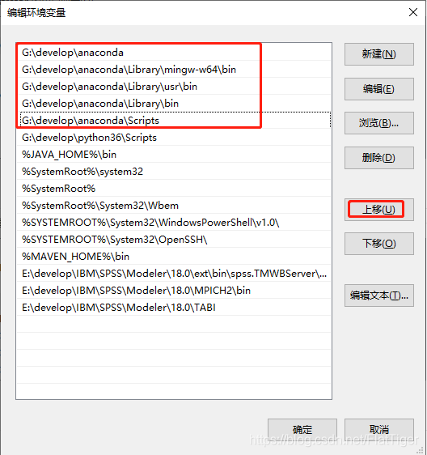{width="100%"}

**第六步：依次点击确定关闭所有的windows窗口，重启cmd**

> win+R
>
> 输入：cmd

**第七步：输入conda \--version验证（注意空格，注意两个横线）**

如果如下图所示，就代表配置成功了。conda后面的数字可以不一样，这个是conda的版本信息

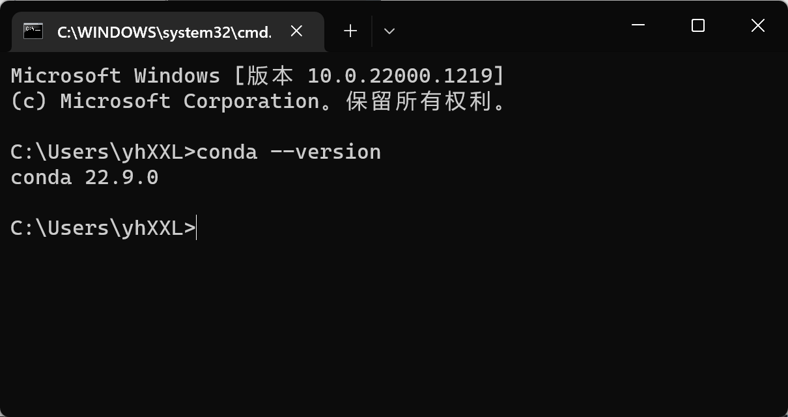{width="100%"}

### conda\pip 基本命令

-   添加镜像


```bash
# 为了装包速度快点，添加国内镜像

conda config --add channels https://mirrors.tuna.tsinghua.edu.cn/anaconda/pkgs/free/
conda config --add channels https://mirrors.tuna.tsinghua.edu.cn/anaconda/pkgs/main/
conda config --add channels https://mirrors.tuna.tsinghua.edu.cn/anaconda/cloud/conda-forge/
conda config --add channels https://mirrors.tuna.tsinghua.edu.cn/anaconda/cloud/bioconda/
conda config --set show_channel_urls yes

```

-   基本命令


```bash
conda list    #查看当前环境所安装的包
conda install numpy # 安装包
conda install python=2.7    #安装指定版本包或软件
conda uninstall numpy  # 卸载包

pip list    #查看当前环境所安装的包
pip install numpy # 安装包

# 可以在使用pip的时候加参数-i https://pypi.tuna.tsinghua.edu.cn/simple 
# 例如：pip install -i https://pypi.tuna.tsinghua.edu.cn/simple gevent，这样就会从清华这边的镜像去安装gevent库。
```

### 打开jupyter notebook

-   将带有.ipynb 文件夹放到桌面

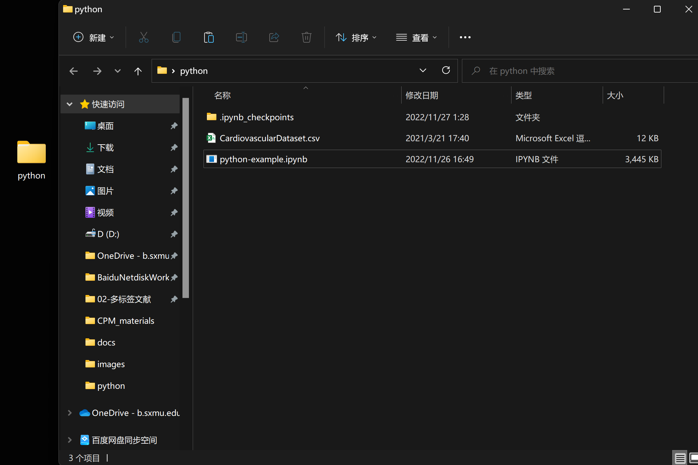{width="100%"}

-   打开 anaconda prompt

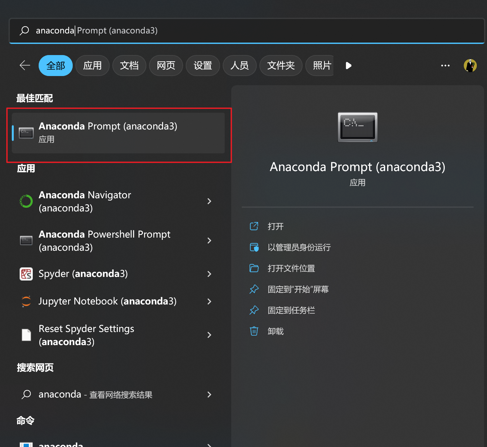{width="100%"}

-   输入： cd desktop 按回车键

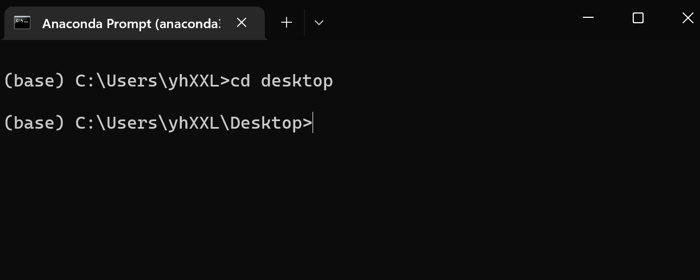{width="100%"}

-   接着输入：jupyter notebook 按回车键

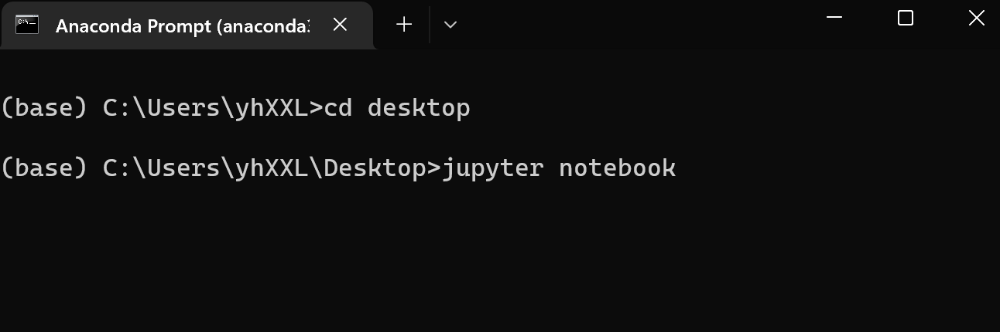{width="100%"}

-   稍等一会，打开自带浏览器，找到python这个文件，打开

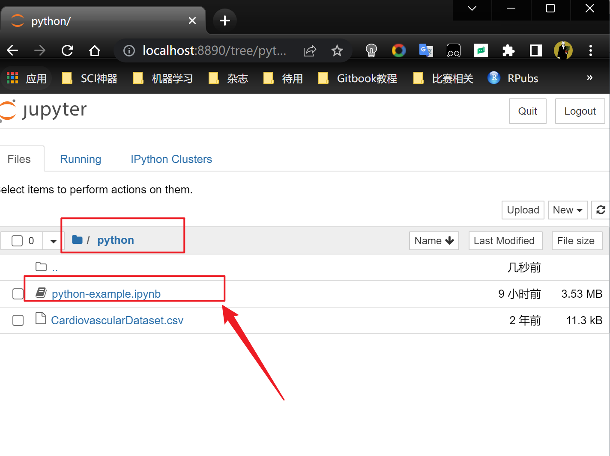{width="100%"}

-   点python-example.ipynb文件就可以了

## python 入门

推荐教程：<https://www.cainiaojc.com/python/python-tutorial.html>

简单介绍：

文档链接: <https://www.mubucm.com/doc/5y3mswgOYWg>

文档链接: <https://www.mubucm.com/doc/3U7gD8xHiWg>
