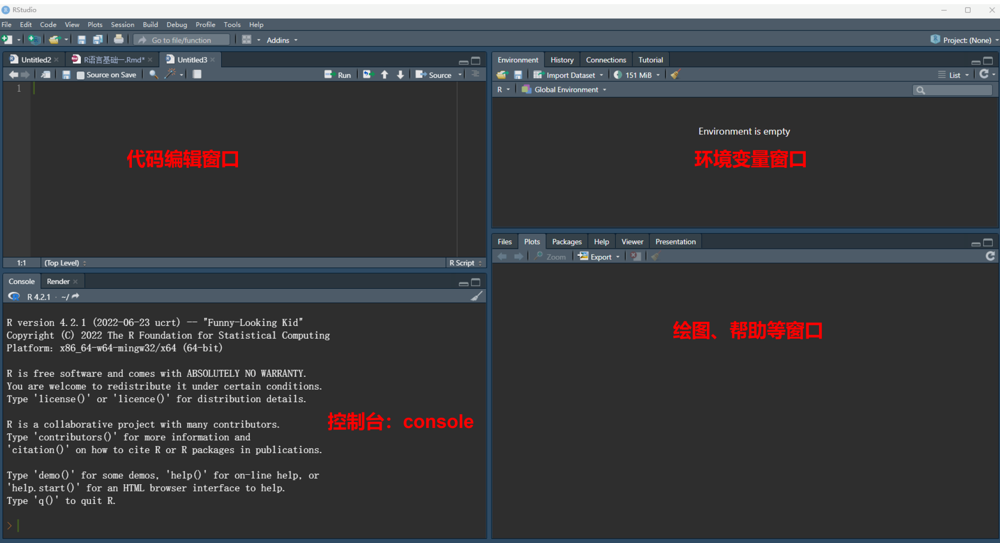
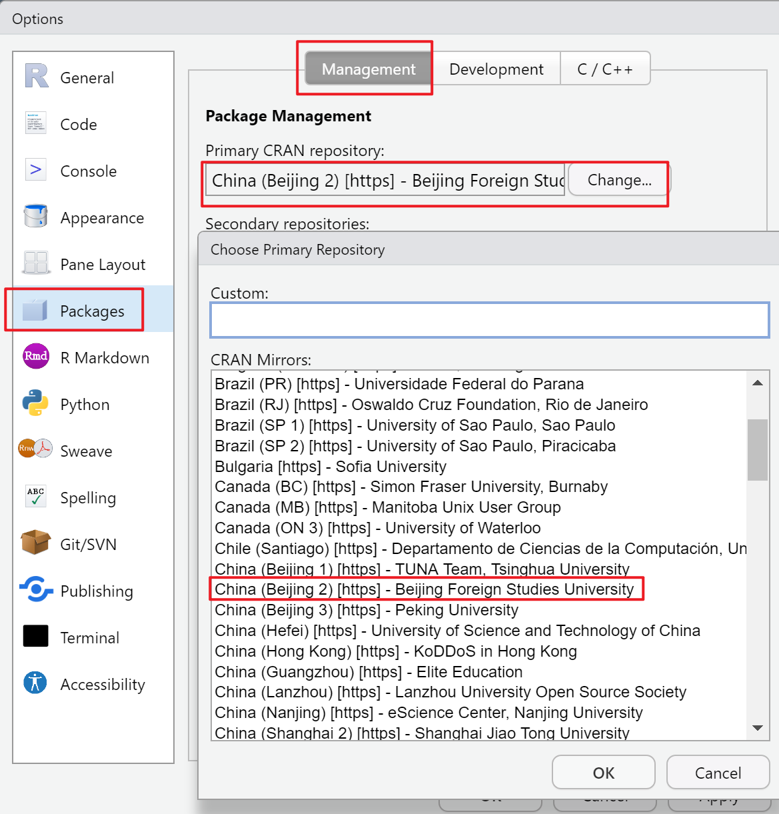
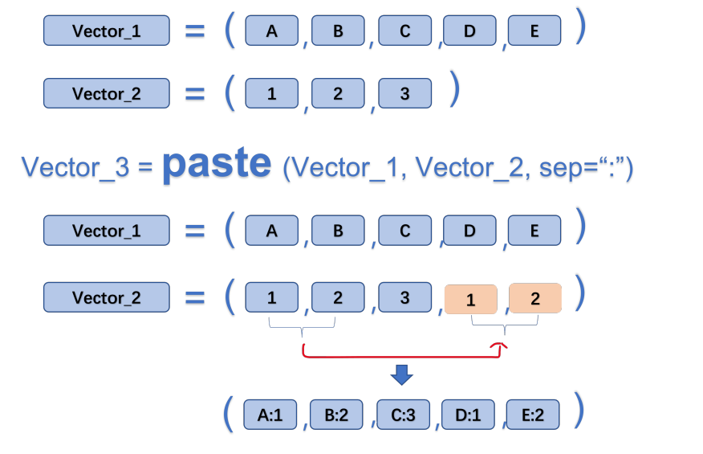

# R入门


## 基础拾遗

### Rstudio 设置

-   初识Rstudio

Rstudio 默认由四个窗口组成，分别为：代码编辑窗口，环境变量窗口，控制台，以及绘图帮助窗口。窗口可以通过拖动分割柱移动。

{width="100%"}

-   个性化

Tools -\> Global Options -\> Appearance -\> 设定喜欢的编辑界面

-   packages 下载镜像设置

Tools -\> Global Options -\> Packages -\> primary CRAN repository -\>changes(选择距离你最近的镜像)

{width="100%"}


```r
# 下载 R 包：
install.packages("tidyverse")  注意打上英文的引号哦！ Ctrl+enter 运行！！
```


```r
# 加载 R 包：
library(tidyverse) # 注意并不需要引号哦！
```

**注意！ R 包安装成功后，要及时注释安装语句，避免重复安装。**


```r
# install.packages("tidyverse")
```

**注释： R 语言中，在代码前面加 "\#" 号表示该行后面的内容为解释性语句，默认不运行。快捷键:Ctrl+shift+C**

### 创建一个 R 脚本

快捷键 Ctrl+shift+N, 或点击右上角绿色加号 -\> R Script。

R 脚本（后缀名.R）是我们在上面编写程序以实现特定功能的文档。

-   写脚本的注意事项:

1.  脚本不应太长，一个脚本实现一个任务；
2.  养成注释的好习惯 (ctrl+shift+c)；

-   保存脚本：

-   打开脚本：

    如果出现中文为乱码，则点击 File -\> Reopen with Encoding -\> 选择其他中文编码。常见的中文编码类型有； UTF-8， GBK 等。

### 演示：

-   设定工作路径:


```r
# set working directory
setwd("D:\\数据") # 注意：斜杠与反斜杠，双反斜杠的不同
```

-   加载 R 包：


```r
library(tidyverse)
```

-   读取数据:


```r
mydata <- read.csv("data/CardiovascularDataset.csv",header = T) 
# header=True 表示有表头
```

这个语句里面， read.csv 表示在当前工作路径下，读取一个名为 data.csv 的文档； header=T 表示表头为真， T 为 TRUE 的缩写。然后，通过赋值符号"\<-"将读取的数据存储在变量 mydata 这里

-   查看数据:


```r
colnames(mydata) #col 为 colnumn 的前三个字母
```


```r
# 查看数据结构
str(mydata)# str 为 structure 的前三个字母
```

```
## 'data.frame':	303 obs. of  14 variables:
##  $ age     : int  63 53 41 56 60 57 56 44 52 57 ...
##  $ sex     : int  1 1 0 1 1 1 0 1 1 1 ...
##  $ cp      : int  3 0 1 1 0 0 1 1 2 2 ...
##  $ trestbps: int  145 140 130 120 130 140 140 120 172 150 ...
##  $ chol    : int  233 203 204 236 206 192 294 263 199 168 ...
##  $ fbs     : int  1 1 0 0 0 0 0 0 1 0 ...
##  $ restecg : int  0 0 0 1 0 1 0 1 1 1 ...
##  $ thalach : int  150 155 172 178 132 148 153 173 162 174 ...
##  $ exang   : int  0 1 0 0 1 0 0 0 0 0 ...
##  $ oldpeak : num  2.3 3.1 1.4 0.8 2.4 0.4 1.3 0 0.5 1.6 ...
##  $ slope   : int  0 0 2 2 1 1 1 2 2 2 ...
##  $ ca      : int  0 0 0 0 2 0 0 0 0 0 ...
##  $ thal    : int  1 3 2 2 3 1 2 3 3 2 ...
##  $ target  : int  1 0 1 1 0 1 1 1 1 1 ...
```


```r
# 查看分类变量的取值（唯一值）
unique(mydata$sex) # 美元符号 $ 表示索引，按变量名索引。
```

```
## [1] 1 0
```


```r
unique(mydata$target)
```

### 一些快捷键

1.  窗口可以通过拖动分割柱移动，也可以使用快捷键控制。比如：**Ctrl+shift+1**(2\\3\\4)

2.  创建一个R脚本 ------**Ctrl+shift+N**

3.  快速注释------**Ctrl+shift+C**

4.  善于利用小标题实现功能分区（**ctrl+shift+r**）

5.  **ctrl+alt+r** ------快速插入代码框

6.  注释（Ctrl+shift+c）； \# ；

7.  赋值（Alt+-）： =, \<- ;

8.  函数的标志： ();

9.  变量索引： \$;

10. 管道操作符： %\>%， \|\>：读作 "然后" ;

11. 比较或判断： \>, \< , \>=, \<=, ==, != ；

12. 逻辑运算： &(与), \|(或), !(非) ;

13. 算数运算： +， -， \*， /, \^, %%(取余), %/%(整除)。

## 数据基本操作

### 读取数据


```r
mydata <- read_csv("data/CardiovascularDataset.csv") # 读取数据
# knitr::kable(mydata, align = "c")

colnames(mydata) # 查看表头
str(mydata) # 查看数据结构
unique(mydata$cause) # 查看分类变量的取值（唯一值）
# 其他查看数据的函数
# summary(mydata)
# head(mydata)
# tail(mydata)
```

### 选择数据


```r
mydata2 <- mydata |> # 管道操作符： %>% 或者 |> ，读作然后
    filter(sex== 1) |>
    filter(target==1)
mydata2
```

```
##    age sex cp trestbps chol fbs restecg thalach exang
## 1   63   1  3      145  233   1       0     150     0
## 2   56   1  1      120  236   0       1     178     0
## 3   57   1  0      140  192   0       1     148     0
## 4   44   1  1      120  263   0       1     173     0
## 5   52   1  2      172  199   1       1     162     0
## 6   57   1  2      150  168   0       1     174     0
## 7   54   1  0      140  239   0       1     160     0
## 8   49   1  1      130  266   0       1     171     0
## 9   64   1  3      110  211   0       0     144     1
## 10  37   1  2      130  250   0       1     187     0
## 11  47   1  0      112  204   0       1     143     0
## 12  42   1  1      120  295   0       1     162     0
## 13  41   1  1      110  235   0       1     153     0
## 14  62   1  1      128  208   1       0     140     0
## 15  57   1  0      110  201   0       1     126     1
## 16  64   1  0      128  263   0       1     105     1
## 17  43   1  0      115  303   0       1     181     0
## 18  70   1  1      156  245   0       0     143     0
## 19  48   1  2      124  255   1       1     175     0
## 20  57   1  0      132  207   0       1     168     1
## 21  52   1  2      138  223   0       1     169     0
## 22  53   1  0      142  226   0       0     111     1
## 23  52   1  0      108  233   1       1     147     0
## 24  43   1  2      130  315   0       1     162     0
## 25  53   1  2      130  246   1       0     173     0
## 26  42   1  3      148  244   0       0     178     0
## 27  59   1  3      178  270   0       0     145     0
## 28  42   1  2      120  240   1       1     194     0
## 29  50   1  2      129  196   0       1     163     0
## 30  69   1  3      160  234   1       0     131     0
## 31  57   1  2      150  126   1       1     173     0
## 32  43   1  0      110  211   0       1     161     0
## 33  55   1  1      130  262   0       1     155     0
## 34  41   1  2      130  214   0       0     168     0
## 35  56   1  3      120  193   0       0     162     0
## 36  59   1  0      138  271   0       0     182     0
## 37  44   1  2      120  226   0       1     169     0
## 38  42   1  2      130  180   0       1     150     0
## 39  66   1  0      160  228   0       0     138     0
## 40  64   1  3      170  227   0       0     155     0
## 41  47   1  2      130  253   0       1     179     0
## 42  35   1  1      122  192   0       1     174     0
## 43  58   1  1      125  220   0       1     144     0
## 44  56   1  1      130  221   0       0     163     0
## 45  56   1  1      120  240   0       1     169     0
## 46  41   1  1      120  157   0       1     182     0
## 47  38   1  2      138  175   0       1     173     0
## 48  38   1  2      138  175   0       1     173     0
## 49  43   1  0      150  247   0       1     171     0
## 50  59   1  0      135  234   0       1     161     0
## 51  44   1  2      130  233   0       1     179     1
## 52  42   1  0      140  226   0       1     178     0
## 53  61   1  2      150  243   1       1     137     1
## 54  40   1  3      140  199   0       1     178     1
## 55  59   1  2      150  212   1       1     157     0
## 56  51   1  2      110  175   0       1     123     0
## 57  53   1  2      130  197   1       0     152     0
## 58  65   1  0      120  177   0       1     140     0
## 59  44   1  1      130  219   0       0     188     0
## 60  54   1  2      125  273   0       0     152     0
## 61  51   1  3      125  213   0       0     125     1
## 62  54   1  2      150  232   0       0     165     0
## 63  48   1  1      130  245   0       0     180     0
## 64  45   1  0      104  208   0       0     148     1
## 65  39   1  2      140  321   0       0     182     0
## 66  52   1  1      120  325   0       1     172     0
## 67  44   1  2      140  235   0       0     180     0
## 68  47   1  2      138  257   0       0     156     0
## 69  66   1  0      120  302   0       0     151     0
## 70  62   1  2      130  231   0       1     146     0
## 71  52   1  1      134  201   0       1     158     0
## 72  48   1  0      122  222   0       0     186     0
## 73  45   1  0      115  260   0       0     185     0
## 74  34   1  3      118  182   0       0     174     0
## 75  54   1  1      108  309   0       1     156     0
## 76  52   1  3      118  186   0       0     190     0
## 77  41   1  1      135  203   0       1     132     0
## 78  58   1  2      140  211   1       0     165     0
## 79  51   1  2      100  222   0       1     143     1
## 80  44   1  1      120  220   0       1     170     0
## 81  54   1  2      120  258   0       0     147     0
## 82  51   1  2       94  227   0       1     154     1
## 83  29   1  1      130  204   0       0     202     0
## 84  51   1  0      140  261   0       0     186     1
## 85  51   1  2      125  245   1       0     166     0
## 86  59   1  1      140  221   0       1     164     1
## 87  52   1  1      128  205   1       1     184     0
## 88  58   1  2      105  240   0       0     154     1
## 89  41   1  2      112  250   0       1     179     0
## 90  45   1  1      128  308   0       0     170     0
## 91  52   1  3      152  298   1       1     178     0
## 92  68   1  2      118  277   0       1     151     0
## 93  46   1  1      101  197   1       1     156     0
##    oldpeak slope ca thal target
## 1      2.3     0  0    1      1
## 2      0.8     2  0    2      1
## 3      0.4     1  0    1      1
## 4      0.0     2  0    3      1
## 5      0.5     2  0    3      1
## 6      1.6     2  0    2      1
## 7      1.2     2  0    2      1
## 8      0.6     2  0    2      1
## 9      1.8     1  0    2      1
## 10     3.5     0  0    2      1
## 11     0.1     2  0    2      1
## 12     0.0     2  0    2      1
## 13     0.0     2  0    2      1
## 14     0.0     2  0    2      1
## 15     1.5     1  0    1      1
## 16     0.2     1  1    3      1
## 17     1.2     1  0    2      1
## 18     0.0     2  0    2      1
## 19     0.0     2  2    2      1
## 20     0.0     2  0    3      1
## 21     0.0     2  4    2      1
## 22     0.0     2  0    3      1
## 23     0.1     2  3    3      1
## 24     1.9     2  1    2      1
## 25     0.0     2  3    2      1
## 26     0.8     2  2    2      1
## 27     4.2     0  0    3      1
## 28     0.8     0  0    3      1
## 29     0.0     2  0    2      1
## 30     0.1     1  1    2      1
## 31     0.2     2  1    3      1
## 32     0.0     2  0    3      1
## 33     0.0     2  0    2      1
## 34     2.0     1  0    2      1
## 35     1.9     1  0    3      1
## 36     0.0     2  0    2      1
## 37     0.0     2  0    2      1
## 38     0.0     2  0    2      1
## 39     2.3     2  0    1      1
## 40     0.6     1  0    3      1
## 41     0.0     2  0    2      1
## 42     0.0     2  0    2      1
## 43     0.4     1  4    3      1
## 44     0.0     2  0    3      1
## 45     0.0     0  0    2      1
## 46     0.0     2  0    2      1
## 47     0.0     2  4    2      1
## 48     0.0     2  4    2      1
## 49     1.5     2  0    2      1
## 50     0.5     1  0    3      1
## 51     0.4     2  0    2      1
## 52     0.0     2  0    2      1
## 53     1.0     1  0    2      1
## 54     1.4     2  0    3      1
## 55     1.6     2  0    2      1
## 56     0.6     2  0    2      1
## 57     1.2     0  0    2      1
## 58     0.4     2  0    3      1
## 59     0.0     2  0    2      1
## 60     0.5     0  1    2      1
## 61     1.4     2  1    2      1
## 62     1.6     2  0    3      1
## 63     0.2     1  0    2      1
## 64     3.0     1  0    2      1
## 65     0.0     2  0    2      1
## 66     0.2     2  0    2      1
## 67     0.0     2  0    2      1
## 68     0.0     2  0    2      1
## 69     0.4     1  0    2      1
## 70     1.8     1  3    3      1
## 71     0.8     2  1    2      1
## 72     0.0     2  0    2      1
## 73     0.0     2  0    2      1
## 74     0.0     2  0    2      1
## 75     0.0     2  0    3      1
## 76     0.0     1  0    1      1
## 77     0.0     1  0    1      1
## 78     0.0     2  0    2      1
## 79     1.2     1  0    2      1
## 80     0.0     2  0    2      1
## 81     0.4     1  0    3      1
## 82     0.0     2  1    3      1
## 83     0.0     2  0    2      1
## 84     0.0     2  0    2      1
## 85     2.4     1  0    2      1
## 86     0.0     2  0    2      1
## 87     0.0     2  0    2      1
## 88     0.6     1  0    3      1
## 89     0.0     2  0    2      1
## 90     0.0     2  0    2      1
## 91     1.2     1  0    3      1
## 92     1.0     2  1    3      1
## 93     0.0     2  0    3      1
```

这里面出现了管道操作符号" \|\> ", 这个符号读作：然后。所以这个语句的意思是：首先，选中 mydata，然后，选择 cause 为"HIV/AIDS" 的行，然后，选择年份为 2019 年的行，最后，将选择好的数据赋值给 mydata2。

特别注意： = 是赋值符， == 为判断符。

### 保存数据


```r
write.csv(mydata2, # 将 mydata2 这个数据
"data/sex1_target.csv") # 保存为 HIV.csv 文件

save(mydata2, file = "mydata2.Rdata")
load("mydata2.Rdata")
```

## 数据类型与数据结构

### 常见的数据类型

R 语言常见数据类型有：数值类型（numeric），字符串（character），逻辑（logical），其他： POSIXct,POSIXt 等。

-   数值类型： 1， 2， 3， 4.5,3.8;


```r
class(1)
```

```
## [1] "numeric"
```

```r
typeof(4.5)
```

```
## [1] "double"
```

-   字符串类型："字符"， "123"， "ASIR"， "HIV"


```r
class("123")
```

```
## [1] "character"
```

```r
typeof("ASIR")
```

```
## [1] "character"
```

-   逻辑： TRUE， FALSE, T, F;


```r
class(T)
```

```
## [1] "logical"
```

```r
typeof(FALSE)
```

```
## [1] "logical"
```

### 特殊数据类型： NaN,Inf， NA， NULL

-   NaN:Not a number, 计算出错时候出现，比如 0/0,Inf/Inf

-   Inf : 无穷

-   NA：not availabel，缺失值。 NA 值具有传染性，任何数值与之发生关系均会变为 NA

-   NULL：空值。空值与 NA 的区别：比如一个教室稀稀拉拉坐了十几个学生，那么没有学生的位置可以视为缺失，而空值表示连座位也没有。

### 数据类型的转换

-   numeric 与 logical 可以转化为 character，而 character 转化为 numeric 或者 logical 有可能出错，产生 NA 值。


```r
a <- as.character(1990)
class(a)
```

```
## [1] "character"
```


```r
b <- as.numeric("1990")
class(b)
```

```
## [1] "numeric"
```


```r
c <- as.numeric("ABC")
## Warning: 强制改变过程中产生了NA
c
```

```
## [1] NA
```

-   logical 可以转化为数值 0/1, 而在进行逻辑判断的时候， 0/1 也会被认为是 F/T


```r
as.numeric(TRUE)
```

```
## [1] 1
```

```r
as.logical(1)
```

```
## [1] TRUE
```

### 数据结构

-   标量

单个元素组成的数据结构，比如"A",123,TRUE 等。

\### 向量

多个标量组成的一维的数据结构，比如 Vector。


```r
# 生成向量
a <- c(1990:2019)
a
```

```
##  [1] 1990 1991 1992 1993 1994 1995 1996 1997 1998 1999
## [11] 2000 2001 2002 2003 2004 2005 2006 2007 2008 2009
## [21] 2010 2011 2012 2013 2014 2015 2016 2017 2018 2019
```

```r
b <- c(1,2,3,4,5,6)
b
```

```
## [1] 1 2 3 4 5 6
```

```r
c <- rep("A",3) #repeat 前三个字母
c
```

```
## [1] "A" "A" "A"
```

```r
d <- seq(from=1,to=10,by=2) #sequence 前三个字母
d
```

```
## [1] 1 3 5 7 9
```

-   矩阵 (matrix)，数据框 (data.frame)， tipple

-   列表 (list) 与数组 (array)

## 函数

### 函数的结构

R 语言函数一般由三个部分构成：函数体（body），参数（formals） , 环境（environment）。可以通过相应的函数查看函数的相应部分。以常见的 "粘贴" 函数 paste() 为例：


```r
# paste() 函数可以将两个向量对应的元素粘贴在一起。
a <- c("A","B","C")
b <- c(1:3)
c <- paste(a,b,sep = ":",collapse = NULL)
c
```

```
## [1] "A:1" "B:2" "C:3"
```

我们分别使用 body， formals, environment 函数查看 paste() 函数的相应部分。


```r
# 查看函数结构
body(paste)
```

```
## .Internal(paste(list(...), sep, collapse, recycle0))
```

```r
# 查看函数参数
formals(paste)
```

```
## $...
## 
## 
## $sep
## [1] " "
## 
## $collapse
## NULL
## 
## $recycle0
## [1] FALSE
```

```r
# 查看函数来自哪个包
environment(paste)
```

```
## <environment: namespace:base>
```

### 函数的功能

函数就像一个加工厂，可以将 "原料" 通过一系列转变，然后输出相应的 "产品"

{width="100%"}

这里的输入，可以是某个值、向量、 data.frame，或者是其他类型的数据；

输出，可以是数据，文档，图片等等。

### 函数的分类

R 语言的函数包括内置函数，外来函数（R 包），自编函数三大类。

-   实用的内置函数


```r
# 查看R语言自带数据集
data()
# 描述性统计类
sum()
cumsum()
mean()
median()
sd()
quantile()
# 生成随机数
runif(n = , min = , max = ) # uniform，生成 n 个服从均匀分布的小数
round(runif(n=,min=,max=),# round() 函数空值小数点的位数
      digits = 0)# 生成 n 个服从均匀分布的整数
```

-   实用的外来函数（tidyverse）


```r
# 根据变量取值进行筛选
filter()
# 选择变量
select()
# 生成变量
mutate()
# 排序
arrange()
# 分组统计
group_by() |>
  summarize()
```

-   演示（使用R自带数据）


```r
# 加载数据
data("ToothGrowth")
# 查看表头
colnames(ToothGrowth)
```

```
## [1] "len"  "supp" "dose"
```

```r
# 查看数据结构
str(ToothGrowth)
```

```
## 'data.frame':	60 obs. of  3 variables:
##  $ len : num  4.2 11.5 7.3 5.8 6.4 10 11.2 11.2 5.2 7 ...
##  $ supp: Factor w/ 2 levels "OJ","VC": 2 2 2 2 2 2 2 2 2 2 ...
##  $ dose: num  0.5 0.5 0.5 0.5 0.5 0.5 0.5 0.5 0.5 0.5 ...
```

```r
# 查看分组变量的取值
unique(ToothGrowth$supp)
```

```
## [1] VC OJ
## Levels: OJ VC
```

```r
# 生成变量（生成两个标签）
ToothGrowth <- ToothGrowth |>
  mutate(剂量=ifelse(dose==0.5,"0.5mg",
                   ifelse(dose==1.0,"1.0mg","2.0mg"))) |>
  mutate(补充喂养=ifelse(supp=="VC"," 维 C"," 橙汁"))

# 分组统计
summary_data <- ToothGrowth |>
  group_by(补充喂养, 剂量) |>
  summarize(
    n=n(),
    mean=mean(len),
    sd=sd(len))
```

-   自编函数

### 查看函数帮助


```r
# 如果知道具体的函数名字：
? # 查看函数的帮助，比如 ?filter
help() # 同？
?? # 查看 R 包的帮助，比如??dplyr
# 如果不知道具体的函数名字
apropos("norm")# apropos: 就... 而言
```

## 向量及其操作

向量为一系列标量的集合

### 创建向量


```r
c()
seq()
rep()
```

### 向量的类型

-   字符串，数值， logical 类型


```r
# 字符串型：
a <- c("A","A","B","B","C","C")
# 数值类型
b <- c(1:10)
# logical 类型
c <- c(T,T,F,F)
```

-   因子类型

R 语言有一类非常重要的变量类型，名为因子（factor）。因子可以视为分类变量的特殊类型，它既有值，又对值进行了排序（levels）。


```r
# 如何生成因子
name1 <- c(0,1,2)
name2 <- factor(name1,
                levels = c(0,1,2), #levels 必须与原始数据取值相同
                labels = c("Male","Female","Both")) #labels 是为了
class(name1)
```

```
## [1] "numeric"
```

```r
class(name2)
```

```
## [1] "factor"
```

### 向量的运算


```r
# 简单统计
a <- c(1:20)
mean(a)
```

```
## [1] 10.5
```

```r
# 算数运算
b <- 2*a # 标量与向量
c <- b+a # 标量与向量
```

### 重要：向量的循环补齐机制


```r
a <- c("A","B","C","D","E")
b <- c(1:3)
c <- paste(a,b,sep = ":")
c
```

```
## [1] "A:1" "B:2" "C:3" "D:1" "E:2"
```

{width="100%"}

### 交、并、补


```r
# 向量的交、并、补集，找不同，找相同，找不同（背熟）

# 取交集
a <- c(1:15)
b <- c(10:20)
intersect(a,b) 
```

```
## [1] 10 11 12 13 14 15
```

```r
# 取并集
union(a,b)
```

```
##  [1]  1  2  3  4  5  6  7  8  9 10 11 12 13 14 15 16 17
## [18] 18 19 20
```

```r
# 找不同
setdiff(a,b)
```

```
## [1] 1 2 3 4 5 6 7 8 9
```

```r
setdiff(b,a)
```

```
## [1] 16 17 18 19 20
```

```r
# 去除重复
aa <- c(rep("A",3),4:6)
unique(aa)
```

```
## [1] "A" "4" "5" "6"
```

### 向量的下标索引


```r
# 已经知道向量 x
x <- c(" 张三"," 小明"," 王五"," 李思齐")
# 如何选择李思齐？
x[4]
```

```
## [1] " 李思齐"
```

```r
# 如何同时选择小明与李思齐？
x[c(2,4)]
```

```
## [1] " 小明"   " 李思齐"
```

```r
# 如何不选择张三
x[-1]
```

```
## [1] " 小明"   " 王五"   " 李思齐"
```

## 数据框及其操作

数据框是 R 语言最常用的二维表。

### 生成数据框


```r
# 通过 read.csv 函数等读取
df <- read_csv()
```


```r
# 通过向量组合生成
age <- c(20,30,18,26)
name <- c(" 赵"," 钱"," 孙"," 李")
score <- c(99,65,77,88)
df <- data.frame(age=age,
                 name=name,
                 score=score)
```

### 数据框的下标索引


```r
# 数据框下标索引中间有逗号，逗号前表示行，逗号后表示列 [row,col]
# 选择 df 前两列
df[,2] # 空着表示全选
```

```
## [1] " 赵" " 钱" " 孙" " 李"
```

```r
df[2,] # 选择 df 前两行
```

```
##   age name score
## 2  30   钱    65
```

```r
df[2,2] # 选择 df 第二行第二列
```

```
## [1] " 钱"
```

```r
df[-3,] # 不选择第三行
```

```
##   age name score
## 1  20   赵    99
## 2  30   钱    65
## 4  26   李    88
```

```r
df[c(1,3),2] # 选择 1， 3 行； 2 列
```

```
## [1] " 赵" " 孙"
```

```r
df[df$name==" 李",] # 选择姓李的数据
```

```
##   age name score
## 4  26   李    88
```

### 数据框如何生成新的列


```r
# 比如生成身高数据
height <- c(178,180,169,175)
df$height <- height
df
```

```
##   age name score height
## 1  20   赵    99    178
## 2  30   钱    65    180
## 3  18   孙    77    169
## 4  26   李    88    175
```
