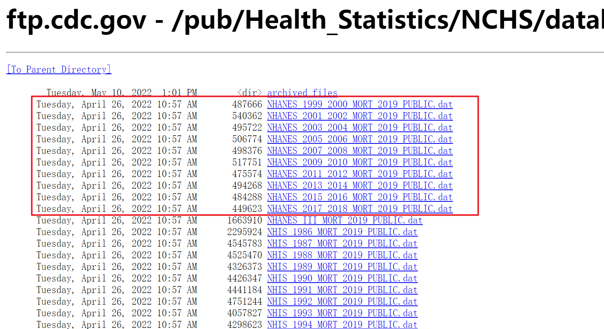

# NHANES数据库介绍

## 数据库简介

National Health and Nutrition Examination Survey （NHANES数据库，网址：[https://www.cdc.gov/nchs/nhanes/index.htm）](https://www.cdc.gov/nchs/nhanes/index.htm），收集了有关美国家庭人口健康和营养信息，是一项基于人群的横断面调查。)收集了有关美国家庭人口健康和营养信息，是一项基于人群的横断面调查。

该数据库开始于80年代，生物样本包含了参与者的血清，血浆，尿液等，涉及多种测量指标。此外，还包含了大量的调查问卷数据，调查问卷涉及广泛，包括人口统计学、社会经济学、饮食和健康相关问题，体检部分包括生理测量、实验室检查等内容。

-   **观看NHANES官方视频介绍**

该数据库自20世纪末开始，每两年一个周期，更新数据，而且是免费对外开放的，研究者可以根据需要直接下载数据。

{width="100%"}

在网站首页，进入Publications and Products，我们可以进行交互式数据可视化展示，数据简报，电子病例等。比如，我们进入数据可视化页面的数据。这些数据代表了从1999-2000年到2017-2018年国家健康和营养检查调查 (NHANES) 的估计值。

{width="100%"}

虽然NHANES数据库自带分析功能并以线图、bar图和表等展示数据，但是并不能满足我们发表论文的需求。因此，我们需要学会数据的下载和处理。当然，如何把数据库数据转化为论文，还要通过相关医学文献的阅读来实现。

在NHANES数据库官网首页，点击左栏的NHANES Questionnaires, Datasets, and Related Documentation，进入调查表、数据集和相关文档。待下载的数据在Continuous NHANES选项里面。这些数据是按照年份进行上传和保存的。

-   **Step 1.** 点击1处或2处直接进入数据下载页面（如下图）

{width="100%"}

-   **Step 2.** 可以从下图中的1、2、3处下载数据。

{width="100%"}

从1或3处可以按年份下载，每个年份包含Demographics Data"（人口数据）、"Dietary Data"（饮食数据）、"Examination Data"（检查数据）、"Laboratory Data"（化验数据）、"Questionnaire Data"（问卷数据）、"Limited Access Data"（限制访问数据）。

比如，我们选取2017-2018年的数据进行下载。点击选择左栏选项中的NHANES 2017-2018或右侧Continuous NHANES里面的NHANES 2017-2018。然后页面自动跳转到2017-2018数据页面。数据内容包括四部分：①数据、文档和密码文件，包含人口统计资料、饮食数据、检查资料、实验室资料、问卷表和有限访问的数据；②详细资料，包括问卷工具、实验方法、程序手册以及小册子和知情同意文件；③使用数据，包括概述、发行说明、实验室数据概览、检查资料概览、问卷数据概览、调查途径和数据分析指南、回应率和人口统计，网站还提供了网络教程。④内容概览，主要是常见问题的汇总等。

{width="100%"}

点击要下载的数据文件，选择存储位置，点击下载。我们以Demographics Data为例。选择Data File下面的DEMO_J\_ Data进行下载（Doc_File是对访问资料的介绍，无需下载）。文件类型是.XPT，下载时对网速有要求。下载后数据可用统计软件SPSS等打开，或者用R也可以。

{width="100%"}

-   或者直接用nhanesA下载数据（速度可能比较慢）


```r
library(nhanesA)
mydata1<-nhanes('DEMO_J')
```

## 数据提取

数据下好后用R读取


```r
library(haven)
library(tidyverse)
mydata <- read_xpt("data/demo_j.xpt")
head(mydata,10)
```

```
## # A tibble: 10 x 46
##    SEQN SDDSR~1 RIDST~2 RIAGE~3 RIDAG~4 RIDAG~5 RIDRE~6
##   <dbl>   <dbl>   <dbl>   <dbl>   <dbl>   <dbl>   <dbl>
## 1 93703      10       2       2       2      NA       5
## 2 93704      10       2       1       2      NA       3
## 3 93705      10       2       2      66      NA       4
## 4 93706      10       2       1      18      NA       5
## 5 93707      10       2       1      13      NA       5
## 6 93708      10       2       2      66      NA       5
## # ... with 4 more rows, 39 more variables:
## #   RIDRETH3 <dbl>, RIDEXMON <dbl>, RIDEXAGM <dbl>,
## #   DMQMILIZ <dbl>, DMQADFC <dbl>, DMDBORN4 <dbl>,
## #   DMDCITZN <dbl>, DMDYRSUS <dbl>, DMDEDUC3 <dbl>,
## #   DMDEDUC2 <dbl>, DMDMARTL <dbl>, RIDEXPRG <dbl>,
## #   SIALANG <dbl>, SIAPROXY <dbl>, SIAINTRP <dbl>,
## #   FIALANG <dbl>, FIAPROXY <dbl>, FIAINTRP <dbl>, ...
```

-   [对照变量说明提取需要得变量](https://wwwn.cdc.gov/Nchs/Nhanes/2017-2018/DEMO_J.htm)

{width="100%"}


```r
dat1<- mydata %>% select(SEQN, # 序列号
                         RIAGENDR, # 性别
                         RIDAGEYR, # 年龄
                         RIDRETH3, # 种族
                         DMDMARTL, # 婚姻状况
                         WTINT2YR,WTMEC2YR, # 权重
                         SDMVPSU, # psu
                         SDMVSTRA) # strata
```

以上demo文件中只有人口统计学指标，提取其他信息还需要下载其他数据。假如我们想提取血糖，血糖应该在[化验室指标](https://wwwn.cdc.gov/nchs/nhanes/search/datapage.aspx?Component=Laboratory&CycleBeginYear=2017)那里，这次我们使用nhanesA包来下载。

{width="100%"}


```r
# xuetang1 <- nhanes('GLU_J') # 在线提取
xuetang <- read_xpt("data/glu_j.xpt")
knitr::kable(xuetang[1:10, ] ,align = "c")
```


| SEQN  | WTSAF2YR | LBXGLU | LBDGLUSI |
|:-----:|:--------:|:------:|:--------:|
| 93708 |  25654   |  122   |   6.77   |
| 93711 |  29226   |  107   |   5.94   |
| 93717 |  137151  |   91   |   5.05   |
| 93718 |  58883   |   89   |   4.94   |
| 93719 |    0     |   86   |   4.77   |
| 93721 |  17155   |  104   |   5.77   |
| 93722 |  294374  |  101   |   5.61   |
| 93731 |  65813   |   98   |   5.44   |
| 93732 |    0     |   NA   |    NA    |
| 93735 |  20279   |   83   |   4.61   |

提取好指标后进行合并


```r
hdata<- full_join(dat1, xuetang, by = 'SEQN', type = 'full')
knitr::kable(hdata[1:10, ] ,align = "c")
```


| SEQN  | RIAGENDR | RIDAGEYR | RIDRETH3 | DMDMARTL | WTINT2YR | WTMEC2YR | SDMVPSU | SDMVSTRA | WTSAF2YR | LBXGLU | LBDGLUSI |
|:-----:|:--------:|:--------:|:--------:|:--------:|:--------:|:--------:|:-------:|:--------:|:--------:|:------:|:--------:|
| 93703 |    2     |    2     |    6     |    NA    |   9246   |   8540   |    2    |   145    |    NA    |   NA   |    NA    |
| 93704 |    1     |    2     |    3     |    NA    |  37339   |  42567   |    1    |   143    |    NA    |   NA   |    NA    |
| 93705 |    2     |    66    |    4     |    3     |   8615   |   8338   |    2    |   145    |    NA    |   NA   |    NA    |
| 93706 |    1     |    18    |    6     |    NA    |   8549   |   8723   |    2    |   134    |    NA    |   NA   |    NA    |
| 93707 |    1     |    13    |    7     |    NA    |   6769   |   7065   |    1    |   138    |    NA    |   NA   |    NA    |
| 93708 |    2     |    66    |    6     |    1     |  13329   |  14372   |    2    |   138    |  25654   |  122   |   6.77   |
| 93709 |    2     |    75    |    4     |    2     |  12043   |  12278   |    1    |   136    |    NA    |   NA   |    NA    |
| 93710 |    2     |    0     |    3     |    NA    |  16418   |  16848   |    1    |   134    |    NA    |   NA   |    NA    |
| 93711 |    1     |    56    |    6     |    1     |  11178   |  12391   |    2    |   134    |  29226   |  107   |   5.94   |
| 93712 |    1     |    18    |    1     |    NA    |  29040   |  30337   |    2    |   147    |    NA    |   NA   |    NA    |

把它保存起来，今后的操作将在这个数据展开


```r
write.csv(hdata,file= "1.csv",row.names = F)
```

## 需要注意的点

### 结局

-   [有死亡信息](https://www.cdc.gov/nchs/data-linkage/mortality-public.htm)，需要另外页面下载。

进入死亡数据下载界面（Data Linkage------NDI Mortality Files------Public-Use Files）

{width="100%"}

Public-Use Linked Mortality Files点击FTP Site，进入死亡数据索引目录。阅读数据集说明文件及变量说明，可以对数据集内容有个基本的了解。

{width="100%"}

选择需要年份的死亡数据下载；

{width="100%"}

### 数据分析

NHANES是[复杂抽样](https://wwwn.cdc.gov/nchs/nhanes/tutorials/module2.aspx)，所以需要用到"复杂抽样"的分析方法。

并且要注意[权重的合并](https://wwwn.cdc.gov/nchs/nhanes/tutorials/module3.aspx)！

> -   NHANES样本分为四个阶段：
>
>     （a）PSU（县、县内的区域组或相邻县的组合）；
>
>     （b）PSU内的部分（普查区或区的组合）；
>
>     （c）分段内的居住单元、家庭（DU）；
>
>     （d）家庭中的个人。PSU是从美国所有县取样的。根据过采样标准，在DU级别进行筛选以识别被抽样的人（SP）。
>
> -   year:样本中年数的调整
>
>     NHANES是每年都会进行的抽样，但由于样本量的限制，经常需要合并多年以增强统计效能。但是不同年份测量的变量不一致。比如要合并6年的数据，这可能导致有的变量2年一测，有的变量3年一测，有的变量6年一测。此时不可以直接提取进行计算。
>
>     以4年的数据为例：由于4年样本设计，从原始抽样率计算的初始基本权重对应于4年样本。 这些初始基权值是基于抽样概率的， 为了产生与1年和2年样本的全国人口总数相一致的权重，需要调整因子。 例如，为了为2015-2016年NHANES和2017-2018年NHANES在公共使用文件中发布的数据创建两年样本权重，将4年基权重乘以2，以考虑2年的选择（设计中的年数除以样本中的年数，4除以2=2）。

多看官网的各种分析提供的[代码示例](https://wwwn.cdc.gov/nchs/nhanes/tutorials/module6.aspx)

### 一些技巧

-   查看指定年份和指定类别的信息


```r
library(nhanesA)
nhanesTables('EXAM', 2017)
```

{width="100%"}

-   查看详细信息

1.  假设我们需要进一步查看BPX_J的内部信息


```r
nhanesTableVars(data_group = 'Exam', nh_table = 'BPX_J', namesonly = FALSE)
```

{width="100%"}

可以看到，此表之中有27列。Seqn是受访者的序列号，可以用来连接各表。


